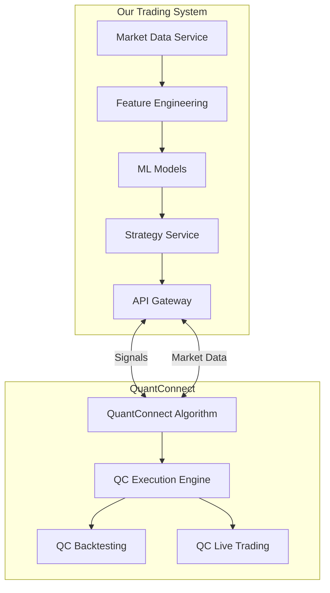
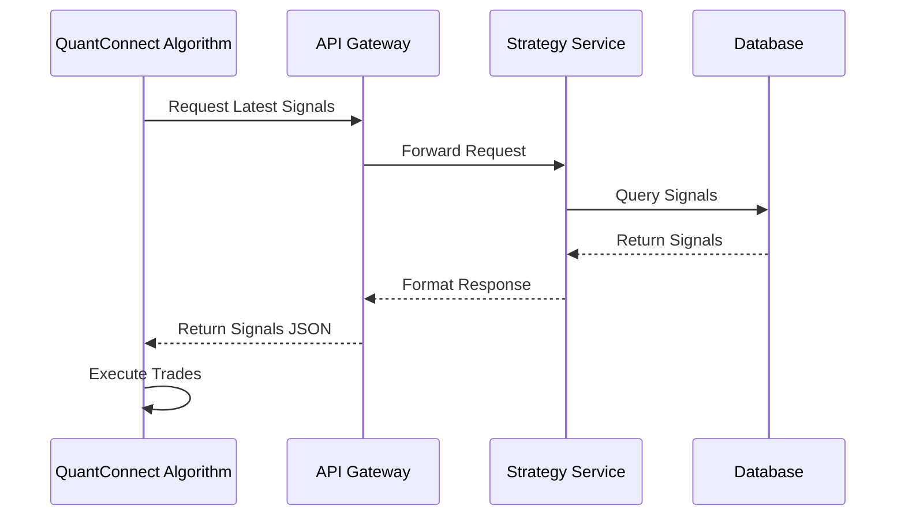

# QuantConnect Integration

## Overview

This document details the integration between our trading system and QuantConnect's platform. It covers the architecture, implementation patterns, data flow, deployment considerations, and operational procedures for both live trading and backtesting scenarios.

## Table of Contents

1. [Architecture Overview](#architecture-overview)
2. [Integration Patterns](#integration-patterns)
3. [API Design and Optimization](#api-design)
4. [Deployment Configuration](#deployment-configuration)
5. [Live Trading Implementation](#live-trading)
6. [Backtesting Considerations](#backtesting)
7. [Security and Compliance](#security-compliance)
8. [Implementation Timeline](#implementation-timeline)


<a name="architecture-overview"></a>
## 1. Architecture Overview

### Integration Architecture



### Separation of Concerns

Our integration with QuantConnect follows a strict separation of concerns:

1. **Trading System**: Responsible for market data collection, feature engineering, model inference, and signal generation
2. **QuantConnect**: Responsible for order execution, position management, and broker integration

This separation provides several advantages:
- Protects our intellectual property
- Allows independent development of both components
- Optimizes each component for its specific role
- Maintains flexibility to switch execution platforms if needed

<a name="integration-patterns"></a>
## 2. Integration Patterns

### API-Based Integration

The primary integration method is through REST APIs exposed by our API Gateway:



### Message-Based Integration

For live trading scenarios, we also support a webhook-based approach with a messaging adapter:

```python
# In trading_system_common/messaging/quantconnect.py
class QuantConnectMessageAdapter:
    """Adapter for translating between our messaging system and QuantConnect's API."""
    
    def __init__(self, qc_api_key: str, qc_secret_key: str):
        """Initialize the QuantConnect message adapter."""
        # Setup QuantConnect API client
        self.qc_api_client = QuantConnectClient(qc_api_key, qc_secret_key)
        
        # Setup internal messaging
        self.message_broker = get_message_broker()
        
        # Track deployed algorithms
        self.deployed_algorithms = {}
    
    async def start(self):
        """Start listening for signal events."""
        # Subscribe to signal events
        await self.message_broker.subscribe(
            "signals.generated", 
            self.on_signal_generated
        )
        
        # Subscribe to trading results from QuantConnect
        await self.message_broker.subscribe(
            "quantconnect.results",
            self.on_qc_result
        )
    
    async def on_signal_generated(self, event):
        """Handle signal generation event."""
        # Transform event to QuantConnect format
        qc_payload = self._transform_signal_to_qc(event)
        
        # Send to appropriate QC algorithm
        algorithm_id = self._get_algorithm_for_signal(event)
        if algorithm_id:
            await self.qc_api_client.notify_algorithm(
                algorithm_id, 
                qc_payload
            )
```

<a name="api-design"></a>
## 3. API Design and Optimization

### Endpoint Design

The API endpoints are designed with QuantConnect's limitations in mind:

- **Signal Endpoint**: Returns the latest trading signals with appropriate filters
- **Market Data Endpoint**: Provides supplementary market data when needed
- **Status Endpoint**: Allows QuantConnect to check system health

### Rate Limiting Considerations

QuantConnect imposes a limit of 100 API calls during backtesting. Our API is optimized to work within these limits:

1. **Batch Endpoints**: Return multiple signals in a single call
2. **Caching**: Heavy use of caching to minimize redundant calls
3. **Compression**: Responses are compressed to reduce bandwidth
4. **Essential Data Only**: Responses include only the data necessary for trading

```python
# Example API endpoint optimization
@router.get("/signals/batch/{exchange}/{symbols}")
async def get_batch_signals(
    exchange: str,
    symbols: str,  # Comma-separated list
    lookback: int = 1,
    cache_control: Optional[str] = Header(None)
):
    """Get signals for multiple symbols in a single call."""
    # Parse symbols
    symbol_list = symbols.split(",")
    
    # Check cache first
    cache_key = f"batch_signals:{exchange}:{symbols}:{lookback}"
    cached_result = await redis_client.get(cache_key)
    
    if cached_result and cache_control != "no-cache":
        return json.loads(cached_result)
    
    # Fetch signals for all symbols
    signals = []
    for symbol in symbol_list:
        symbol_signals = await signal_service.get_signals(
            exchange, symbol, lookback=lookback
        )
        signals.extend(symbol_signals)
    
    # Cache result
    result = {"signals": signals, "timestamp": datetime.utcnow().isoformat()}
    await redis_client.setex(cache_key, 300, json.dumps(result))  # 5-minute cache
    
    return result
```

<a name="deployment-configuration"></a>
## 4. Deployment Configuration

### Cloud Resources
All cloud resources will be deployed in GCP's `us-east1` region (Virginia) for minimal latency to QuantConnect's infrastructure in New Jersey:

```yaml
# terraform/quantconnect-integration.tf
resource "google_cloud_run_service" "quantconnect_adapter" {
  name     = "quantconnect-adapter"
  location = "us-east1"
  project  = "production"
  
  template {
    spec {
      containers {
        image = "gcr.io/production/quantconnect-adapter:latest"
        
        env {
          name  = "QUANTCONNECT_API_KEY"
          value_from {
            secret_manager_secret = "quantconnect-api-key"
          }
        }
        
        env {
          name  = "QUANTCONNECT_API_SECRET"
          value_from {
            secret_manager_secret = "quantconnect-api-secret"
          }
        }
      }
    }
  }
}
```

### IP Whitelisting

Our API endpoints restrict access to QuantConnect's IP ranges:

```bash
# Cloud Armor security policy
gcloud compute security-policies create qc-whitelist \
  --description "Protect QuantConnect API endpoints"

# Allow only QuantConnect IPs
gcloud compute security-policies rules create 1000 \
  --security-policy qc-whitelist \
  --description "Allow QuantConnect IPs" \
  --src-ip-ranges "123.456.789.0/24,987.654.321.0/24" \
  --action "allow"

# Deny all other IPs
gcloud compute security-policies rules create 2147483647 \
  --security-policy qc-whitelist \
  --description "Deny all other traffic" \
  --src-ip-ranges "*" \
  --action "deny-403"
```

<a name="live-trading"></a>
## 5. Live Trading Implementation

### Algorithm Structure

The QuantConnect algorithm that interfaces with our system follows this structure:

```python
# Python QuantConnect algorithm example
class MlTradingSystemAlgorithm(QCAlgorithm):
    def Initialize(self):
        self.api_endpoint = "https://api.trading-system.com"
        self.api_key = ""
        self.active_symbols = set()
        
        # Basic algorithm setup
        self.SetStartDate(2023, 1, 1)
        self.SetCash(100000)
        
        # Add assets we may trade
        self.AddCrypto("BTCUSD")
        self.AddCrypto("ETHUSD")
        
        # Schedule signal checks
        self.Schedule.On(self.DateRules.EveryDay(), 
                         self.TimeRules.Every(timedelta(minutes=5)), 
                         self.FetchSignals)
    
    def FetchSignals(self):
        try:
            # Fetch signals from our API
            signals = self.FetchSignalsFromApi()
            
            for signal in signals:
                # Process each signal
                self.ProcessSignal(signal)
        except Exception as ex:
            self.Log(f"Error fetching signals: {ex}")
    
    def ProcessSignal(self, signal):
        # Extract signal details
        symbol = signal['symbol']
        action = signal['action']
        quantity = signal['quantity']
        stop_loss = signal['stop_loss']
        take_profit = signal['take_profit']
        
        # Execute order based on signal
        if action == "buy":
            # Execute buy order
            ticket = self.MarketOrder(symbol, quantity)
            if ticket.Status == OrderStatus.Filled:
                # Set stop loss and take profit
                self.StopMarketOrder(symbol, -quantity, stop_loss)
                self.LimitOrder(symbol, -quantity, take_profit)
                
                # Track active symbol
                self.active_symbols.add(self.Symbol(symbol))
        
        elif action == "sell":
            # Execute sell order
            self.MarketOrder(symbol, -quantity)
            
            # Remove from active symbols
            if self.Symbol(symbol) in self.active_symbols:
                self.active_symbols.remove(self.Symbol(symbol))
    
    def FetchSignalsFromApi(self):
        import requests
        import json
        
        # Add authentication
        headers = {"X-API-KEY": self.api_key}
        
        # Get current symbols as comma-separated list
        symbols = ",".join([s.Value for s in self.Securities.Keys])
        
        # Fetch from batch endpoint to minimize API calls
        endpoint = f"{self.api_endpoint}/signals/batch/all/{symbols}"
        
        # Make request
        response = requests.get(endpoint, headers=headers)
        
        # Check response
        if response.status_code == 200:
            return json.loads(response.text)['signals']
        else:
            self.Log(f"API Error: {response.status_code}, {response.text}")
            return []

### Signal Format

Signals sent to QuantConnect follow this standard format:

```json
{
  "signals": [
    {
      "symbol": "BTCUSD",
      "exchange": "bybit",
      "timestamp": "2023-06-01T12:00:00Z",
      "action": "buy",
      "quantity": 0.5,
      "confidence": 0.85,
      "stop_loss": 26500.0,
      "take_profit": 28500.0,
      "signal_id": "sig-abc-123",
      "model_id": "model-xyz-789",
      "features": {
        "volatility": 0.023,
        "trend_strength": 0.75
      }
    }
  ],
  "metadata": {
    "timestamp": "2023-06-01T12:00:01Z",
    "version": "1.0"
  }
}
```

<a name="backtesting"></a>
## 6. Backtesting Considerations

### API Simulation

For backtesting, the QuantConnect algorithm can either:

1. **Use the live API**: With historical data access enabled
2. **Use a local data source**: Embedding the necessary signals in the algorithm

```python
# Python QuantConnect backtesting data approach
class MlTradingSystemAlgorithm(QCAlgorithm):
    def Initialize(self):
        # Load backtest signals from embedded resource
        self.backtest_signals = self.LoadBacktestSignals()
        
        # Rest of initialization...

    def FetchSignals(self):
        if self.backtest_mode:
            # Use pre-loaded signals based on current time
            current_date = self.Time.Date
            if current_date in self.backtest_signals:
                for signal in self.backtest_signals[current_date]:
                    self.ProcessSignal(signal)
        else:
            # Use live API
            signals = self.FetchSignalsFromApi()
            # Process signals...

    def ProcessSignal(self, signal):
        # Process signal...

    def FetchSignalsFromApi(self):
        # Implement live API call to fetch signals...
        pass

    def LoadBacktestSignals(self):
        # Implement logic to load backtest signals from embedded resource...
        pass
```

### Backtesting API Optimization

To accommodate QuantConnect's 100 API call limit during backtesting:

1. **Pre-fetch approach**: Load all signals at the start of the backtest
2. **Date-based batching**: Fetch signals for entire date ranges in single calls
3. **Local caching**: Cache API responses in the algorithm

<a name="security-compliance"></a>
## 7. Security and Compliance

### Authentication

All API access requires authentication:

```python
# Authentication middleware
@app.middleware("http")
async def authenticate(request: Request, call_next):
    """Authenticate API requests."""
    # Check for API key
    api_key = request.headers.get("X-API-KEY")
    if not api_key:
        return JSONResponse(
            status_code=status.HTTP_401_UNAUTHORIZED,
            content={"detail": "Missing API key"}
        )
    
    # Validate API key
    if not await is_valid_api_key(api_key):
        return JSONResponse(
            status_code=status.HTTP_403_FORBIDDEN,
            content={"detail": "Invalid API key"}
        )
    
    # Continue with request
    return await call_next(request)
```

### Audit Logging

All interactions with QuantConnect are logged for audit purposes:

```python
@app.middleware("http")
async def audit_log(request: Request, call_next):
    """Log all API accesses for audit."""
    # Generate request ID
    request_id = str(uuid.uuid4())
    
    # Extract request details
    client_ip = request.client.host
    method = request.method
    path = request.url.path
    
    # Log request
    logger.info(
        f"API request received",
        extra={
            "request_id": request_id,
            "client_ip": client_ip,
            "method": method,
            "path": path,
            "source": "quantconnect" if is_quantconnect_ip(client_ip) else "other"
        }
    )
    
    # Process request
    start_time = time.time()
    response = await call_next(request)
    duration = time.time() - start_time
    
    # Log response
    logger.info(
        f"API response sent",
        extra={
            "request_id": request_id,
            "status_code": response.status_code,
            "duration": duration
        }
    )
    
    return response
```

<a name="implementation-timeline"></a>
## 8. Implementation Timeline

### Development Day 3: Integration (March 23, 2025)
- [ ] Design API contract for QuantConnect integration
- [ ] Implement basic signal delivery API endpoints
- [ ] Create authentication and security measures
- [ ] Develop QuantConnect example algorithm
- [ ] Implement batch API endpoints for backtesting optimization
- [ ] Develop webhook integration for live trading
- [ ] Create monitoring and alerting for signal delivery
- [ ] Set up IP whitelisting and security policies

### Testing Day 6: Paper Trading (March 26, 2025)
- [ ] Test backtesting workflows end-to-end
- [ ] Optimize API performance and response times
- [ ] Implement comprehensive logging and monitoring
- [ ] Conduct load testing and security review
- [ ] Set up paper trading environment
- [ ] Run end-to-end tests with paper trading
- [ ] Monitor system performance and make adjustments
- [ ] Finalize integration documentation

### Production Day 7: Live Trading (March 27, 2025)
- [ ] Deploy integration to production environment
- [ ] Establish operational procedures for live trading
- [ ] Launch live trading with minimal capital
- [ ] Monitor system performance in production
- [ ] Implement 24/7 monitoring rotation
- [ ] Create incident response procedures 