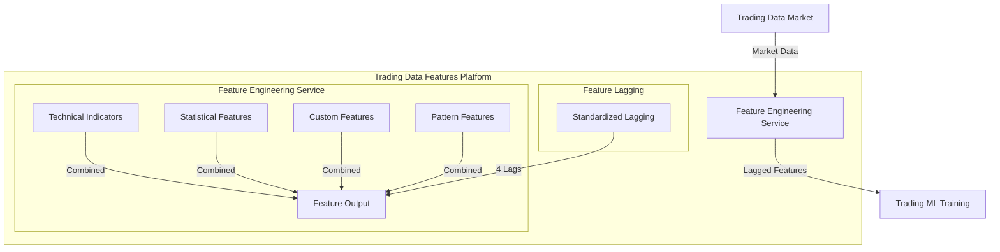

# Trading Data Features Platform

## Overview

The Trading Data Features Platform is responsible for transforming raw market data into meaningful features that can be used for machine learning models. It generates technical indicators, statistical features, and custom transformations, with a unified approach that treats all patterns as features. The platform implements standardized lagging across all feature types to prevent lookahead bias.

## Components



## Infrastructure by Environment

### Local Development

```yaml
# Local development configuration (trading-data-features/config/local.yaml)
environment: development
mode: backtest  # or 'live'

input:
  type: duckdb
  db_path: ../trading-data-market/data/duckdb/market_data.db
  
output:
  type: duckdb
  db_path: ./data/duckdb/features.db
  parquet_path: ./data/parquet

cache:
  type: memory
  size_limit_mb: 1024
  
api:
  host: 0.0.0.0
  port: 8001
  log_level: debug
  
processors:
  - name: technical_indicators
    enabled: true
    batch_size: 5000
    parallel_jobs: 4
    indicators:
      - name: rsi
        params: {timeperiod: 14}
      - name: macd
        params: {fastperiod: 12, slowperiod: 26, signalperiod: 9}
      # More indicators...
      
  - name: statistical_features
    enabled: true
    batch_size: 5000
    parallel_jobs: 4
    features:
      - name: returns
        params: {periods: [1, 5, 10, 20]}
      - name: volatility
        params: {window: 20}
      # More statistical features...
      
  - name: pattern_features
    enabled: true
    batch_size: 5000
    parallel_jobs: 4
    patterns:
      - name: swing_events
        params: {
          lookback_windows: [10, 20, 30, 50],
          std_dev_thresholds: [1.0, 1.5, 2.0, 2.5]
        }
      - name: regime_classification
        params: {
          n_regimes: 3,
          min_regime_duration: 20
        }
      # More pattern features...
      
  - name: custom_features
    enabled: true
    batch_size: 5000
    parallel_jobs: 4
    module_path: ./src/custom_features
```

**Docker Compose Setup:**

```yaml
# trading-data-features/docker-compose.yml
version: '3.8'

services:
  trading-data-features:
    build:
      context: .
      dockerfile: Dockerfile
    ports:
      - "8001:8001"
    volumes:
      - ./data:/app/data
      - ./config:/app/config
      - ./src:/app/src
    environment:
      - CONFIG_PATH=/app/config/local.yaml
      - LOG_LEVEL=DEBUG
    depends_on:
      - trading-data-market

  target-generation-service:
    build:
      context: ../target-generation-service
      dockerfile: Dockerfile
    ports:
      - "8002:8002"
    volumes:
      - ./data:/app/data  # Shared volume with feature service
      - ../target-generation-service/config:/app/config
      - ../target-generation-service/src:/app/src
    environment:
      - CONFIG_PATH=/app/config/local.yaml
      - LOG_LEVEL=DEBUG
    depends_on:
      - trading-data-features
```

### Development Environment (GCP)

```yaml
# Development GCP configuration (trading-data-features/config/dev.yaml)
environment: development
mode: backtest  # or 'live'

input:
  type: bigquery
  project_id: development
  dataset: market_data
  table: validated_ohlcv
  
output:
  type: bigquery
  project_id: development
  dataset: feature_data
  table: features
  gcs_bucket: development-feature-data
  
cache:
  type: redis
  host: redis-service
  port: 6379
  
api:
  host: 0.0.0.0
  port: 8001
  log_level: info
  
processors:
  - name: technical_indicators
    enabled: true
    batch_size: 10000
    parallel_jobs: 8
    indicators:
      - name: rsi
        params: {timeperiod: 14}
      # More indicators...
```

**Kubernetes Configuration:**

```yaml
# trading-data-features/k8s/dev/deployment.yaml
apiVersion: apps/v1
kind: Deployment
metadata:
  name: trading-data-features
  namespace: trading-dev
``` 