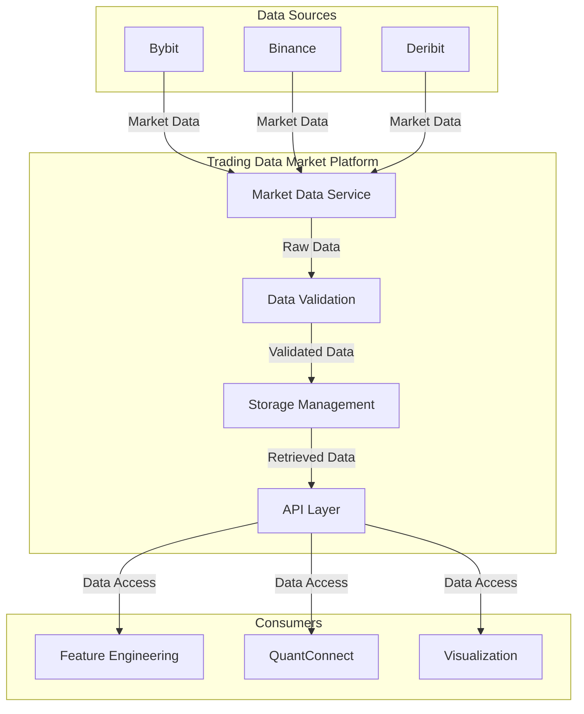

# Trading Data Market Platform

## Overview

The Trading Data Market Platform is responsible for collecting, validating, storing, and providing access to market data from various sources. It serves as the foundation for all other components in the trading system by ensuring consistent, high-quality market data is available for both backtesting and live trading.

## Components



## Infrastructure by Environment

### Local Development

```yaml
# Local development configuration example (trading-data-market/config/local.yaml)
environment: development
storage:
  type: duckdb
  db_path: ./data/duckdb/market_data.db
  parquet_path: ./data/parquet
cache:
  type: memory
  ttl_seconds: 600
api:
  host: 0.0.0.0
  port: 8000
  log_level: debug
exchange_clients:
  bybit:
    base_url: https://api.bybit.com
    rate_limit: 10  # requests per second
```

**Docker Compose Setup:**

```yaml
# trading-data-market/docker-compose.yml
version: '3.8'

services:
  trading-data-market:
    build:
      context: .
      dockerfile: Dockerfile
    ports:
      - "8000:8000"
    volumes:
      - ./data:/app/data
      - ./config:/app/config
    environment:
      - CONFIG_PATH=/app/config/local.yaml
      - LOG_LEVEL=DEBUG
```

### Development Environment (GCP)

```yaml
# Development GCP configuration (trading-data-market/config/dev.yaml)
environment: development
storage:
  type: bigquery
  project_id: development
  dataset: market_data
  raw_table: raw_ohlcv
  validated_table: validated_ohlcv
  gcs_bucket: development-market-data
cache:
  type: redis
  host: redis-service
  port: 6379
  ttl_seconds: 600
api:
  host: 0.0.0.0
  port: 8000
  log_level: info
exchange_clients:
  bybit:
    base_url: https://api.bybit.com
    rate_limit: 10  # requests per second
```

**Kubernetes Configuration:**

```yaml
# trading-data-market/k8s/dev/deployment.yaml
apiVersion: apps/v1
kind: Deployment
metadata:
  name: trading-data-market
  namespace: trading-dev
spec:
  replicas: 1
  selector:
    matchLabels:
      app: trading-data-market
  template:
    metadata:
      labels:
        app: trading-data-market
    spec:
      containers:
      - name: trading-data-market
        image: gcr.io/development/trading-data-market:latest
        ports:
        - containerPort: 8000
        env:
        - name: CONFIG_PATH
          value: /app/config/dev.yaml
        - name: GOOGLE_APPLICATION_CREDENTIALS
          value: /var/secrets/google/key.json
        volumeMounts:
        - name: google-cloud-key
          mountPath: /var/secrets/google
        - name: config-volume
          mountPath: /app/config
      volumes:
      - name: google-cloud-key
        secret:
          secretName: trading-data-market-gcp-key
      - name: config-volume
        configMap:
          name: trading-data-market-config
```

### Production Environment (GCP)

```yaml
# Production configuration (trading-data-market/config/prod.yaml)
environment: production
storage:
  type: bigquery
  project_id: production
  dataset: market_data
  raw_table: raw_ohlcv
  validated_table: validated_ohlcv
  gcs_bucket: production-market-data
cache:
  type: redis
  host: redis-service
  port: 6379
  ttl_seconds: 600
api:
  host: 0.0.0.0
  port: 8000
  log_level: warn
exchange_clients:
  bybit:
    base_url: https://api.bybit.com
    rate_limit: 20  # higher rate limit for production
```

## Mode-Specific Behavior

### Backtesting Mode

In backtesting mode, the Trading Data Market Platform focuses on historical data retrieval and minimal processing overhead.

```python
# Example usage in backtesting mode
from trading_data_market.client import MarketDataClient

# Initialize with backtesting configuration
client = MarketDataClient(mode="backtest")

# Fetch historical data for backtest
historical_data = client.get_historical_data(
    symbol="BTCUSDT",
    exchange="bybit",
    timeframe="1h",
    start_date="2023-01-01",
    end_date="2023-12-31"
)
``` 