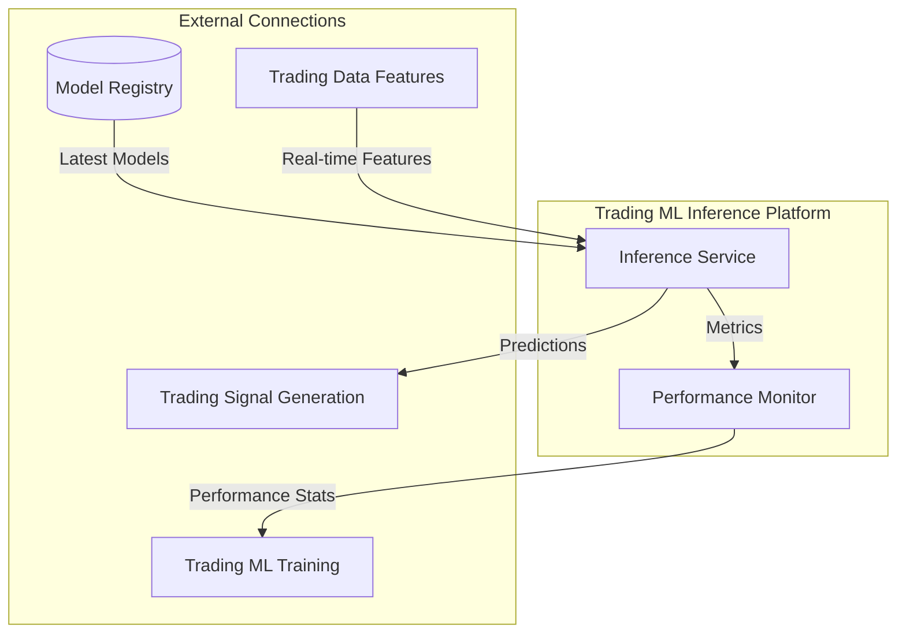

# Trading ML Inference Platform

## Overview

The Trading ML Inference Platform is responsible for serving and monitoring machine learning models that power trading strategies. This platform leverages MLFlow for model registry and deployment, with integration to VertexAI for cloud-based serving in production environments. The platform ensures real-time prediction generation with proper handling of feature lags and model versioning.

## Components



### Inference Service

Serves predictions from trained models to the Trading Signal Generation platform. Key responsibilities:

- Real-time feature processing
- Lag-aware prediction generation
- Prediction confidence scoring
- Model version management
- Feature drift detection

### Performance Monitor

Monitors model performance and data quality in real-time. Key responsibilities:

- Model performance tracking
- Feature drift detection
- Prediction quality metrics
- Alert generation
- Performance reporting

## Infrastructure by Environment

### Local Development

```yaml
# Local Development Configuration (trading-ml-inference/config/local.yaml)
environment: local
mlflow:
  tracking_uri: http://localhost:5000
  model_registry: ./models
storage:
  cache_dir: ./cache
database:
  type: duckdb
  path: ./data/ml.duckdb
inference:
  batch_size: 1000
  cache_ttl: 60  # seconds
  max_concurrent_models: 4
monitoring:
  metrics_window: 1h
  alert_threshold: 0.1
```

Local development uses:
- Local MLFlow server for model registry
- Local file system for cache storage
- DuckDB for feature and prediction storage
- Docker containers for service isolation

### Feature Branch Environment

```yaml
# Feature Branch Configuration (trading-ml-inference/config/feature-branch.yaml)
environment: feature-branch
mlflow:
  tracking_uri: http://mlflow.feature-branch.svc.cluster.local:5000
  model_registry: gs://trading-system-feature-branch/models
storage:
  cache_dir: gs://trading-system-feature-branch/cache
database:
  type: bigquery
  project: development
  dataset: feature_branch
inference:
  batch_size: 1000
  cache_ttl: 300  # seconds
  max_concurrent_models: 8
monitoring:
  metrics_window: 1h
  alert_threshold: 0.1
```

Feature branch environment uses:
- Dedicated MLFlow instance in Kubernetes
- GCS for model and cache storage
- BigQuery for feature and prediction storage
- Feature-branch specific datasets to prevent interference

### Development Environment (GCP)

```yaml
# Development Configuration (trading-ml-inference/config/dev.yaml)
environment: development
mlflow:
  tracking_uri: http://mlflow.dev.svc.cluster.local:5000
  model_registry: gs://trading-system-dev/models
storage:
  cache_dir: gs://trading-system-dev/cache
database:
  type: bigquery
  project: development
  dataset: ml_inference
inference:
  batch_size: 2000
  cache_ttl: 300  # seconds
  max_concurrent_models: 16
monitoring:
  metrics_window: 1h
  alert_threshold: 0.1
```

**Kubernetes Configuration:**

```yaml
# trading-ml-inference/k8s/dev/deployment.yaml
apiVersion: apps/v1
kind: Deployment
metadata:
  name: trading-ml-inference
  namespace: trading-dev
spec:
  replicas: 3
  selector:
    matchLabels:
      app: trading-ml-inference
  template:
    metadata:
      labels:
        app: trading-ml-inference
    spec:
      containers:
      - name: trading-ml-inference
        image: gcr.io/development/trading-ml-inference:latest
        ports:
        - containerPort: 8000
        env:
        - name: CONFIG_PATH
          value: /app/config/dev.yaml
        - name: GOOGLE_APPLICATION_CREDENTIALS
          value: /var/secrets/google/key.json
        volumeMounts:
        - name: google-cloud-key
          mountPath: /var/secrets/google
        - name: config-volume
          mountPath: /app/config
        resources:
          requests:
            memory: "4Gi"
            cpu: "2"
          limits:
            memory: "8Gi"
            cpu: "4"
      volumes:
      - name: google-cloud-key
        secret:
          secretName: trading-ml-inference-gcp-key
      - name: config-volume
        configMap:
          name: trading-ml-inference-config
``` 