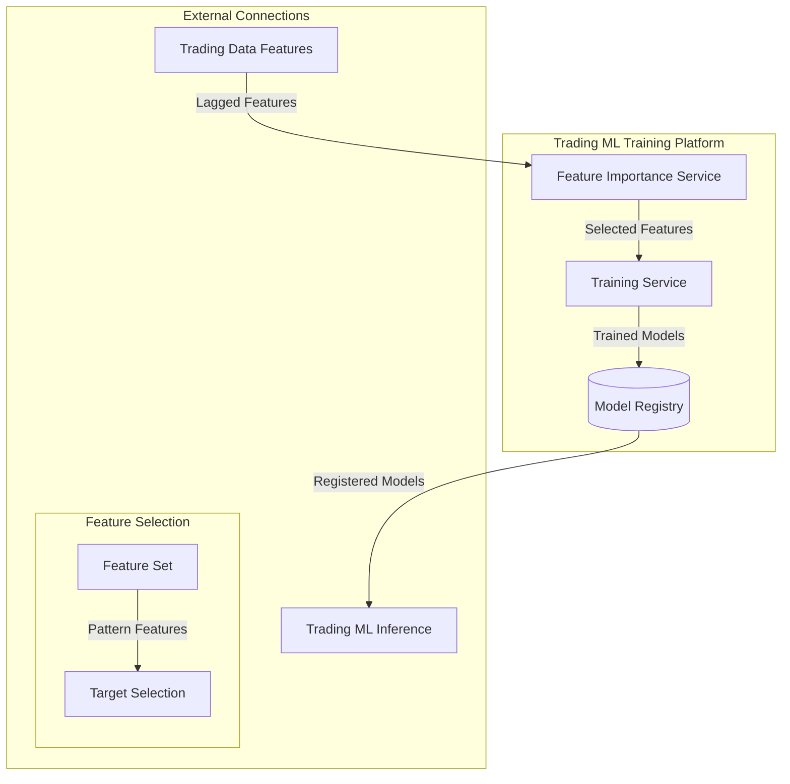

# Trading ML Training Platform

## Overview

The Trading ML Training Platform is responsible for training and managing machine learning models that power trading strategies. This platform leverages MLFlow for experiment tracking and model registry, with integration to VertexAI for cloud-based training in production environments. The platform implements a unified approach where prediction targets are selected from lagged pattern features, ensuring proper temporal alignment and prevention of lookahead bias.

## Components



### Feature Importance Service

Analyzes feature correlation and importance to identify the most predictive features for model training. Key responsibilities:

- Feature screening and selection
- Handling of lagged features
- Separation of pattern features for potential target use
- Cross-feature correlation analysis
- Feature stability monitoring

### Training Service

Trains, tunes, and evaluates machine learning models using selected features. Key responsibilities:

- Target selection from pattern features
- Feature-target temporal alignment
- Model training with proper lag handling
- Hyperparameter optimization
- Model evaluation and selection

## Target Selection Process

The platform implements a unified approach where prediction targets are selected from pattern features:

```python
def prepare_training_data(features_df: pd.DataFrame, target_config: dict) -> Tuple[pd.DataFrame, pd.DataFrame]:
    """
    Prepare training data by selecting appropriate pattern features as targets.
    
    Args:
        features_df: DataFrame with all features including pattern features
        target_config: Configuration for target selection including window and threshold
        
    Returns:
        Tuple of (X, y) for training
    """
    # Get base (unlagged) pattern features that match the target configuration
    base_prefix = f"base_w{target_config['window']}_s{target_config['std_dev']}"
    target_cols = [col for col in features_df.columns if col.startswith(base_prefix)]
    
    # Forward shift the selected features by target_lag
    target_df = pd.DataFrame(index=features_df.index)
    for col in target_cols:
        # Remove base prefix for cleaner target names
        target_name = col.replace(f"{base_prefix}_", "target_")
        target_df[target_name] = features_df[col].shift(-target_config['target_lag'])
    
    # Remove any base (unlagged) pattern features from feature set
    feature_cols = [
        col for col in features_df.columns
        if not col.startswith('base_w')
    ]
    
    return features_df[feature_cols], target_df
```

## Infrastructure by Environment

### Local Development

```yaml
# Local Development Configuration (trading-ml-training/config/local.yaml)
environment: local
mlflow:
  tracking_uri: http://localhost:5000
  experiment_name: ml-local-experiment
storage:
  model_registry: ./models
  artifacts: ./artifacts
database:
  type: duckdb
  path: ./data/ml.duckdb
training:
  resources:
    max_workers: 4
    memory_limit: 8G
```

Local development uses:
- Local MLFlow server for experiment tracking
- Local file system for model storage
- DuckDB for feature storage
- Docker containers for service isolation

### Feature Branch Environment

```yaml
# Feature Branch Configuration (trading-ml-training/config/feature-branch.yaml)
environment: feature-branch
mlflow:
  tracking_uri: http://mlflow.feature-branch.svc.cluster.local:5000
  experiment_name: ml-feature-branch-experiment
storage:
  model_registry: gs://trading-system-feature-branch/models
  artifacts: gs://trading-system-feature-branch/artifacts
database:
  type: bigquery
  project: development
  dataset: feature_branch
training:
  resources:
    max_workers: 8
    memory_limit: 16G
```

Feature branch environment uses:
- Dedicated MLFlow instance in Kubernetes
- GCS for model and artifact storage
- BigQuery for feature storage
- Feature-branch specific datasets to prevent interference

### Development Environment (GCP)

```yaml
# Development Configuration (trading-ml-training/config/dev.yaml)
environment: development
mlflow:
  tracking_uri: http://mlflow.dev.svc.cluster.local:5000
  experiment_name: ml-dev-experiment
storage:
  model_registry: gs://trading-system-dev/models
  artifacts: gs://trading-system-dev/artifacts
database:
  type: bigquery
  project: development
  dataset: ml_training
training:
  resources:
    max_workers: 16
    memory_limit: 32G
``` 