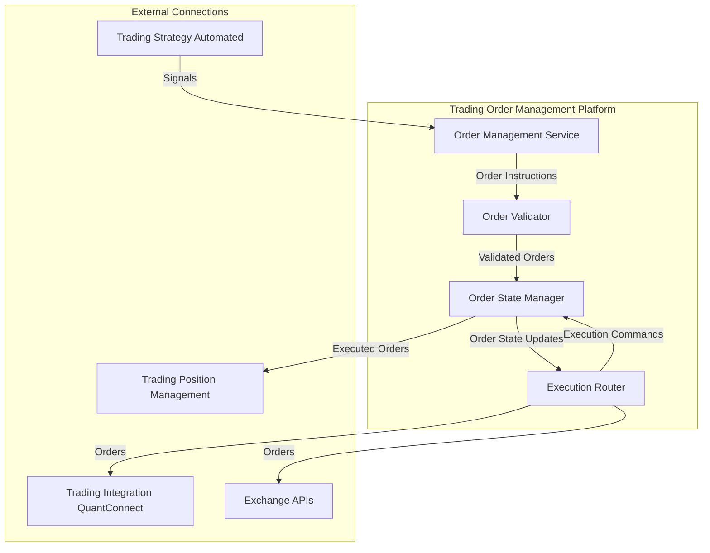

# Trading Order Management Platform

## Overview
- Converts trading signals into executable orders
- Manages order lifecycle and execution
- Supports multiple order types and execution modes
- Implements order routing and execution tracking
- Generates order execution metrics and statistics
- Optimized for low-latency order processing

## Service Components

### 1. Order Generation
- **Signal Processing**:
  - Converts trading signals into actionable orders
  - Supports market and limit orders
  - Configurable execution timing
  - Fee calculation and slippage modeling

### 2. Order Management
- **Order Lifecycle**:
  - Order creation and validation
  - Execution tracking
  - Fill monitoring
  - Cancellation handling
  - Amendment processing

### 3. Execution Engine
- **Order Routing**:
  - Exchange connectivity
  - Smart order routing
  - Rate limit management
  - Order splitting
  - Execution algorithms

### 4. Performance Analytics
- **Order-Level Metrics**:
  - Execution latency
  - Fill rates
  - Slippage analysis
  - Fee impact
- **Aggregate Metrics**:
  - Order success rates
  - Average execution time
  - Cost analysis
  - Exchange performance

## Implementation Details

### Order Processing Flow
1. Receive trading signal
2. Generate appropriate order(s)
3. Route to exchange
4. Track execution
5. Report fills
6. Update position management

### Execution Modes
- **Market Orders**:
  - Immediate execution
  - Price impact consideration
  - Fill guarantee
- **Limit Orders**:
  - Price level specification
  - Time in force options
  - Fill uncertainty

### Performance Optimizations
- Asynchronous order processing
- Batched order updates
- Connection pooling
- Rate limit optimization

### Example Configuration
```python
order_params = {
    # Order Management
    'default_order_type': 'market',
    'time_in_force': 'GTC',     # Good Till Cancelled
    'max_slippage_bps': 10,     # Maximum allowed slippage in basis points
    
    # Execution
    'retry_attempts': 3,        # Number of retry attempts
    'retry_delay_ms': 100,      # Delay between retries
    'execution_timeout_ms': 5000, # Maximum execution wait time
    
    # Rate Limiting
    'rate_limit_orders': 10,    # Orders per second
    'rate_limit_window_ms': 1000, # Rate limit window
    
    # Monitoring
    'track_execution_metrics': True,
    'log_level': 'INFO'
}
```

## Best Practices
- Implement comprehensive order validation
- Monitor execution quality
- Track exchange connectivity
- Maintain detailed order logs
- Handle partial fills appropriately
- Implement circuit breakers
- Monitor rate limits

## Components

The Trading Order Management Platform consists of the following components:



### Order Management Service (OMS)

Receives signals from the Trading Strategy Automated platform and translates them into order instructions, including entry, exit, order type, and pricing information.

### Order Validator (OV)

Validates orders against trading rules, account limits, and exchange-specific constraints before submission.

### Order State Manager (OSM)

Tracks the lifecycle of each order from creation to final execution or cancellation, managing state transitions and persistence.

### Execution Router (ER)

Routes orders to the appropriate execution platform (QuantConnect or direct exchange APIs) based on configuration and order characteristics.

## Infrastructure by Environment

### Local Development

```yaml
# Local Development Configuration (trading-order-management/config/local.yaml)
environment: local
service:
  host: localhost
  port: 8004
database:
  type: duckdb
  path: ./data/order_management.duckdb
messaging:
  type: redis
  host: localhost
  port: 6379
execution:
  mode: simulation  # Options: simulation, quantconnect, direct
  simulation:
    slippage: 0.0005  # 5 basis points
    delay_ms: 100
account_limits:
  max_order_value: 1000
  max_daily_orders: 50
  min_order_size: 10
order_cache:
  enabled: true
  ttl: 3600  # seconds
```

Local development uses:
- Local Docker containers for service isolation
- DuckDB for order persistence
- Redis for messaging
- Simulated execution for testing
- Conservative account limits

### Development Environment (GCP)

```yaml
# Development Configuration (trading-order-management/config/dev.yaml)
environment: development
service:
  host: trading-order-management.development.svc.cluster.local
  port: 8004
database:
  type: bigquery
  project: development
  dataset: order_management
messaging:
  type: pubsub
  project: development
  topic_prefix: dev_
execution:
  mode: quantconnect  # Options: simulation, quantconnect, direct
  quantconnect:
    api_key: ${QC_API_KEY}
    project_id: ${QC_PROJECT_ID}
  direct:
    exchanges: ["bybit", "binance"]
account_limits:
  max_order_value: 5000
  max_daily_orders: 200
  min_order_size: 10
order_cache:
  enabled: true
  ttl: 3600  # seconds
```

**Kubernetes Configuration:**

```yaml
# trading-order-management/k8s/dev/deployment.yaml
apiVersion: apps/v1
kind: Deployment
metadata:
  name: trading-order-management
  namespace: trading-dev
spec:
  replicas: 2
  selector:
    matchLabels:
      app: trading-order-management
  template:
    metadata:
      labels:
        app: trading-order-management
    spec:
      containers:
      - name: trading-order-management
        image: gcr.io/development/trading-order-management:latest
        ports:
        - containerPort: 8004
        env:
        - name: CONFIG_PATH
          value: /app/config/dev.yaml
        - name: GOOGLE_APPLICATION_CREDENTIALS
          value: /var/secrets/google/key.json
        volumeMounts:
        - name: google-cloud-key
          mountPath: /var/secrets/google
        - name: config-volume
          mountPath: /app/config
        resources:
          requests:
            memory: "4Gi"
            cpu: "2"
          limits:
            memory: "8Gi"
            cpu: "4"
      volumes:
      - name: google-cloud-key
        secret:
          secretName: trading-order-management-gcp-key
      - name: config-volume
        configMap:
          name: trading-order-management-config
``` 