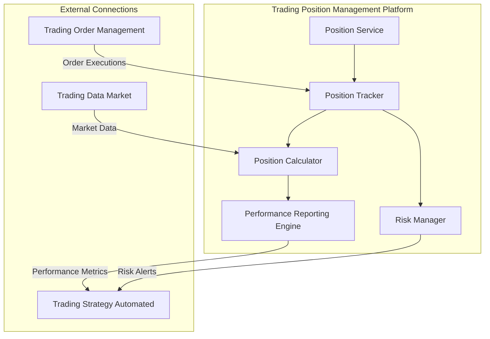

# Trading Position Management Platform

## Overview
- Tracks all positions across trading accounts
- Calculates real-time P&L and risk metrics
- Manages position limits and risk thresholds
- Implements position-based risk controls
- Generates position and risk analytics
- Provides real-time position monitoring

## Service Components

### 1. Position Tracking
- **Position State**:
  - Current position size
  - Entry price tracking
  - Average position cost
  - Unrealized P&L
  - Realized P&L
  - Position duration

### 2. Risk Management
- **Risk Metrics**:
  - Position exposure
  - Value at Risk (VaR)
  - Maximum drawdown
  - Volatility metrics
  - Correlation analysis
  - Concentration risk

### 3. Position Controls
- **Risk Limits**:
  - Maximum position size
  - Position value limits
  - Drawdown thresholds
  - Exposure limits
  - Volatility-based limits
  - Correlation-based limits

### 4. Performance Analytics
- **Position Metrics**:
  - P&L attribution
  - Risk-adjusted returns
  - Position turnover
  - Holding periods
  - Win/loss ratios
  - Sharpe ratio

## Implementation Details

### Position Update Flow
1. Receive fill notification
2. Update position state
3. Calculate risk metrics
4. Check risk thresholds
5. Generate alerts if needed
6. Update analytics

### Risk Monitoring
- **Real-time Checks**:
  - Position limit monitoring
  - Risk threshold checks
  - Drawdown monitoring
  - Exposure tracking
- **Periodic Analysis**:
  - Portfolio stress testing
  - Scenario analysis
  - Risk factor decomposition
  - Correlation updates

### Example Configuration
```python
position_params = {
    # Position Management
    'max_position_value_usd': 100000,
    'max_position_size_btc': 10,
    'position_value_alert_threshold': 0.8,  # 80% of max
    
    # Risk Management
    'max_drawdown_pct': 10,
    'var_confidence_level': 0.95,
    'risk_check_interval_ms': 1000,
    
    # P&L Calculation
    'mark_to_market_interval_ms': 1000,
    'realized_pnl_method': 'FIFO',
    
    # Monitoring
    'enable_risk_alerts': True,
    'risk_metrics_history_days': 30
}
```

## Risk Metrics

### 1. Position-Level Metrics
- Current position value
- Unrealized P&L
- Position cost basis
- Position age
- Return metrics
- Risk contribution

### 2. Portfolio-Level Metrics
- Total exposure
- Portfolio VaR
- Portfolio beta
- Correlation matrix
- Concentration metrics
- Aggregate P&L

### 3. Risk Alerts
- Position limit breaches
- Drawdown alerts
- Volatility spikes
- Correlation changes
- Exposure warnings
- P&L thresholds

## Best Practices
- Real-time position reconciliation
- Regular risk limit reviews
- Comprehensive position logging
- Multiple risk metric monitoring
- Stress testing scenarios
- Emergency position reduction plans
- Regular performance attribution

## Components

The Trading Position Management Platform consists of the following components:



### Position Service

Provides API endpoints for querying position data and managing positions.

### Position Tracker

Tracks open and closed positions, updating their status based on executed orders.

### Position Calculator

Calculates position metrics such as unrealized P&L, drawdown, and returns.

### Performance Reporting Engine

Generates comprehensive performance reports and analytics.

### Risk Manager

Monitors position risk and triggers alerts when thresholds are exceeded.

## Infrastructure by Environment

### Local Development

```yaml
# Local Development Configuration (trading-position-management/config/local.yaml)
environment: local
service:
  host: localhost
  port: 8005
database:
  type: duckdb
  path: ./data/position_management.duckdb
messaging:
  type: redis
  host: localhost
  port: 6379
risk_alerts:
  max_drawdown_percent: 10
  max_leverage: 2.0
```

### Development Environment (GCP)

```yaml
# Development Configuration (trading-position-management/config/dev.yaml)
environment: development
service:
  host: trading-position-management.development.svc.cluster.local
  port: 8005
database:
  type: bigquery
  project: development
  dataset: position_management
messaging:
  type: pubsub
  project: development
  topic_prefix: dev_
risk_alerts:
  max_drawdown_percent: 15
  max_leverage: 3.0
```

**Kubernetes Configuration:**

```yaml
# trading-position-management/k8s/dev/deployment.yaml
apiVersion: apps/v1
kind: Deployment
metadata:
  name: trading-position-management
  namespace: trading-dev
spec:
  replicas: 2
  selector:
    matchLabels:
      app: trading-position-management
  template:
    metadata:
      labels:
        app: trading-position-management
    spec:
      containers:
      - name: trading-position-management
        image: gcr.io/development/trading-position-management:latest
        ports:
        - containerPort: 8005
        env:
        - name: CONFIG_PATH
          value: /app/config/dev.yaml
        - name: GOOGLE_APPLICATION_CREDENTIALS
          value: /var/secrets/google/key.json
        volumeMounts:
        - name: google-cloud-key
          mountPath: /var/secrets/google
        - name: config-volume
          mountPath: /app/config
        resources:
          requests:
            memory: "4Gi"
            cpu: "2"
          limits:
            memory: "8Gi"
            cpu: "4"
      volumes:
      - name: google-cloud-key
        secret:
          secretName: trading-position-management-gcp-key
      - name: config-volume
        configMap:
          name: trading-position-management-config
``` 