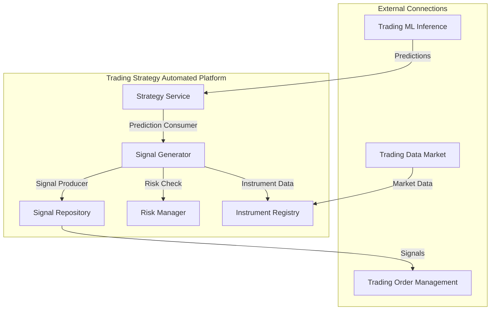

# Trading Strategy Automated Platform

## Overview

The Trading Strategy Automated Platform is responsible for transforming model predictions into actionable trading signals and executing them automatically. It implements trading strategies, evaluates prediction confidence, applies risk management rules, and generates signals for live trading scenarios.

## Components



### Strategy Service

The core service that manages the automated strategy components and provides API endpoints.

### Signal Generator

Transforms model predictions into trading signals based on configured strategy rules.

### Risk Manager

Enforces risk management limits and validates signals against portfolio constraints.

### Signal Repository

Stores generated signals and tracks their status through the order execution lifecycle.

### Instrument Registry

Maintains information about tradable instruments, including exchange-specific details.

## Infrastructure by Environment

### Local Development

```yaml
# Local Development Configuration (trading-strategy-automated/config/local.yaml)
environment: local
service:
  host: localhost
  port: 8004
database:
  type: duckdb
  path: ./data/strategy.duckdb
messaging:
  type: redis
  host: localhost
  port: 6379
signal_repository:
  max_stored_signals: 1000
  storage_days: 30
risk_management:
  max_position_size_usd: 10000
  max_single_trade_risk_percent: 2.0
  max_portfolio_risk_percent: 5.0
  max_correlation_exposure: 0.7
strategy_rules:
  default_confidence_threshold: 0.65
  min_profit_risk_ratio: 1.5
instruments:
  metadata_refresh_hours: 24
```

Local development uses:
- Local Docker containers for service isolation
- DuckDB for signal and state persistence
- Redis for messaging
- Conservative risk management settings

### Development Environment (GCP)

```yaml
# Development Configuration (trading-strategy-automated/config/dev.yaml)
environment: development
service:
  host: trading-strategy-automated.development.svc.cluster.local
  port: 8004
database:
  type: bigquery
  project: development
  dataset: strategy_automated
messaging:
  type: pubsub
  project: development
  topic_prefix: dev_
signal_repository:
  max_stored_signals: 10000
  storage_days: 90
risk_management:
  max_position_size_usd: 50000
  max_single_trade_risk_percent: 3.0
  max_portfolio_risk_percent: 12.0
  max_correlation_exposure: 0.8
strategy_rules:
  default_confidence_threshold: 0.55
  min_profit_risk_ratio: 1.2
  confidence_scaling: true
instruments:
  metadata_refresh_hours: 6
  extended_attributes: true
```

**Kubernetes Configuration:**

```yaml
# trading-strategy-automated/k8s/dev/deployment.yaml
apiVersion: apps/v1
kind: Deployment
metadata:
  name: trading-strategy-automated
  namespace: trading-dev
spec:
  replicas: 2
  selector:
    matchLabels:
      app: trading-strategy-automated
  template:
    metadata:
      labels:
        app: trading-strategy-automated
    spec:
      containers:
      - name: trading-strategy-automated
        image: gcr.io/development/trading-strategy-automated:latest
        ports:
        - containerPort: 8004
        env:
        - name: CONFIG_PATH
          value: /app/config/dev.yaml
        - name: GOOGLE_APPLICATION_CREDENTIALS
          value: /var/secrets/google/key.json
        volumeMounts:
        - name: google-cloud-key
          mountPath: /var/secrets/google
        - name: config-volume
          mountPath: /app/config
        resources:
          requests:
            memory: "4Gi"
            cpu: "2"
          limits:
            memory: "8Gi"
            cpu: "4"
      volumes:
      - name: google-cloud-key
        secret:
          secretName: trading-strategy-automated-gcp-key
      - name: config-volume
        configMap:
          name: trading-strategy-automated-config
``` 