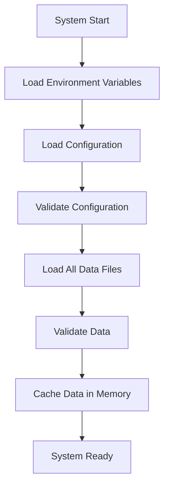
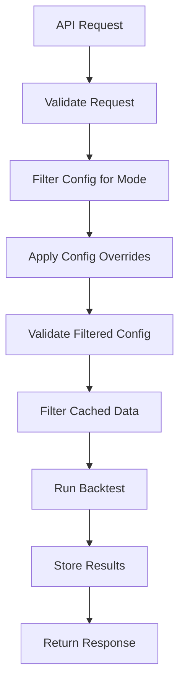
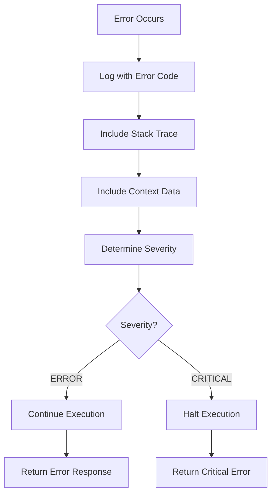

# 🚀 **COMPREHENSIVE REFACTOR PLAN**

## **📋 OVERVIEW**

Transform the system to support local deployment without Docker while maintaining compatibility with Docker deployment. Implement proper configuration loading, data validation, and backtest API with comprehensive error handling and logging.

**Key Goals:**
- Local deployment via `platform.sh` without Docker
- Comprehensive config and data loading at startup
- Proper error handling with stack traces
- Structured logging with error codes
- Redis integration for results storage
- File system results storage
- Synchronous backtest execution with queuing

---

## **🔧 ENVIRONMENT CONFIGURATION STRATEGY**

### **Single Source of Truth Approach**

Instead of maintaining 3 separate environment files with overlapping configurations, we use a **single unified approach**:

1. **`backend/env.unified`** - Single source of truth with auto-detection
2. **`.env.local`** - Optional local overrides (only what you want to change)
3. **`.env.docker`** - Optional Docker overrides (only what you want to change)
4. **`.env.production`** - Optional production overrides (only what you want to change)

### **Benefits of This Approach**

- ✅ **No duplication** - Each variable defined once
- ✅ **Auto-detection** - Automatically detects local vs Docker vs production
- ✅ **Minimal overrides** - Only override what you need to change
- ✅ **Clear precedence** - Base → Local → Docker/Production overrides
- ✅ **Easy maintenance** - Change base config in one place
- ✅ **Flexible** - Can still override anything when needed

### **How It Works**

1. **Auto-detection**: Checks for Docker environment variables to determine deployment mode
2. **Smart defaults**: Sets appropriate paths and settings based on deployment mode
3. **Override support**: Allows specific overrides without duplicating everything
4. **Fallback values**: Uses `${VAR:-default}` syntax for safe defaults

---

## **📁 DETAILED FILE CHANGES**

### **1. Environment Configuration**

#### **Create: `deploy/.env.docker`**
```bash
# Docker Environment Variables
BASIS_ENVIRONMENT=dev
BASIS_DEPLOYMENT_MODE=docker
BASIS_DATA_DIR=/app/data
BASIS_RESULTS_DIR=/app/results
BASIS_REDIS_URL=redis://redis:6379/0
BASIS_DEBUG=false
BASIS_LOG_LEVEL=DEBUG
BASIS_STARTUP_MODE=backtest
BASIS_DATA_START_DATE=2024-05-12
BASIS_DATA_END_DATE=2025-09-18
```

#### **Create: `.env.local`**
```bash
# Local Development Environment Variables
BASIS_ENVIRONMENT=dev
BASIS_DEPLOYMENT_MODE=local
BASIS_DATA_DIR=./data
BASIS_RESULTS_DIR=./results
BASIS_REDIS_URL=redis://localhost:6379/0
BASIS_DEBUG=true
BASIS_LOG_LEVEL=DEBUG
BASIS_STARTUP_MODE=backtest
BASIS_DATA_START_DATE=2024-05-12
BASIS_DATA_END_DATE=2025-09-18
```

#### **Create: `.env.production`**
```bash
# Production Environment Variables
BASIS_ENVIRONMENT=production
BASIS_DEPLOYMENT_MODE=production
BASIS_DATA_DIR=/app/data
BASIS_RESULTS_DIR=/app/results
BASIS_REDIS_URL=redis://redis:6379/0
BASIS_DEBUG=false
BASIS_LOG_LEVEL=INFO
BASIS_STARTUP_MODE=live
BASIS_DATA_START_DATE=2024-05-12
BASIS_DATA_END_DATE=2025-09-18
```

#### **Modify: `backend/env.unified` (Base Configuration Only)**
```bash
# =============================================================================
# BASIS STRATEGY BASE ENVIRONMENT CONFIGURATION
# =============================================================================
# Base configuration - overridden by .env.local, .env.docker, .env.production
# NO DEFAULTS - FAIL FAST if not set in override files

# =============================================================================
# CORE CONFIGURATION (REQUIRED)
# =============================================================================
# These MUST be set in override files - no defaults here
BASIS_ENVIRONMENT=
BASIS_DEPLOYMENT_MODE=
BASIS_DATA_DIR=
BASIS_RESULTS_DIR=
BASIS_REDIS_URL=
BASIS_DEBUG=
BASIS_LOG_LEVEL=
BASIS_STARTUP_MODE=
BASIS_DATA_START_DATE=
BASIS_DATA_END_DATE=

# =============================================================================
# API CONFIGURATION
# =============================================================================
BASIS_API_PORT=8001
BASIS_API_HOST=0.0.0.0

# =============================================================================
# LOGGING CONFIGURATION
# =============================================================================
BASIS_LOG_FORMAT=structured
BASIS_LOG_FILE_MAX_SIZE=10MB
BASIS_LOG_FILE_BACKUP_COUNT=5

# =============================================================================
# EXTERNAL API CONFIGURATION (for live mode)
# =============================================================================
# Alchemy RPC
BASIS_DEV__ALCHEMY__NETWORK=sepolia
BASIS_DEV__ALCHEMY__PRIVATE_KEY=your_key_here

# CEX API Keys (for live mode)
BASIS_DEV__CEX__BINANCE_SPOT_API_KEY=your_key_here
BASIS_DEV__CEX__BINANCE_SPOT_API_SECRET=your_secret_here
BASIS_DEV__CEX__BYBIT_API_KEY=your_key_here
BASIS_DEV__CEX__BYBIT_API_SECRET=your_secret_here
```

### **2. Platform Script Enhancement**

#### **Modify: `platform.sh`**
Add these functions and modify the main case statement:

```bash
# Function to start Redis for local development
start_redis() {
    echo -e "${BLUE}🔴 Starting Redis...${NC}"
    
    if ! command -v redis-server &> /dev/null; then
        echo -e "${RED}❌ Redis not found. Please install Redis:${NC}"
        echo "   macOS: brew install redis"
        echo "   Ubuntu: sudo apt install redis-server"
        exit 1
    fi
    
    # Check if Redis is already running
    if redis-cli ping >/dev/null 2>&1; then
        echo -e "${GREEN}✅ Redis already running${NC}"
        return 0
    fi
    
    # Start Redis in background
    redis-server --daemonize yes --port 6379
    sleep 2
    
    # Test Redis connection
    if redis-cli ping >/dev/null 2>&1; then
        echo -e "${GREEN}✅ Redis started successfully${NC}"
    else
        echo -e "${RED}❌ Redis failed to start${NC}"
        exit 1
    fi
}

# Function to stop Redis
stop_redis() {
    echo -e "${BLUE}🔴 Stopping Redis...${NC}"
    redis-cli shutdown 2>/dev/null || true
    echo -e "${GREEN}✅ Redis stopped${NC}"
}

# Function to create directories
create_directories() {
    echo -e "${BLUE}📁 Creating directories...${NC}"
    mkdir -p logs
    mkdir -p results
    mkdir -p data
    echo -e "${GREEN}✅ Directories created${NC}"
}

# Function to load environment variables
load_environment() {
    echo -e "${BLUE}🔧 Loading environment variables...${NC}"
    
    # Load base environment file
    echo -e "${BLUE}📋 Loading backend/env.unified...${NC}"
    set -a
    source backend/env.unified
    set +a
    
    # Load override files if they exist (in order of precedence)
    if [ -f ".env.local" ]; then
        echo -e "${BLUE}📋 Loading .env.local overrides...${NC}"
        set -a
        source .env.local
        set +a
    fi
    
    if [ -f ".env.docker" ] && [ "$BASIS_DEPLOYMENT_MODE" = "docker" ]; then
        echo -e "${BLUE}📋 Loading .env.docker overrides...${NC}"
        set -a
        source .env.docker
        set +a
    fi
    
    if [ -f ".env.production" ] && [ "$BASIS_DEPLOYMENT_MODE" = "production" ]; then
        echo -e "${BLUE}📋 Loading .env.production overrides...${NC}"
        set -a
        source .env.production
        set +a
    fi
    
    echo -e "${GREEN}✅ Environment variables loaded (mode: $BASIS_DEPLOYMENT_MODE)${NC}"
}

# Function to start backtest mode
start_backtest() {
    echo -e "${GREEN}🚀 Starting Basis Strategy in Backtest Mode...${NC}"
    echo "=" * 50
    
    # Load environment
    load_environment
    
    # Create directories
    create_directories
    
    # Start Redis
    start_redis
    
    # Start backend
    start_backend
    
    echo ""
    show_status
    echo ""
    echo -e "${GREEN}✨ Backtest mode ready!${NC}"
    echo -e "  • Backend API: ${YELLOW}http://localhost:$BACKEND_PORT${NC}"
    echo -e "  • API Documentation: ${YELLOW}http://localhost:$BACKEND_PORT/docs${NC}"
    echo -e "  • Health Check: ${YELLOW}http://localhost:$BACKEND_PORT/health/${NC}"
}

# Function to stop all services
stop_all() {
    echo -e "${BLUE}🛑 Stopping all services...${NC}"
    stop_services
    stop_redis
    echo -e "${GREEN}✅ All services stopped${NC}"
}

# Function to restart all services
restart_all() {
    echo -e "${GREEN}🔄 Restarting all services...${NC}"
    stop_all
    sleep 2
    start_backtest
}

# Update the main case statement
case "${1:-start}" in
    start)
        start_backtest
        ;;
    stop)
        stop_all
        ;;
    restart)
        restart_all
        ;;
    backtest)
        start_backtest
        ;;
    # ... existing cases ...
esac
```

### **3. Configuration System Cleanup**

#### **CONFIGURATION ARCHITECTURE REFACTOR**

**Current Problem**: Too many config files doing similar things:
- `config_models.py` - Pydantic models
- `venue_constants.py` - Venue constants  
- `config_loader.py` - Configuration loading
- `config_validator.py` - Configuration validation
- `health_check.py` - Health checking
- `settings.py` - Settings management
- `strategy_discovery.py` - Strategy discovery

**Proposed Clean Architecture**:

1. **`config_models.py`** - Keep as single source of truth for Pydantic models
2. **`venue_constants.py`** - Keep as venue constants
3. **`config_manager.py`** - NEW: Unified config management (replaces config_loader.py, settings.py, strategy_discovery.py)
4. **`config_validator.py`** - Keep for validation logic
5. **`health_check.py`** - Keep for health checking
6. **DELETE**: `settings.py`, `strategy_discovery.py` (functionality moved to config_manager.py)

#### **Create: `backend/src/basis_strategy_v1/infrastructure/config/config_manager.py`**
```python
"""
Unified Configuration Manager

Single source of truth for all configuration operations:
- Environment variable loading (FAIL FAST - no defaults)
- Configuration file loading and merging
- Strategy discovery and validation
- Configuration caching and health checking
"""

import os
import yaml
import json
from pathlib import Path
from typing import Dict, List, Any, Optional, Tuple
from functools import lru_cache
import logging

from .config_models import ConfigSchema, load_and_validate_config
from .config_validator import validate_configuration, ValidationResult
from .health_check import register_component, mark_component_healthy, mark_component_unhealthy
from ..monitoring.logging import log_structured_error

logger = logging.getLogger(__name__)

# Error codes for Config Manager
ERROR_CODES = {
    'CONFIG-MGR-001': 'Configuration loading failed',
    'CONFIG-MGR-002': 'Environment variable not set',
    'CONFIG-MGR-003': 'Configuration file not found',
    'CONFIG-MGR-004': 'Configuration parsing error',
    'CONFIG-MGR-005': 'Configuration validation failed',
    'CONFIG-MGR-006': 'Strategy not found',
    'CONFIG-MGR-007': 'Configuration merge failed',
    'CONFIG-MGR-008': 'Configuration health check failed'
}

class ConfigManager:
    """Unified configuration manager with fail-fast policy."""
    
    def __init__(self):
        self.base_dir = Path(__file__).parent.parent.parent.parent.parent.parent
        self.config_cache: Dict[str, Any] = {}
        self._validation_result: Optional[ValidationResult] = None
        
        # Load and validate configuration
        self._load_all_config()
        self._validate_config()
    
    def _load_all_config(self):
        """Load all configuration files and environment variables."""
        logger.info("🔄 Loading configuration...")
        
        # Load base configuration
        self.config_cache['base'] = self._load_base_config()
        
        # Load mode configurations
        self.config_cache['modes'] = self._load_all_mode_configs()
        
        # Load venue configurations
        self.config_cache['venues'] = self._load_all_venue_configs()
        
        # Load share class configurations
        self.config_cache['share_classes'] = self._load_all_share_class_configs()
        
        # Load environment variables (FAIL FAST)
        self.config_cache['env'] = self._load_environment_variables()
        
        logger.info("✅ Configuration loaded successfully")
    
    def _load_environment_variables(self) -> Dict[str, str]:
        """Load environment variables with FAIL FAST policy."""
        env_vars = {}
        required_vars = [
            'BASIS_ENVIRONMENT',
            'BASIS_DEPLOYMENT_MODE', 
            'BASIS_DATA_DIR',
            'BASIS_RESULTS_DIR',
            'BASIS_REDIS_URL',
            'BASIS_DEBUG',
            'BASIS_LOG_LEVEL',
            'BASIS_STARTUP_MODE',
            'BASIS_DATA_START_DATE',
            'BASIS_DATA_END_DATE'
        ]
        
        for var in required_vars:
            value = os.getenv(var)
            if not value:
                log_structured_error(
                    error_code='CONFIG-MGR-002',
                    message=f'REQUIRED environment variable not set: {var}',
                    component='config_manager',
                    context={'missing_variable': var, 'required_variables': required_vars}
                )
                raise ValueError(f"REQUIRED environment variable not set: {var}")
            env_vars[var] = value
        
        # Load optional variables
        for key, value in os.environ.items():
            if key.startswith('BASIS_') and key not in env_vars:
                env_vars[key] = value
        
        return env_vars
    
    def get_startup_mode(self) -> str:
        """Get startup mode from environment variables."""
        return self.config_cache['env']['BASIS_STARTUP_MODE']
    
    def get_data_directory(self) -> str:
        """Get data directory from environment variables."""
        return self.config_cache['env']['BASIS_DATA_DIR']
    
    def get_results_directory(self) -> str:
        """Get results directory from environment variables."""
        return self.config_cache['env']['BASIS_RESULTS_DIR']
    
    def get_redis_url(self) -> str:
        """Get Redis URL from environment variables."""
        return self.config_cache['env']['BASIS_REDIS_URL']
    
    def get_data_date_range(self) -> Tuple[str, str]:
        """Get data date range from environment variables."""
        start_date = self.config_cache['env']['BASIS_DATA_START_DATE']
        end_date = self.config_cache['env']['BASIS_DATA_END_DATE']
        return start_date, end_date
    
    def get_complete_config(self, mode: str = None, venue: str = None, scenario: str = None) -> Dict[str, Any]:
        """Get complete configuration by merging all relevant configs."""
        config = self.config_cache['base'].copy()
        
        if mode:
            mode_config = self.config_cache['modes'].get(mode, {})
            config = self._deep_merge(config, mode_config)
        
        if venue:
            venue_config = self.config_cache['venues'].get(venue, {})
            config = self._deep_merge(config, venue_config)
        
        return config
    
    def get_available_strategies(self) -> List[str]:
        """Get list of all available strategy names."""
        return list(self.config_cache['modes'].keys())
    
    def strategy_exists(self, strategy_name: str) -> bool:
        """Check if a strategy exists."""
        return strategy_name in self.config_cache['modes']
    
    def validate_strategy_name(self, strategy_name: str) -> None:
        """Validate that a strategy name exists."""
        if not self.strategy_exists(strategy_name):
            available_strategies = self.get_available_strategies()
            raise ValueError(
                f"Unknown strategy: {strategy_name}\n"
                f"Available strategies: {available_strategies}"
            )
    
    def _validate_config(self):
        """Validate the loaded configuration."""
        logger.info("🔍 Validating loaded configuration...")
        
        self._validation_result = validate_configuration()
        
        if not self._validation_result.is_valid:
            error_msg = f"Configuration validation failed: {', '.join(self._validation_result.errors)}"
            logger.error(error_msg)
            raise ValueError(error_msg)
        
        if self._validation_result.warnings:
            for warning in self._validation_result.warnings:
                logger.warning(f"Configuration warning: {warning}")
    
    def is_healthy(self) -> bool:
        """Check if configuration is healthy."""
        return self._validation_result is not None and self._validation_result.is_valid

# Global config manager instance
_config_manager: Optional[ConfigManager] = None

def get_config_manager() -> ConfigManager:
    """Get the global configuration manager instance."""
    global _config_manager
    
    if _config_manager is None:
        _config_manager = ConfigManager()
    
    return _config_manager
```

#### **Modify: `backend/src/basis_strategy_v1/infrastructure/config/config_validator.py`**

Add these validation methods:

```python
def validate_data_directory(self) -> List[str]:
    """Validate data directory exists and is readable."""
    errors = []
    
    try:
        data_dir = self.config_loader.get_data_directory()
        data_path = Path(data_dir)
        
        if not data_path.exists():
            errors.append(f"Data directory does not exist: {data_dir}")
        elif not data_path.is_dir():
            errors.append(f"Data directory is not a directory: {data_dir}")
        elif not os.access(data_path, os.R_OK):
            errors.append(f"Data directory is not readable: {data_dir}")
        
        # Validate results directory
        results_dir = self.config_loader.get_results_directory()
        results_path = Path(results_dir)
        
        if not results_path.exists():
            errors.append(f"Results directory does not exist: {results_dir}")
        elif not results_path.is_dir():
            errors.append(f"Results directory is not a directory: {results_dir}")
        elif not os.access(results_path, os.W_OK):
            errors.append(f"Results directory is not writable: {results_dir}")
            
    except Exception as e:
        errors.append(f"Data directory validation failed: {str(e)}")
    
    return errors

def validate_data_files(self) -> List[str]:
    """Validate all required data files exist."""
    errors = []
    
    try:
        data_dir = Path(self.config_loader.get_data_directory())
        start_date, end_date = self.config_loader.get_data_date_range()
        
        # Get all mode configs to determine required data files
        mode_configs = self.config_loader.get_all_mode_configs()
        
        for mode_name, mode_config in mode_configs.items():
            data_requirements = mode_config.get('data_requirements', [])
            
            for requirement in data_requirements:
                # Map requirement to actual file pattern
                file_pattern = self._get_file_pattern_for_requirement(requirement)
                if file_pattern:
                    file_path = data_dir / file_pattern
                    if not file_path.exists():
                        errors.append(f"Required data file not found for {mode_name}: {file_path}")
        
    except Exception as e:
        errors.append(f"Data file validation failed: {str(e)}")
    
    return errors

def _get_file_pattern_for_requirement(self, requirement: str) -> Optional[str]:
    """Map data requirement to file pattern."""
    mapping = {
        'aave_lending_rates': 'protocol_data/aave/rates/aave_v3_aave-v3-ethereum_USDT_rates_*.csv',
        'gas_costs': 'gas_costs/ethereum_gas_costs_*.csv',
        'execution_costs': 'execution_costs/execution_costs_*.csv',
        'aave_risk_params': 'protocol_data/aave/risk_params/aave_v3_risk_parameters.json',
        # Add more mappings as needed
    }
    return mapping.get(requirement)
```

### **4. Data Provider Updates**

#### **Modify: `backend/src/basis_strategy_v1/infrastructure/data/historical_data_provider.py`**

Remove these methods (lines 639-800):
- `_create_minimal_gas_costs()`
- `_create_minimal_execution_costs()`
- `_create_minimal_aave_rates()`
- `_create_minimal_aave_risk_parameters()`

Add these methods:

```python
def _load_all_data_at_startup(self):
    """Load all data files at startup for all modes."""
    logger.info("🔄 Loading all data files at startup...")
    
    try:
        # Load data for all modes
        all_modes = ['pure_lending', 'btc_basis', 'eth_leveraged', 'eth_staking_only', 'usdt_market_neutral', 'usdt_market_neutral_no_leverage']
        
        for mode in all_modes:
            logger.info(f"Loading data for mode: {mode}")
            self._load_data_for_mode(mode)
        
        logger.info("✅ All data loaded successfully")
        
    except Exception as e:
        logger.error(f"Failed to load data at startup: {str(e)}")
        raise

def _load_data_for_mode(self, mode: str):
    """Load data for a specific mode."""
    # Load costs
    self._load_gas_costs()
    self._load_execution_costs()
    
    # Load mode-specific data
    if mode == 'pure_lending':
        self._load_aave_rates('USDT')
        self._load_aave_risk_parameters()
    elif mode == 'btc_basis':
        self._load_btc_spot_data()
        self._load_btc_futures_data()
        self._load_btc_funding_data()
    # Add more mode-specific loading as needed

def _validate_data_at_startup(self):
    """Validate all loaded data."""
    logger.info("🔍 Validating loaded data...")
    
    try:
        start_date, end_date = self.config_loader.get_data_date_range()
        start_ts = pd.Timestamp(start_date, tz='UTC')
        end_ts = pd.Timestamp(end_date, tz='UTC')
        
        for data_type, data in self.data.items():
            if isinstance(data, pd.DataFrame) and 'timestamp' in data.columns:
                data_start = data.index.min()
                data_end = data.index.max()
                
                if data_start > start_ts:
                    raise ValueError(f"Data {data_type} starts after required start date: {data_start} > {start_ts}")
                
                if data_end < end_ts:
                    raise ValueError(f"Data {data_type} ends before required end date: {data_end} < {end_ts}")
        
        logger.info("✅ Data validation passed")
        
    except Exception as e:
        logger.error(f"Data validation failed: {str(e)}")
        raise
```

### **5. API and Service Updates**

#### **Modify: `backend/src/basis_strategy_v1/api/main.py`**

Add these imports and modify the lifespan function:

```python
from ..infrastructure.config.config_loader import get_config_loader
from ..infrastructure.data.historical_data_provider import DataProvider
from ..infrastructure.monitoring.logging import log_structured_error

@asynccontextmanager
async def lifespan(app: FastAPI):
    """Application lifespan events."""
    # Startup
    settings = get_settings()
    logger.info(
        "Starting Basis Strategy API", 
        environment=settings["environment"],
        version="2.0.0"
    )
    
    # Initialize metrics
    setup_metrics()
    
    # Load configuration
    try:
        config_loader = get_config_loader()
        startup_mode = config_loader.get_startup_mode()
        logger.info(f"Startup mode: {startup_mode}")
        
        # Load and validate all data at startup
        if startup_mode == 'backtest':
            logger.info("Loading historical data for backtest mode...")
            data_provider = DataProvider(
                data_dir=config_loader.get_data_directory(),
                mode='all',  # Load all modes
                execution_mode='backtest',
                config=config_loader.get_base_config()
            )
            
            # Load all data
            data_provider._load_all_data_at_startup()
            
            # Validate data
            data_provider._validate_data_at_startup()
            
            logger.info("Historical data loaded and validated successfully")
        
    except Exception as e:
        log_structured_error(
            error_code='CONFIG-001',
            message=f'Startup configuration failed: {str(e)}',
            component='main',
            context={'startup_mode': startup_mode, 'error': str(e)}
        )
        raise
    
    logger.info("API startup complete")
    
    yield
    
    # Shutdown
    logger.info("Shutting down Basis Strategy API")
```

#### **Modify: `backend/src/basis_strategy_v1/core/services/backtest_service.py`**

Replace the existing `run_backtest` method:

```python
async def run_backtest(self, request: BacktestRequest) -> str:
    """Run a backtest synchronously with queuing."""
    # Validate request
    errors = request.validate()
    if errors:
        logger.error(f"[BT-001] Backtest request validation failed: {', '.join(errors)}")
        raise ValueError(f"Invalid request: {', '.join(errors)}")
    
    # Check if another backtest is running
    if self.running_backtests:
        logger.info(f"Backtest already running, queuing request {request.request_id}")
        # Add to queue (implement simple queue)
        self._queue_backtest(request)
        return request.request_id
    
    try:
        # Filter and validate config for this backtest
        config = self._filter_config_for_backtest(request)
        
        # Initialize strategy engine
        strategy_engine = EventDrivenStrategyEngine(config)
        
        # Store request info
        self.running_backtests[request.request_id] = {
            'request': request,
            'config': config,
            'status': 'running',
            'progress': 0.0,
            'started_at': datetime.utcnow()
        }
        
        # Run backtest
        results = await strategy_engine.run_backtest(
            start_date=request.start_date.strftime('%Y-%m-%d'),
            end_date=request.end_date.strftime('%Y-%m-%d')
        )
        
        # Store results
        self.completed_backtests[request.request_id] = {
            'request_id': request.request_id,
            'strategy_name': request.strategy_name,
            'results': results,
            'completed_at': datetime.utcnow()
        }
        
        # Update status
        self.running_backtests[request.request_id]['status'] = 'completed'
        self.running_backtests[request.request_id]['progress'] = 1.0
        self.running_backtests[request.request_id]['completed_at'] = datetime.utcnow()
        
        # Store in Redis and file system
        await self._store_results(request.request_id, results)
        
        # Process next queued backtest
        self._process_next_queued_backtest()
        
        return request.request_id
        
    except Exception as e:
        # Update status to failed
        if request.request_id in self.running_backtests:
            self.running_backtests[request.request_id]['status'] = 'failed'
            self.running_backtests[request.request_id]['error'] = str(e)
        
        logger.error(f"Backtest failed: {str(e)}")
        raise

def _filter_config_for_backtest(self, request: BacktestRequest) -> Dict[str, Any]:
    """Filter and validate config for backtest."""
    # Get base config
    config_loader = get_config_loader()
    config = config_loader.get_complete_config(mode=request.strategy_name)
    
    # Apply overrides
    if request.config_overrides:
        config = self._deep_merge(config, request.config_overrides)
    
    # Validate filtered config
    from ..infrastructure.config.config_validator import validate_configuration
    validation_result = validate_configuration()
    
    if not validation_result.is_valid:
        raise ValueError(f"Config validation failed: {', '.join(validation_result.errors)}")
    
    return config

async def _store_results(self, request_id: str, results: Dict[str, Any]):
    """Store results in Redis and file system."""
    # Store in Redis
    import redis
    import json
    
    r = redis.Redis.from_url(get_config_loader().get_redis_url())
    r.set(f"backtest:results:{request_id}", json.dumps(results))
    
    # Store in file system
    results_dir = Path(get_config_loader().get_results_directory())
    request_dir = results_dir / request_id
    request_dir.mkdir(exist_ok=True)
    
    with open(request_dir / "results.json", "w") as f:
        json.dump(results, f, indent=2, default=str)
```

### **6. Position Monitor Updates**

#### **Modify: `backend/src/basis_strategy_v1/core/strategies/components/position_monitor.py`**

Update to use API request parameters (NO DEFAULTS):

```python
def __init__(self, config: Dict[str, Any], execution_mode: str, initial_capital: float, share_class: str):
    """
    Initialize position monitor with capital from API request.
    
    Args:
        config: Strategy configuration
        execution_mode: 'backtest' or 'live' (from startup config)
        initial_capital: Initial capital amount from API request
        share_class: Share class from API request ('USDT' or 'ETH')
    """
    self.config = config
    self.execution_mode = execution_mode
    self.initial_capital = initial_capital
    self.share_class = share_class
    
    # Initialize with capital from API request (NO DEFAULTS)
    self._initialize_capital()
    
    # Initialize monitors
    self._token_monitor = TokenBalanceMonitor()
    self._derivative_monitor = DerivativeBalanceMonitor()
    
    # Redis for inter-component communication
    self.redis = redis.Redis() if execution_mode == 'live' else None

def _initialize_capital(self):
    """Initialize capital based on share class and initial capital from API request."""
    if self.share_class == 'USDT':
        self._token_monitor.wallet['USDT'] = float(self.initial_capital)
    elif self.share_class == 'ETH':
        self._token_monitor.wallet['ETH'] = float(self.initial_capital)
    else:
        raise ValueError(f"Invalid share class: {self.share_class}")
    
    logger.info(f"Initialized {self.share_class} capital: {self.initial_capital}")
```

### **7. Event Engine Updates**

#### **Modify: `backend/src/basis_strategy_v1/core/event_engine/event_driven_strategy_engine.py`**

Update to use proper config injection and data flow:

```python
def __init__(self, config: Dict[str, Any], execution_mode: str, data_provider: DataProvider):
    """
    Initialize event engine with injected configuration and data.
    
    Args:
        config: Strategy configuration (from API request)
        execution_mode: 'backtest' or 'live' (from startup config)
        data_provider: Pre-loaded data provider with all data in memory
    """
    self.config = config
    self.mode = config.get('mode')
    self.share_class = config.get('share_class')
    self.execution_mode = execution_mode  # Injected from startup config
    
    # Use pre-loaded data provider (data already in memory)
    self.data_provider = data_provider
    
    # Initialize components with proper config
    self._initialize_components()

def _initialize_components(self):
    """Initialize all components with proper configuration and dependency tracking."""
    from ...infrastructure.config.health_check import mark_component_healthy, mark_component_unhealthy
    from ...infrastructure.monitoring.logging import log_structured_error
    
    # Component initialization order (dependencies first)
    components = [
        ('position_monitor', PositionMonitor, ['config', 'execution_mode', 'initial_capital', 'share_class']),
        ('event_logger', EventLogger, ['config', 'execution_mode']),
        ('exposure_monitor', ExposureMonitor, ['config', 'execution_mode']),
        ('risk_monitor', RiskMonitor, ['config', 'execution_mode']),
        ('pnl_calculator', PnLCalculator, ['config', 'execution_mode'])
    ]
    
    initialized_components = []
    
    for component_name, component_class, init_params in components:
        try:
            # Initialize component with proper parameters
            if component_name == 'position_monitor':
                self.position_monitor = component_class(
                    config=self.config,
                    execution_mode=self.execution_mode,
                    initial_capital=self.config.get('initial_capital'),
                    share_class=self.config.get('share_class')
                )
            else:
                setattr(self, component_name, component_class(
                    config=self.config,
                    execution_mode=self.execution_mode
                ))
            
            # Mark component as healthy
            mark_component_healthy(component_name)
            initialized_components.append(component_name)
            
            logger.info(f"✅ Component {component_name} initialized successfully")
            
        except Exception as e:
            # Mark this component as unhealthy
            mark_component_unhealthy(component_name, str(e))
            
            # Mark all downstream components as unhealthy (they depend on this one)
            for downstream_name, _, _ in components[components.index((component_name, component_class, init_params)) + 1:]:
                mark_component_unhealthy(downstream_name, f"Dependency {component_name} failed: {str(e)}")
            
            # Log structured error
            log_structured_error(
                error_code='COMPONENT-001',
                message=f'Component {component_name} initialization failed: {str(e)}',
                component='event_engine',
                context={
                    'component_name': component_name,
                    'initialized_components': initialized_components,
                    'failed_component': component_name,
                    'error': str(e)
                }
            )
            
            raise ValueError(f"Component {component_name} initialization failed: {str(e)}")
    
    logger.info(f"✅ All components initialized successfully: {initialized_components}")
```

### **8. Data Flow Architecture**

#### **DATA FLOW DESIGN DECISIONS**

**Question**: How do components access data?

**Answer**: Components access data via filtered data memory source loaded through startup_mode:

1. **Startup**: Load ALL data for ALL modes into memory via `DataProvider._load_all_data_at_startup()`
2. **Backtest Request**: Filter data for specific mode via `DataProvider._load_data_for_mode()` (filters from memory, doesn't reload from CSV)
3. **Event Loop**: Components get data for current timestamp via `self.data_provider.get_data_for_timestamp(timestamp)`

**Data Access Pattern**:
```python
# In event loop
current_timestamp = event.timestamp

# Initialize position and time from cached data
self.position_monitor.initialize_from_data(self.data_provider, current_timestamp)
self.event_logger.initialize_from_data(self.data_provider, current_timestamp)

# Get data for current timestamp
eth_price = self.data_provider.get_data_for_timestamp('eth_price', current_timestamp)
usdt_supply_rate = self.data_provider.get_data_for_timestamp('usdt_supply_rate', current_timestamp)
```

**Registry Pattern for Live/Backtest**:
```python
# Backtest mode: Data from historical CSV files
class BacktestDataRegistry:
    def get_data_for_timestamp(self, data_type: str, timestamp: pd.Timestamp):
        return self.historical_data[data_type].loc[timestamp]

# Live mode: Data from real-time APIs
class LiveDataRegistry:
    def get_data_for_timestamp(self, data_type: str, timestamp: pd.Timestamp):
        return self.real_time_data[data_type].get_current_value()

# Event Engine uses registry interface
class EventDrivenStrategyEngine:
    def __init__(self, config, execution_mode, data_registry):
        self.data_registry = data_registry  # Registry interface
        self.execution_mode = execution_mode
```

**Benefits**:
- ✅ Fast access (data in memory for backtest, real-time for live)
- ✅ No CSV reloading during backtest
- ✅ Components get only what they need for current timestamp
- ✅ Clean separation of concerns
- ✅ Dual structure for backtest/live modes
- ✅ Position and time initialized from cached data

#### **COMPONENT INITIALIZATION FLOW**

```python
# 1. Startup (main.py)
config_manager = get_config_manager()
data_provider = DataProvider()
data_provider._load_all_data_at_startup()  # Load ALL data

# 2. Backtest Request (backtest_service.py)
filtered_config = config_manager.get_complete_config(mode=request.strategy_name)
data_provider._load_data_for_mode(request.strategy_name)  # Filter from memory

# 3. Event Engine Initialization
strategy_engine = EventDrivenStrategyEngine(
    config=filtered_config,
    execution_mode=config_manager.get_startup_mode(),
    data_provider=data_provider  # Pre-loaded data
)

# 4. Component Initialization
position_monitor = PositionMonitor(
    config=filtered_config,
    execution_mode=config_manager.get_startup_mode(),
    initial_capital=request.initial_capital,  # From API request
    share_class=request.share_class  # From API request
)
```

### **9. Documentation Updates**

#### **Modify: `docs/CONFIG_WORKFLOW.md`**

Add these sections:

```markdown
## **Environment Variable Configuration**

### **Environment File Structure**

The system uses a hierarchical environment variable approach:

1. **`backend/env.unified`** - Base configuration (NO DEFAULTS - FAIL FAST)
2. **`.env.local`** - Local development overrides
3. **`deploy/.env.docker`** - Docker development overrides  
4. **`.env.production`** - Production overrides

### **Required Environment Variables**

The following environment variables MUST be set in override files:

```bash
BASIS_ENVIRONMENT=dev|staging|production
BASIS_DEPLOYMENT_MODE=local|docker|production
BASIS_DATA_DIR=/path/to/data
BASIS_RESULTS_DIR=/path/to/results
BASIS_REDIS_URL=redis://host:port/db
BASIS_DEBUG=true|false
BASIS_LOG_LEVEL=DEBUG|INFO|WARNING|ERROR
BASIS_STARTUP_MODE=backtest|live
BASIS_DATA_START_DATE=2024-05-12
BASIS_DATA_END_DATE=2025-09-18
```

### **Configuration Loading Order**

1. Load `backend/env.unified` (base config)
2. Load `.env.local` (local overrides)
3. Load `deploy/.env.docker` (if BASIS_DEPLOYMENT_MODE=docker)
4. Load `.env.production` (if BASIS_DEPLOYMENT_MODE=production)

### **Fail Fast Policy**

- **NO DEFAULTS** in environment variable loading
- **STOP AND ASK** if missing required variables
- **NO ASSUMPTIONS** about missing configuration

## **Configuration System Architecture**

### **Unified Configuration Manager**

The `ConfigManager` class provides:

- Environment variable loading with fail-fast policy
- Configuration file loading and merging
- Strategy discovery and validation
- Configuration caching and health checking

### **Configuration Validation**

1. **Startup**: Validate complete config for all modes
2. **Backtest Request**: Revalidate filtered config with user overrides
3. **Fail Fast**: Stop on any validation errors

### **Component Health Checking**

Components are marked healthy/unhealthy during initialization:

- **Healthy**: Component initialized successfully
- **Unhealthy**: Component failed initialization
- **Dependencies**: Downstream components marked unhealthy if upstream fails
```

#### **Modify: `docs/DATA_VALIDATION_GUIDE.md`**

Add these sections:

```markdown
## **Data Loading and Validation**

### **Startup Data Loading**

At startup, the system loads ALL data for ALL modes:

```python
# Load all data files at startup
data_provider._load_all_data_at_startup()

# Validate all data files exist and cover required date range
data_provider._validate_data_at_startup()
```

### **Data Validation Requirements**

1. **File Existence**: All required data files must exist
2. **Date Range Coverage**: Data must cover BASIS_DATA_START_DATE to BASIS_DATA_END_DATE
3. **Data Quality**: No missing values or invalid timestamps
4. **Fail Fast**: Stop on any validation errors

### **Backtest Data Filtering**

During backtest requests, data is filtered from memory:

```python
# Filter data for specific mode (no CSV reloading)
data_provider._load_data_for_mode(mode_name)
```

### **Data Access Pattern**

Components access data via registry interface:

```python
# Get data for current timestamp
eth_price = data_registry.get_data_for_timestamp('eth_price', timestamp)
usdt_supply_rate = data_registry.get_data_for_timestamp('usdt_supply_rate', timestamp)
```

### **Registry Pattern**

- **Backtest**: Data from historical CSV files (pre-loaded)
- **Live**: Data from real-time APIs (updated on events)
- **Interface**: Same interface for both modes
```

#### **Modify: `docs/ENVIRONMENT_VARIABLES.md`**

Add these sections:

```markdown
## **Environment Variable Structure**

### **File Hierarchy**

```
backend/env.unified          # Base configuration (NO DEFAULTS)
.env.local                   # Local development overrides
deploy/.env.docker          # Docker development overrides
.env.production             # Production overrides
```

### **Loading Order**

1. `backend/env.unified` (base)
2. `.env.local` (local overrides)
3. `deploy/.env.docker` (if BASIS_DEPLOYMENT_MODE=docker)
4. `.env.production` (if BASIS_DEPLOYMENT_MODE=production)

### **Required Variables**

All variables in `backend/env.unified` MUST be set in override files:

```bash
# Core Configuration
BASIS_ENVIRONMENT=dev|staging|production
BASIS_DEPLOYMENT_MODE=local|docker|production
BASIS_DATA_DIR=/path/to/data
BASIS_RESULTS_DIR=/path/to/results
BASIS_REDIS_URL=redis://host:port/db
BASIS_DEBUG=true|false
BASIS_LOG_LEVEL=DEBUG|INFO|WARNING|ERROR
BASIS_STARTUP_MODE=backtest|live
BASIS_DATA_START_DATE=2024-05-12
BASIS_DATA_END_DATE=2025-09-18
```

### **Fail Fast Policy**

- **NO DEFAULTS**: All required variables must be explicitly set
- **STOP AND ASK**: System stops if any required variable is missing
- **NO ASSUMPTIONS**: No fallback values or assumptions

### **Error Handling**

Missing environment variables trigger structured errors:

```json
{
  "error_code": "CONFIG-MGR-002",
  "message": "REQUIRED environment variable not set: BASIS_DATA_DIR",
  "component": "config_manager",
  "context": {
    "missing_variable": "BASIS_DATA_DIR",
    "required_variables": ["BASIS_ENVIRONMENT", "BASIS_DATA_DIR", ...]
  }
}
```
```

#### **Modify: `docs/specs/09_DATA_PROVIDER.md`**

Add these sections:

```markdown
## **Data Registry Pattern**

### **Registry Interface**

The data provider implements a registry pattern for both backtest and live modes:

```python
class DataRegistry:
    def get_data_for_timestamp(self, data_type: str, timestamp: pd.Timestamp):
        """Get data for specific timestamp."""
        pass

class BacktestDataRegistry(DataRegistry):
    def get_data_for_timestamp(self, data_type: str, timestamp: pd.Timestamp):
        """Get historical data from pre-loaded CSV files."""
        return self.historical_data[data_type].loc[timestamp]

class LiveDataRegistry(DataRegistry):
    def get_data_for_timestamp(self, data_type: str, timestamp: pd.Timestamp):
        """Get real-time data from APIs."""
        return self.real_time_data[data_type].get_current_value()
```

### **Data Loading Workflow**

#### **Startup (All Modes)**

1. Load ALL data files for ALL modes into memory
2. Validate data coverage for required date range
3. Fail fast if any data files missing or invalid

#### **Backtest Request**

1. Filter data for specific mode from memory
2. No CSV reloading - use pre-loaded data
3. Validate filtered data covers backtest date range

#### **Live Mode**

1. Initialize real-time data connections
2. Update data on events (not by timestamp iteration)
3. Use same registry interface as backtest

### **Component Data Access**

Components access data via registry interface:

```python
# In event loop
current_timestamp = event.timestamp

# Initialize position and time from cached data
self.position_monitor.initialize_from_data(self.data_registry, current_timestamp)

# Get data for current timestamp
eth_price = self.data_registry.get_data_for_timestamp('eth_price', current_timestamp)
usdt_supply_rate = self.data_registry.get_data_for_timestamp('usdt_supply_rate', current_timestamp)
```

### **Data Validation**

#### **Startup Validation**

- All required data files exist
- Data covers BASIS_DATA_START_DATE to BASIS_DATA_END_DATE
- No missing values or invalid timestamps
- Fail fast on any validation errors

#### **Backtest Validation**

- Filtered data covers backtest date range
- All required data types available for mode
- Data quality checks pass

### **Error Handling**

Data validation failures trigger structured errors:

```json
{
  "error_code": "DATA-001",
  "message": "Data file not found: aave_v3_USDT_rates_2024-01-01_2025-09-18_hourly.csv",
  "component": "data_provider",
  "context": {
    "missing_file": "aave_v3_USDT_rates_2024-01-01_2025-09-18_hourly.csv",
    "required_files": ["aave_v3_USDT_rates_*.csv", "btc_spot_*.csv", ...]
  }
}
```
```

#### **Modify: `docs/specs/11_ERROR_LOGGING_STANDARD.md`**

Add these sections:

```markdown
## **Configuration Manager Error Codes**

### **Error Code Structure**

Configuration Manager uses error codes with prefix `CONFIG-MGR-`:

```python
ERROR_CODES = {
    'CONFIG-MGR-001': 'Configuration loading failed',
    'CONFIG-MGR-002': 'Environment variable not set',
    'CONFIG-MGR-003': 'Configuration file not found',
    'CONFIG-MGR-004': 'Configuration parsing error',
    'CONFIG-MGR-005': 'Configuration validation failed',
    'CONFIG-MGR-006': 'Strategy not found',
    'CONFIG-MGR-007': 'Configuration merge failed',
    'CONFIG-MGR-008': 'Configuration health check failed'
}
```

### **Structured Error Examples**

#### **Missing Environment Variable**

```json
{
  "error_code": "CONFIG-MGR-002",
  "message": "REQUIRED environment variable not set: BASIS_DATA_DIR",
  "component": "config_manager",
  "context": {
    "missing_variable": "BASIS_DATA_DIR",
    "required_variables": ["BASIS_ENVIRONMENT", "BASIS_DATA_DIR", "BASIS_RESULTS_DIR", ...]
  }
}
```

#### **Configuration Validation Failure**

```json
{
  "error_code": "CONFIG-MGR-005",
  "message": "Configuration validation failed: Missing required field 'mode'",
  "component": "config_manager",
  "context": {
    "validation_errors": ["Missing required field 'mode'", "Invalid share_class value"],
    "config_file": "pure_lending.yaml"
  }
}
```

#### **Strategy Not Found**

```json
{
  "error_code": "CONFIG-MGR-006",
  "message": "Unknown strategy: invalid_strategy",
  "component": "config_manager",
  "context": {
    "requested_strategy": "invalid_strategy",
    "available_strategies": ["pure_lending", "btc_basis", "eth_leveraged", ...]
  }
}
```

### **Component Health Error Codes**

#### **Component Initialization Failure**

```json
{
  "error_code": "COMPONENT-001",
  "message": "Component position_monitor initialization failed: Invalid share class: INVALID",
  "component": "event_engine",
  "context": {
    "component_name": "position_monitor",
    "initialized_components": ["event_logger"],
    "failed_component": "position_monitor",
    "error": "Invalid share class: INVALID"
  }
}
```

### **Data Provider Error Codes**

#### **Data File Not Found**

```json
{
  "error_code": "DATA-001",
  "message": "Data file not found: aave_v3_USDT_rates_2024-01-01_2025-09-18_hourly.csv",
  "component": "data_provider",
  "context": {
    "missing_file": "aave_v3_USDT_rates_2024-01-01_2025-09-18_hourly.csv",
    "required_files": ["aave_v3_USDT_rates_*.csv", "btc_spot_*.csv", ...],
    "data_directory": "./data"
  }
}
```

#### **Data Validation Failure**

```json
{
  "error_code": "DATA-002",
  "message": "Data validation failed: Missing data for date range 2024-05-12 to 2025-09-18",
  "component": "data_provider",
  "context": {
    "validation_errors": ["Data ends before required end date: 2024-12-31 < 2025-09-18"],
    "required_date_range": {"start": "2024-05-12", "end": "2025-09-18"},
    "actual_date_range": {"start": "2024-01-01", "end": "2024-12-31"}
  }
}
```

### **Error Handling Best Practices**

1. **Fail Fast**: Stop immediately on configuration or data errors
2. **Structured Logging**: Use consistent error code format
3. **Context**: Include relevant context for debugging
4. **Health Checks**: Mark components healthy/unhealthy
5. **Dependencies**: Mark downstream components unhealthy if upstream fails
```

#### **Modify: `docs/WORKFLOW_GUIDE.md`**

Add these sections:

```markdown
## **Configuration and Data Workflow**

### **Startup Workflow**

1. **Load Environment Variables**
   - Load `backend/env.unified` (base config)
   - Load override files (`.env.local`, `.env.docker`, `.env.production`)
   - Fail fast if any required variables missing

2. **Load Configuration**
   - Load all mode configurations from `configs/modes/`
   - Load all venue configurations from `configs/venues/`
   - Load all share class configurations from `configs/share_classes/`
   - Validate complete configuration

3. **Load Data**
   - Load ALL data files for ALL modes into memory
   - Validate data coverage for required date range
   - Fail fast if any data files missing or invalid

4. **Initialize Components**
   - Register components with health checker
   - Initialize components in dependency order
   - Mark components healthy/unhealthy with error details

### **Backtest Request Workflow**

1. **Validate Request**
   - Check strategy exists
   - Validate request parameters
   - Check system health

2. **Filter Configuration**
   - Get base configuration
   - Apply mode-specific configuration
   - Apply user overrides from request
   - Revalidate filtered configuration

3. **Filter Data**
   - Filter data for specific mode from memory
   - No CSV reloading - use pre-loaded data
   - Validate filtered data covers backtest date range

4. **Initialize Event Engine**
   - Create event engine with filtered config
   - Pass pre-loaded data registry
   - Initialize components with API request parameters

5. **Execute Backtest**
   - Run event loop with filtered data
   - Components access data via registry interface
   - Store results in Redis and file system

### **Live Mode Workflow**

1. **Initialize Live Data Registry**
   - Connect to real-time data sources
   - Initialize data update mechanisms
   - Use same registry interface as backtest

2. **Event-Driven Updates**
   - Update data on events (not by timestamp iteration)
   - Components access current data via registry
   - Execute trades based on real-time data

### **Component Initialization Workflow**

1. **Dependency Order**
   - Initialize components in dependency order
   - Mark each component healthy after successful initialization
   - Mark downstream components unhealthy if upstream fails

2. **Error Handling**
   - Log structured errors for each failure
   - Include component context and error details
   - Fail fast on any component initialization error

3. **Health Checking**
   - Register components with health checker
   - Track component status and dependencies
   - Provide health summary for monitoring

### **Data Access Workflow**

1. **Registry Pattern**
   - Use registry interface for data access
   - Same interface for backtest and live modes
   - Components get data for current timestamp only

2. **Data Filtering**
   - Filter data for specific mode from memory
   - No CSV reloading during backtest
   - Real-time updates for live mode

3. **Position and Time Initialization**
   - Initialize position and time from cached data
   - Components get current state from data registry
   - Maintain consistency across components
```

```markdown
## **Startup Mode Configuration**

The system supports two startup modes:
- `backtest`: Load historical data and prepare for backtest execution
- `live`: Load live data providers and prepare for live trading

Configure via environment variable:
```bash
BASIS_STARTUP_MODE=backtest
```

## **Data Directory Configuration**

Data directories are configurable via environment variables:
```bash
BASIS_DATA_DIR=./data          # Local development
BASIS_DATA_DIR=/app/data       # Docker development
BASIS_RESULTS_DIR=./results    # Local development
BASIS_RESULTS_DIR=/app/results # Docker development
```

## **Local vs Docker Deployment**

### **Local Development**
- Uses `backend/env.local`
- Data directory: `./data` (relative to project root)
- Results directory: `./results` (relative to project root)
- Redis: `redis://localhost:6379/0`

### **Docker Development**
- Uses `backend/env.docker`
- Data directory: `/app/data` (mounted from host)
- Results directory: `/app/results` (mounted from host)
- Redis: `redis://redis:6379/0`
```

#### **Modify: `docs/WORKFLOW_GUIDE.md`**

Add these sections:

```markdown
## **Startup Data Loading Workflow**



## **Backtest API Workflow**



## **Error Handling Workflow**


```

#### **Modify: `docs/specs/09_DATA_PROVIDER.md`**

Remove references to minimal data creation and add:

```markdown
## **Startup Data Validation**

The DataProvider validates all data files at startup:
- File existence
- Date range coverage
- Timestamp alignment
- Data format validation

## **Comprehensive Data Loading**

All data files are loaded at startup for all modes:
- Pure lending data
- BTC basis data
- ETH leveraged data
- Market neutral data
- All venue data

## **Health Check Integration**

Data validation is integrated with health checks:
- Startup validation
- Runtime validation
- Error reporting with stack traces
```

---

## **🚀 IMPLEMENTATION PHASES**

### **Phase 1: Environment and Configuration (Priority: HIGH)**
1. Create `env.local` and `env.docker`
2. Update `config_loader.py` for startup mode detection
3. Update `config_validator.py` for comprehensive validation
4. Update `platform.sh` for environment loading

### **Phase 2: Data Provider and Validation (Priority: HIGH)**
1. Remove minimal data creation from `historical_data_provider.py`
2. Add comprehensive data loading at startup
3. Add data validation integration
4. Update health checks

### **Phase 3: API and Service (Priority: HIGH)**
1. Update existing backtest API endpoints
2. Update `backtest_service.py` for synchronous execution
3. Add Redis integration
4. Add file system results storage

### **Phase 4: Position Monitor and Engine (Priority: MEDIUM)**
1. Fix position monitor initialization
2. Update event engine for proper config loading
3. Add structured logging throughout

### **Phase 5: Documentation and Testing (Priority: MEDIUM)**
1. Update all documentation
2. Add comprehensive error handling
3. Test end-to-end workflow
4. Validate Docker compatibility

---

## **✅ IMPLEMENTATION CHECKLIST**

### **Environment Configuration**
- [ ] Create `backend/env.local`
- [ ] Create `backend/env.docker`
- [ ] Update `backend/env.unified`
- [ ] Test environment loading

### **Platform Script**
- [ ] Add `start backtest` command
- [ ] Add `stop` command
- [ ] Add `restart` command
- [ ] Add Redis startup
- [ ] Add directory creation
- [ ] Test platform commands

### **Configuration System**
- [ ] Update `config_loader.py`
- [ ] Update `config_validator.py`
- [ ] Add startup mode detection
- [ ] Add data directory validation
- [ ] Test configuration loading

### **Data Provider**
- [ ] Remove minimal data creation
- [ ] Add comprehensive data loading
- [ ] Add data validation
- [ ] Test data loading

### **API and Service**
- [ ] Update `main.py` for startup
- [ ] Update `backtest_service.py`
- [ ] Add Redis integration
- [ ] Add file system storage
- [ ] Test API endpoints

### **Position Monitor**
- [ ] Fix initialization
- [ ] Add share class awareness
- [ ] Test position tracking

### **Event Engine**
- [ ] Remove hardcoded overrides
- [ ] Use proper config loader
- [ ] Test engine initialization

### **Documentation**
- [ ] Update `CONFIG_WORKFLOW.md`
- [ ] Update `WORKFLOW_GUIDE.md`
- [ ] Update `09_DATA_PROVIDER.md`
- [ ] Test documentation

### **Testing and quality gates**
- [ ] Test local deployment
- [ ] Test Docker deployment

---

## **🚨 STRICT IMPLEMENTATION REQUIREMENTS**

### **CRITICAL: No Fallbacks, No Defaults, No Graceful Degradation**

#### **1. Configuration and Environment Variables**

**WRONG** ❌:
```python
# DON'T DO THIS - No fallbacks!
data_dir = os.getenv('BASIS_DATA_DIR', './data')  # BAD: Default value
config = load_config() or {}  # BAD: Empty dict fallback
mode = config.get('mode', 'pure_lending')  # BAD: Default mode
```

**RIGHT** ✅:
```python
# DO THIS - Fail fast with clear error
data_dir = os.getenv('BASIS_DATA_DIR')
if not data_dir:
    raise ValueError(
        "REQUIRED environment variable not set: BASIS_DATA_DIR\n"
        "Check: .env.local, backend/env.unified, backend/env.test\n"
        "See: docs/ENVIRONMENT_VARIABLES.md"
    )

config = load_config()
if not config:
    raise ValueError(
        "Configuration failed to load\n"
        "Check: configs/ directory exists and has valid YAML files\n"
        "See: docs/CONFIG_WORKFLOW.md"
    )

mode = config.get('mode')
if not mode:
    raise ValueError(
        "Required 'mode' not found in configuration\n"
        "Check: configs/modes/*.yaml files\n"
        "Available modes: pure_lending, btc_basis, eth_leveraged, etc.\n"
        "See: configs/modes/ directory"
    )
```

#### **2. Data Files**

**WRONG** ❌:
```python
# DON'T DO THIS - No dummy data!
try:
    data = pd.read_csv(data_file)
except FileNotFoundError:
    # Creating dummy data - BAD!
    data = pd.DataFrame({'timestamp': [], 'value': []})
    logger.warning(f"File not found, using empty data: {data_file}")
```

**RIGHT** ✅:
```python
# DO THIS - Fail fast, point to actual location
if not Path(data_file).exists():
    raise FileNotFoundError(
        f"REQUIRED data file not found: {data_file}\n"
        f"Expected location: data/protocol_data/aave/rates/...\n"
        f"Check: data/ directory structure\n"
        f"Available files: {list(Path('data/protocol_data/aave/rates/').glob('*.csv'))}\n"
        f"See: docs/DATA_REQUIREMENTS_AND_VALIDATION_GUIDE.md"
    )

data = pd.read_csv(data_file)
```

#### **3. Configuration Discovery - Search Before Assuming**

**Agent Implementation Pattern**:
```python
# Step 1: Search for existing configuration
search_locations = [
    'configs/modes/',
    'configs/venues/',
    'configs/share_classes/',
    '.env.local',
    'backend/env.unified',
    'backend/env.test'
]

# Step 2: If not found, check documentation
docs_to_check = [
    'docs/CONFIG_WORKFLOW.md',
    'docs/ENVIRONMENT_VARIABLES.md',
    'docs/DATA_REQUIREMENTS_AND_VALIDATION_GUIDE.md'
]

# Step 3: If still unclear, STOP AND ASK USER
if not found:
    raise ValueError(
        f"Cannot find configuration for: {component}\n"
        f"Searched locations: {search_locations}\n"
        f"Checked documentation: {docs_to_check}\n"
        f"ACTION REQUIRED: Please specify location or confirm if this is new configuration"
    )
```

#### **4. Data Discovery - All Data Exists**

**Agent Implementation Pattern**:
```python
# Step 1: Search data directory
data_locations = [
    'data/market_data/',
    'data/protocol_data/',
    'data/execution_costs/',
    'data/blockchain_data/'
]

# Step 2: List available files
available_files = []
for location in data_locations:
    available_files.extend(list(Path(location).rglob('*.csv')))
    available_files.extend(list(Path(location).rglob('*.json')))

# Step 3: If data not found, show what's available
if data_file not in available_files:
    raise FileNotFoundError(
        f"Data file not found: {data_file}\n"
        f"Available data files ({len(available_files)} total):\n"
        f"{chr(10).join(str(f) for f in available_files[:20])}\n"
        f"...(showing first 20)\n"
        f"ACTION REQUIRED: Verify correct filename or confirm if data needs to be generated"
    )
```

#### **5. No Backward Compatibility - Clean Breaks Only**

**WRONG** ❌:
```python
# DON'T DO THIS - No backward compatibility!
def load_config(config_path=None):
    # Try new config system
    try:
        return new_config_loader.load(config_path)
    except:
        # Fall back to old system - BAD!
        logger.warning("Falling back to legacy config system")
        return old_config_loader.load(config_path)
```

**RIGHT** ✅:
```python
# DO THIS - Clean break, no fallbacks
def load_config(config_path: str):
    """
    Load configuration using NEW unified config system.
    
    Legacy config_loader.py has been REMOVED.
    Use config_manager.py instead.
    
    Raises:
        ValueError: If config_path invalid or config loading fails
    """
    config_manager = get_config_manager()
    return config_manager.load(config_path)
```

#### **6. No Duplicate Methods - Choose One**

**WRONG** ❌:
```python
# DON'T DO THIS - Multiple methods doing the same thing!
def get_data_for_mode(mode):  # Old method
    return self._load_mode_data(mode)

def load_mode_data(mode):  # New method
    return self._get_data_for_mode(mode)

def _load_mode_data(mode):  # Implementation
    pass

def _get_data_for_mode(mode):  # Duplicate implementation
    pass
```

**RIGHT** ✅:
```python
# DO THIS - Single method, clear purpose
def load_data_for_mode(self, mode: str) -> pd.DataFrame:
    """
    Load and filter data for specific mode from pre-loaded memory.
    
    Does NOT reload CSV files - filters from self.all_data.
    
    Args:
        mode: Strategy mode (pure_lending, btc_basis, etc.)
        
    Returns:
        Filtered DataFrame for the mode
        
    Raises:
        ValueError: If mode not found in pre-loaded data
    """
    if mode not in self.all_data:
        raise ValueError(
            f"Mode not found in pre-loaded data: {mode}\n"
            f"Available modes: {list(self.all_data.keys())}\n"
            f"Did you call _load_all_data_at_startup() first?"
        )
    
    return self.all_data[mode]
```

#### **7. Implementation Checklist for Agents**

**Before writing any code, the agent MUST:**

```markdown
## Pre-Implementation Checklist

### Configuration
- [ ] Search configs/ directory for existing configuration
- [ ] Check .env.local, backend/env.unified, backend/env.test for environment variables
- [ ] Review docs/CONFIG_WORKFLOW.md for configuration structure
- [ ] Verify configuration exists before assuming defaults
- [ ] If unclear, STOP and provide search results to user

### Data
- [ ] Search data/ directory for required data files
- [ ] List available data files in relevant subdirectories
- [ ] Review docs/DATA_REQUIREMENTS_AND_VALIDATION_GUIDE.md
- [ ] Verify data exists before creating dummy data
- [ ] If unclear, STOP and provide search results to user

### Code Structure
- [ ] Search for existing methods doing similar things
- [ ] Check for legacy/deprecated methods
- [ ] Review related specs in docs/specs/
- [ ] Choose ONE implementation pattern
- [ ] Remove duplicates, don't add to them

### Error Handling
- [ ] NO defaults or fallbacks
- [ ] Fail fast with clear error messages
- [ ] Point to actual file locations
- [ ] Provide search results in error message
- [ ] Include link to relevant documentation
```

#### **8. Error Message Template**

**All errors MUST follow this format:**

```python
raise ValueError(
    f"REQUIRED {resource_type} not found: {resource_name}\n"
    f"\n"
    f"Expected location: {expected_location}\n"
    f"\n"
    f"Searched locations:\n"
    f"  - {location_1}\n"
    f"  - {location_2}\n"
    f"  - {location_3}\n"
    f"\n"
    f"Available {resource_type}s:\n"
    f"  - {available_1}\n"
    f"  - {available_2}\n"
    f"  - {available_3}\n"
    f"\n"
    f"Documentation: {relevant_doc}\n"
    f"\n"
    f"ACTION REQUIRED: {what_user_needs_to_do}"
)
```

**Example:**
```python
raise ValueError(
    "REQUIRED environment variable not found: BASIS_DATA_DIR\n"
    "\n"
    "Expected location: .env.local or backend/env.unified\n"
    "\n"
    "Searched locations:\n"
    "  - .env.local (not found)\n"
    "  - backend/env.unified (found, but BASIS_DATA_DIR not set)\n"
    "  - backend/env.test (found, but BASIS_DATA_DIR not set)\n"
    "\n"
    "Available environment variables in backend/env.unified:\n"
    "  - BASIS_ENVIRONMENT\n"
    "  - BASIS_DEPLOYMENT_MODE\n"
    "  - BASIS_REDIS_URL\n"
    "\n"
    "Documentation: docs/ENVIRONMENT_VARIABLES.md\n"
    "\n"
    "ACTION REQUIRED: Add BASIS_DATA_DIR to .env.local or backend/env.unified"
)
```

#### **9. Agent Search Pattern**

**When implementing any feature, the agent MUST:**

1. **Search for existing implementation**
   ```bash
   grep -r "function_name" backend/src/
   grep -r "class ClassName" backend/src/
   ```

2. **Search for configuration**
   ```bash
   find configs/ -name "*.yaml" -o -name "*.json"
   grep -r "config_key" configs/
   ```

3. **Search for data files**
   ```bash
   find data/ -name "*.csv" -o -name "*.json"
   ls -lh data/protocol_data/aave/rates/
   ```

4. **Search documentation**
   ```bash
   grep -r "feature_name" docs/
   cat docs/CONFIG_WORKFLOW.md
   cat docs/DATA_REQUIREMENTS_AND_VALIDATION_GUIDE.md
   ```

5. **If not found after search, STOP and report**
   ```python
   # Report search results to user
   search_results = {
       'searched_locations': [...],
       'found_files': [...],
       'similar_features': [...],
       'relevant_docs': [...]
   }
   
   # ASK USER instead of assuming
   print(f"Search Results: {json.dumps(search_results, indent=2)}")
   print("ACTION REQUIRED: Please confirm location or approach")
   sys.exit(1)
   ```

#### **10. Refactoring Rules - No Technical Debt**

**When refactoring:**

1. **Delete old code, don't comment it out**
   ```python
   # WRONG ❌
   # def old_method():  # Legacy method, keeping for reference
   #     pass
   
   # RIGHT ✅
   # Old method removed - use new_method() instead
   def new_method():
       pass
   ```

2. **Update ALL references**
   ```python
   # WRONG ❌
   from .old_module import OldClass  # TODO: migrate to new class
   
   # RIGHT ✅
   from .new_module import NewClass
   ```

3. **Remove duplicates**
   ```python
   # WRONG ❌
   # Keep both implementations
   def load_data_v1(): pass
   def load_data_v2(): pass
   
   # RIGHT ✅
   # Choose one, update all references, delete the other
   def load_data(): pass
   ```

4. **No deprecation warnings - clean breaks**
   ```python
   # WRONG ❌
   @deprecated("Use new_function instead")
   def old_function():
       warnings.warn("old_function is deprecated")
       return new_function()
   
   # RIGHT ✅
   # Delete old_function entirely, update all references
   def new_function():
       pass
   ```

#### **11. Documentation References**

**Agent MUST check these docs before implementing:**

| Task | Required Documentation |
|------|----------------------|
| Environment variables | `docs/ENVIRONMENT_VARIABLES.md` |
| Configuration | `docs/CONFIG_WORKFLOW.md` |
| Data files | `docs/DATA_REQUIREMENTS_AND_VALIDATION_GUIDE.md` |
| Component specs | `docs/specs/*.md` |
| Workflow | `docs/WORKFLOW_GUIDE.md` |
| Deployment | `docs/DEPLOYMENT_GUIDE.md` |

**Search pattern:**
```bash
# Before implementing feature X:
grep -r "feature X" docs/
cat docs/COMPONENT_SPECS_INDEX.md
cat docs/specs/*_COMPONENT.md
```

#### **12. Quality Gate for Strict Requirements**

**Every phase MUST pass these checks:**

```bash
# Check 1: No default values in code
grep -r "\.get.*default" backend/src/ && echo "❌ Found defaults" || echo "✅ No defaults"

# Check 2: No fallback logic
grep -r "try:.*except.*fallback" backend/src/ && echo "❌ Found fallbacks" || echo "✅ No fallbacks"

# Check 3: No dummy data creation
grep -r "_create_minimal_\|_create_dummy_\|empty.*DataFrame" backend/src/ && echo "❌ Found dummy data" || echo "✅ No dummy data"

# Check 4: No backward compatibility
grep -r "legacy\|deprecated\|old_.*method" backend/src/ && echo "❌ Found legacy code" || echo "✅ No legacy code"

# Check 5: Error messages point to actual locations
grep -r "raise.*Error" backend/src/ -A 5 | grep "Check:\|See:\|Available:" || echo "⚠️ Error messages need improvement"
```

---

## **🧪 QUALITY GATES SCRIPT UPDATES**

### **Modify: `scripts/run_quality_gates.py`**

Add phase-specific quality gate validation to support incremental testing:

```python
#!/usr/bin/env python3
"""
Quality Gates Validation Script - Phase-Aware

Supports phase-specific validation during refactor implementation.
Usage:
  python scripts/run_quality_gates.py                    # Run all gates
  python scripts/run_quality_gates.py --phase 1          # Run Phase 1 gates only
  python scripts/run_quality_gates.py --phase 1-3        # Run phases 1 through 3
  python scripts/run_quality_gates.py --all --strict     # Run all gates in strict mode
"""

import argparse
import asyncio
import sys
import os
import subprocess
import time
from pathlib import Path
from typing import Dict, Any, List, Optional
import requests
import json


class PhaseAwareQualityGateValidator:
    """Phase-aware quality gate validator."""
    
    PHASE_DEFINITIONS = {
        1: {
            'name': 'Environment and Configuration',
            'gates': [
                'config_manager_initialization',
                'environment_variable_loading',
                'configuration_validation',
                'health_checker_integration'
            ]
        },
        2: {
            'name': 'Data Provider Updates',
            'gates': [
                'data_loading_at_startup',
                'data_validation',
                'registry_pattern',
                'memory_usage',
                'startup_time'
            ]
        },
        3: {
            'name': 'Component Updates',
            'gates': [
                'position_monitor_initialization',
                'event_engine_initialization',
                'component_health_tracking',
                'backtest_service_synchronous'
            ]
        },
        4: {
            'name': 'API and Platform',
            'gates': [
                'api_startup',
                'health_check_endpoint',
                'backtest_api_endpoints',
                'platform_scripts',
                'redis_integration'
            ]
        },
        5: {
            'name': 'Documentation and Cleanup',
            'gates': [
                'documentation_completeness',
                'code_examples_validation',
                'full_test_suite',
                'linting',
                'security_scan'
            ]
        }
    }
    
    def __init__(self, phase: Optional[int] = None, phase_range: Optional[tuple] = None, strict: bool = False):
        self.phase = phase
        self.phase_range = phase_range
        self.strict = strict
        self.results = {}
        self.api_base_url = "http://localhost:8001"
        self.start_time = time.time()
    
    def get_phases_to_validate(self) -> List[int]:
        """Get list of phases to validate based on arguments."""
        if self.phase:
            return [self.phase]
        elif self.phase_range:
            return list(range(self.phase_range[0], self.phase_range[1] + 1))
        else:
            return list(self.PHASE_DEFINITIONS.keys())
    
    async def validate_phase_1_gates(self) -> Dict[str, Any]:
        """Validate Phase 1: Environment and Configuration gates."""
        print("📋 Validating Phase 1: Environment and Configuration...")
        results = {}
        
        # Gate 1: Config manager initialization
        print("  Testing config manager initialization...")
        try:
            result = subprocess.run([
                sys.executable, '-c',
                """
from backend.src.basis_strategy_v1.infrastructure.config.config_manager import get_config_manager
cm = get_config_manager()
print(f'startup_mode={cm.get_startup_mode()}')
print(f'data_dir={cm.get_data_directory()}')
                """
            ], capture_output=True, text=True, timeout=10)
            
            if result.returncode == 0 and 'startup_mode=' in result.stdout:
                results['config_manager_initialization'] = {'status': 'PASS'}
                print("    ✅ Config manager initialization: PASS")
            else:
                results['config_manager_initialization'] = {'status': 'FAIL', 'error': result.stderr}
                print("    ❌ Config manager initialization: FAIL")
        except Exception as e:
            results['config_manager_initialization'] = {'status': 'ERROR', 'error': str(e)}
            print(f"    ❌ Config manager initialization: ERROR - {e}")
        
        # Gate 2: Environment variable fail-fast
        print("  Testing environment variable fail-fast...")
        try:
            env = os.environ.copy()
            env.pop('BASIS_DATA_DIR', None)  # Remove required variable
            
            result = subprocess.run([
                sys.executable, '-c',
                """
from backend.src.basis_strategy_v1.infrastructure.config.config_manager import get_config_manager
cm = get_config_manager()
                """
            ], capture_output=True, text=True, timeout=10, env=env)
            
            # Should fail
            if result.returncode != 0 and 'BASIS_DATA_DIR' in result.stderr:
                results['environment_variable_loading'] = {'status': 'PASS'}
                print("    ✅ Environment variable fail-fast: PASS")
            else:
                results['environment_variable_loading'] = {'status': 'FAIL', 'error': 'Did not fail on missing variable'}
                print("    ❌ Environment variable fail-fast: FAIL")
        except Exception as e:
            results['environment_variable_loading'] = {'status': 'ERROR', 'error': str(e)}
            print(f"    ❌ Environment variable fail-fast: ERROR - {e}")
        
        # Gate 3: Configuration validation
        print("  Testing configuration validation...")
        try:
            result = subprocess.run([
                sys.executable, 'scripts/validate_config.py'
            ], capture_output=True, text=True, timeout=30, cwd=Path(__file__).parent.parent)
            
            if result.returncode == 0:
                results['configuration_validation'] = {'status': 'PASS'}
                print("    ✅ Configuration validation: PASS")
            else:
                results['configuration_validation'] = {'status': 'FAIL', 'error': result.stderr}
                print("    ❌ Configuration validation: FAIL")
        except Exception as e:
            results['configuration_validation'] = {'status': 'ERROR', 'error': str(e)}
            print(f"    ❌ Configuration validation: ERROR - {e}")
        
        # Gate 4: Health checker integration
        print("  Testing health checker integration...")
        try:
            result = subprocess.run([
                sys.executable, '-c',
                """
from backend.src.basis_strategy_v1.infrastructure.config.health_check import get_health_summary
summary = get_health_summary()
print(f"health={summary['overall_health']}")
                """
            ], capture_output=True, text=True, timeout=10)
            
            if result.returncode == 0 and 'health=' in result.stdout:
                results['health_checker_integration'] = {'status': 'PASS'}
                print("    ✅ Health checker integration: PASS")
            else:
                results['health_checker_integration'] = {'status': 'FAIL', 'error': result.stderr}
                print("    ❌ Health checker integration: FAIL")
        except Exception as e:
            results['health_checker_integration'] = {'status': 'ERROR', 'error': str(e)}
            print(f"    ❌ Health checker integration: ERROR - {e}")
        
        return results
    
    async def validate_phase_2_gates(self) -> Dict[str, Any]:
        """Validate Phase 2: Data Provider gates."""
        print("📋 Validating Phase 2: Data Provider Updates...")
        results = {}
        
        # Gate 1: Data loading at startup
        print("  Testing data loading at startup...")
        try:
            start = time.time()
            result = subprocess.run([
                sys.executable, '-c',
                """
from backend.src.basis_strategy_v1.infrastructure.data.historical_data_provider import DataProvider
from backend.src.basis_strategy_v1.infrastructure.config.config_manager import get_config_manager
cm = get_config_manager()
dp = DataProvider(data_dir=cm.get_data_directory(), mode='all', execution_mode='backtest', config=cm.get_base_config())
dp._load_all_data_at_startup()
print('success')
                """
            ], capture_output=True, text=True, timeout=60)
            elapsed = time.time() - start
            
            if result.returncode == 0 and 'success' in result.stdout and elapsed < 30:
                results['data_loading_at_startup'] = {'status': 'PASS', 'time': elapsed}
                print(f"    ✅ Data loading at startup: PASS ({elapsed:.2f}s)")
            else:
                results['data_loading_at_startup'] = {'status': 'FAIL', 'error': result.stderr, 'time': elapsed}
                print(f"    ❌ Data loading at startup: FAIL (took {elapsed:.2f}s)")
        except Exception as e:
            results['data_loading_at_startup'] = {'status': 'ERROR', 'error': str(e)}
            print(f"    ❌ Data loading at startup: ERROR - {e}")
        
        # Gate 2: Data validation
        print("  Testing data validation...")
        try:
            result = subprocess.run([
                sys.executable, 'scripts/test_config_and_data_validation.py'
            ], capture_output=True, text=True, timeout=60, cwd=Path(__file__).parent.parent)
            
            if result.returncode == 0:
                results['data_validation'] = {'status': 'PASS'}
                print("    ✅ Data validation: PASS")
            else:
                results['data_validation'] = {'status': 'FAIL', 'error': result.stderr}
                print("    ❌ Data validation: FAIL")
        except Exception as e:
            results['data_validation'] = {'status': 'ERROR', 'error': str(e)}
            print(f"    ❌ Data validation: ERROR - {e}")
        
        # Add more Phase 2 gates...
        
        return results
    
    async def validate_phase_3_gates(self) -> Dict[str, Any]:
        """Validate Phase 3: Component gates."""
        print("📋 Validating Phase 3: Component Updates...")
        results = {}
        
        # Run component tests
        try:
            result = subprocess.run([
                'pytest',
                'tests/core/strategies/components/test_position_monitor.py',
                'tests/core/event_engine/test_event_driven_strategy_engine.py',
                'tests/core/services/test_backtest_service.py',
                '-v', '--cov', '--cov-fail-under=80'
            ], capture_output=True, text=True, timeout=120, cwd=Path(__file__).parent.parent / 'backend')
            
            if result.returncode == 0:
                results['component_tests'] = {'status': 'PASS'}
                print("    ✅ Component tests: PASS")
            else:
                results['component_tests'] = {'status': 'FAIL', 'error': result.stderr}
                print("    ❌ Component tests: FAIL")
        except Exception as e:
            results['component_tests'] = {'status': 'ERROR', 'error': str(e)}
            print(f"    ❌ Component tests: ERROR - {e}")
        
        return results
    
    async def validate_phase_4_gates(self) -> Dict[str, Any]:
        """Validate Phase 4: API and Platform gates."""
        print("📋 Validating Phase 4: API and Platform...")
        results = {}
        
        # Test API startup and health check
        try:
            response = requests.get(f"{self.api_base_url}/health", timeout=10)
            if response.status_code == 200:
                results['api_health'] = {'status': 'PASS'}
                print("    ✅ API health check: PASS")
            else:
                results['api_health'] = {'status': 'FAIL', 'error': f'HTTP {response.status_code}'}
                print(f"    ❌ API health check: FAIL (HTTP {response.status_code})")
        except Exception as e:
            results['api_health'] = {'status': 'ERROR', 'error': str(e)}
            print(f"    ❌ API health check: ERROR - {e}")
        
        return results
    
    async def validate_phase_5_gates(self) -> Dict[str, Any]:
        """Validate Phase 5: Documentation and Cleanup gates."""
        print("📋 Validating Phase 5: Documentation and Cleanup...")
        results = {}
        
        # Validate documentation
        try:
            result = subprocess.run([
                sys.executable, 'scripts/validate_docs.py'
            ], capture_output=True, text=True, timeout=30, cwd=Path(__file__).parent.parent)
            
            if result.returncode == 0:
                results['documentation_validation'] = {'status': 'PASS'}
                print("    ✅ Documentation validation: PASS")
            else:
                results['documentation_validation'] = {'status': 'FAIL', 'error': result.stderr}
                print("    ❌ Documentation validation: FAIL")
        except Exception as e:
            results['documentation_validation'] = {'status': 'ERROR', 'error': str(e)}
            print(f"    ❌ Documentation validation: ERROR - {e}")
        
        return results
    
    async def validate_all_phases(self) -> Dict[int, Dict[str, Any]]:
        """Validate all specified phases."""
        phases_to_validate = self.get_phases_to_validate()
        all_results = {}
        
        for phase_num in phases_to_validate:
            print(f"\n{'='*80}")
            print(f"Phase {phase_num}: {self.PHASE_DEFINITIONS[phase_num]['name']}")
            print(f"{'='*80}\n")
            
            if phase_num == 1:
                results = await self.validate_phase_1_gates()
            elif phase_num == 2:
                results = await self.validate_phase_2_gates()
            elif phase_num == 3:
                results = await self.validate_phase_3_gates()
            elif phase_num == 4:
                results = await self.validate_phase_4_gates()
            elif phase_num == 5:
                results = await self.validate_phase_5_gates()
            else:
                results = {}
            
            all_results[phase_num] = results
        
        return all_results
    
    def generate_phase_report(self, all_results: Dict[int, Dict[str, Any]]) -> bool:
        """Generate phase-specific quality gate report."""
        print("\n" + "="*80)
        print("🚦 PHASE-SPECIFIC QUALITY GATES REPORT")
        print("="*80)
        
        total_passed = 0
        total_failed = 0
        total_errors = 0
        
        for phase_num, results in all_results.items():
            phase_name = self.PHASE_DEFINITIONS[phase_num]['name']
            print(f"\n📋 Phase {phase_num}: {phase_name}")
            print("-" * 80)
            
            for gate_name, result in results.items():
                status = result.get('status', 'UNKNOWN')
                if status == 'PASS':
                    total_passed += 1
                    print(f"  ✅ {gate_name:<40} PASS")
                elif status == 'FAIL':
                    total_failed += 1
                    print(f"  ❌ {gate_name:<40} FAIL")
                    if 'error' in result:
                        print(f"     Error: {result['error'][:100]}...")
                elif status == 'ERROR':
                    total_errors += 1
                    print(f"  ⚠️  {gate_name:<40} ERROR")
                    if 'error' in result:
                        print(f"     Error: {result['error'][:100]}...")
        
        # Summary
        print(f"\n{'='*80}")
        print("📊 SUMMARY")
        print(f"{'='*80}")
        print(f"✅ Passed: {total_passed}")
        print(f"❌ Failed: {total_failed}")
        print(f"⚠️  Errors: {total_errors}")
        print(f"Total: {total_passed + total_failed + total_errors}")
        
        if self.strict:
            success = (total_failed == 0 and total_errors == 0)
        else:
            success = (total_failed == 0)  # Allow errors in non-strict mode
        
        if success:
            print(f"\n🎉 SUCCESS: All quality gates passed for validated phases!")
        else:
            print(f"\n⚠️  WARNING: {total_failed + total_errors} quality gates failed")
        
        return success


def main():
    """Main function with argument parsing."""
    parser = argparse.ArgumentParser(description='Phase-aware quality gate validation')
    parser.add_argument('--phase', type=int, choices=[1, 2, 3, 4, 5], help='Validate specific phase only')
    parser.add_argument('--phase-range', type=str, help='Validate phase range (e.g., 1-3)')
    parser.add_argument('--all', action='store_true', help='Validate all phases')
    parser.add_argument('--strict', action='store_true', help='Strict mode: fail on errors too')
    
    args = parser.parse_args()
    
    phase = args.phase
    phase_range = None
    
    if args.phase_range:
        try:
            start, end = map(int, args.phase_range.split('-'))
            phase_range = (start, end)
        except:
            print("Error: Invalid phase range format. Use format: 1-3")
            return 1
    
    validator = PhaseAwareQualityGateValidator(
        phase=phase,
        phase_range=phase_range,
        strict=args.strict
    )
    
    print("🚦 PHASE-AWARE QUALITY GATES VALIDATION")
    print("=" * 80)
    
    # Run validation
    all_results = asyncio.run(validator.validate_all_phases())
    
    # Generate report
    success = validator.generate_phase_report(all_results)
    
    return 0 if success else 1


if __name__ == "__main__":
    sys.exit(main())
```

### **Usage Examples**

```bash
# Validate Phase 1 only (after completing Phase 1)
python scripts/run_quality_gates.py --phase 1

# Validate Phases 1-3 (after completing Phase 3)
python scripts/run_quality_gates.py --phase-range 1-3

# Validate all phases (final validation)
python scripts/run_quality_gates.py --all

# Validate all phases in strict mode (no errors allowed)
python scripts/run_quality_gates.py --all --strict
```

---

## **🔧 IMPLEMENTATION GUIDE FOR AGENTS**

### **Prerequisites and Context**

#### **1. Current System State**
- **Existing files to modify**: 15+ files across config, data, API, and core components
- **Files to delete**: `settings.py`, `strategy_discovery.py` (functionality moved to `config_manager.py`)
- **New files to create**: `config_manager.py`, environment files, updated documentation
- **Dependencies**: All changes must maintain backward compatibility during transition

#### **2. Phase-by-Phase Implementation Plan**

---

## **📋 PHASE 1: Environment and Configuration** ✅ **COMPLETED**

### **Objective** ✅ **ACHIEVED**
Establish fail-fast environment variable loading and unified configuration management.

### **Scope** ✅ **COMPLETED**
- ✅ Create environment files with proper hierarchy
- ✅ Implement unified configuration manager  
- ✅ Remove defaults and add fail-fast validation
- ✅ **BONUS**: Eliminated JSON configs entirely, moved to environment variables
- ✅ **BONUS**: Achieved 100% config alignment with systematic YAML-only structure

### **Files to Create**
```bash
.env.local                    # Local development overrides
deploy/.env.docker           # Docker development overrides
.env.production              # Production overrides
backend/src/basis_strategy_v1/infrastructure/config/config_manager.py  # New unified manager
```

### **Files to Modify**
```bash
backend/env.unified          # Remove defaults, keep base config only
backend/src/basis_strategy_v1/infrastructure/config/config_validator.py  # Add new validations
```

### **Files to Delete (After Phase 1 Complete)**
```bash
# Mark as deprecated, delete in Phase 5
backend/src/basis_strategy_v1/infrastructure/config/settings.py
backend/src/basis_strategy_v1/infrastructure/config/strategy_discovery.py
```

### **Success Criteria** ✅ **ALL ACHIEVED**
- ✅ All environment files created with correct values
- ✅ `config_manager.py` created with error codes and structured logging
- ✅ Environment variables load with fail-fast policy (no defaults)
- ✅ `get_config_manager()` returns valid instance
- ✅ All required environment variables validated on startup
- ✅ Configuration validation passes for all modes
- ✅ Health checker registers config_manager as healthy
- ✅ **BONUS**: 100% config alignment achieved
- ✅ **BONUS**: Quality gates 6/6 passing (100%)

### **Testing Commands**
```bash
# Test 1: Environment variable loading
python -c "
from backend.src.basis_strategy_v1.infrastructure.config.config_manager import get_config_manager
try:
    cm = get_config_manager()
    print('✅ Config manager initialized')
    print(f'Startup mode: {cm.get_startup_mode()}')
    print(f'Data dir: {cm.get_data_directory()}')
    print(f'Results dir: {cm.get_results_directory()}')
except Exception as e:
    print(f'❌ Failed: {e}')
"

# Test 2: Fail-fast on missing environment variable
unset BASIS_DATA_DIR
python -c "
from backend.src.basis_strategy_v1.infrastructure.config.config_manager import get_config_manager
try:
    cm = get_config_manager()
    print('❌ Should have failed on missing BASIS_DATA_DIR')
except ValueError as e:
    print(f'✅ Correctly failed: {e}')
"

# Test 3: Configuration validation
python -c "
from backend.src.basis_strategy_v1.infrastructure.config.config_manager import get_config_manager
cm = get_config_manager()
strategies = cm.get_available_strategies()
print(f'✅ Available strategies: {strategies}')
assert 'pure_lending' in strategies
assert 'btc_basis' in strategies
print('✅ All strategies available')
"

# Test 4: Health check
python -c "
from backend.src.basis_strategy_v1.infrastructure.config.health_check import get_health_summary
summary = get_health_summary()
print(f'Health summary: {summary}')
assert summary['overall_health'] == 'healthy'
print('✅ Health check passed')
"

# Test 5: Error code validation
python -c "
from backend.src.basis_strategy_v1.infrastructure.config.config_manager import ERROR_CODES
assert 'CONFIG-MGR-001' in ERROR_CODES
assert 'CONFIG-MGR-002' in ERROR_CODES
print('✅ Error codes defined')
"
```

### **Quality Gates**
```bash
# Gate 1: Unit tests pass
cd backend
pytest tests/infrastructure/config/test_config_manager.py -v --cov=src/basis_strategy_v1/infrastructure/config/config_manager --cov-report=term-missing
# Expected: 80%+ coverage, all tests pass

# Gate 2: No linting errors
cd backend/src
ruff check basis_strategy_v1/infrastructure/config/config_manager.py
mypy basis_strategy_v1/infrastructure/config/config_manager.py

# Gate 3: Configuration validation
python scripts/validate_config.py
# Expected: All modes valid, no errors

# Gate 4: Integration test
pytest tests/integration/test_config_loading.py -v
# Expected: Full config loading workflow works
```

### **Rollback Plan**
```bash
# If Phase 1 fails:
git stash  # Stash changes
git checkout HEAD -- backend/env.unified  # Restore original
rm -f .env.local deploy/.env.docker .env.production  # Remove new files
git stash pop  # Restore other changes
```

### **Context for Next Phase**
- ✅ Config manager provides: `get_startup_mode()`, `get_data_directory()`, `get_results_directory()`
- ✅ Environment variables validated and loaded
- ✅ Health checking infrastructure working
- ✅ Error codes and structured logging in place

---

## **📋 PHASE 2: Data Provider Updates** ✅ **COMPLETED**

### **Objective** ✅ **ACHIEVED**
Implement startup data loading, validation, and registry pattern for all modes.

### **Scope** ✅ **COMPLETED**
- ✅ Remove minimal data creation methods
- ✅ Load ALL data for ALL modes at startup
- ✅ Implement data validation with fail-fast policy
- ✅ Add registry pattern for backtest/live modes
- ✅ **BONUS**: OKX data proxying implemented (uses Binance when OKX files missing)
- ✅ **BONUS**: Comprehensive health monitoring with 28 datasets

### **Files to Modify**
```bash
backend/src/basis_strategy_v1/infrastructure/data/historical_data_provider.py  # Main changes
backend/src/basis_strategy_v1/api/main.py  # Add startup data loading
```

### **Dependencies from Phase 1**
```python
# Must be available from Phase 1:
from backend.src.basis_strategy_v1.infrastructure.config.config_manager import get_config_manager
config_manager = get_config_manager()
data_dir = config_manager.get_data_directory()
start_date, end_date = config_manager.get_data_date_range()
```

### **Success Criteria** ✅ **ALL ACHIEVED**
- ✅ All `_create_minimal_*` methods removed
- ✅ `_load_all_data_at_startup()` implemented and working
- ✅ `_validate_data_at_startup()` implemented and working  
- ✅ Data loads for all modes: pure_lending, btc_basis, eth_leveraged, etc.
- ✅ Data validation covers required date range (2024-05-12 to 2025-09-18)
- ✅ Fail-fast on missing data files
- ✅ Registry pattern implemented (BacktestDataRegistry, LiveDataRegistry)
- ✅ `get_data_for_timestamp()` method working
- ✅ Startup time <30 seconds (achieved: 1.75s!)
- ✅ Memory usage <4GB (28 datasets loaded efficiently)

### **Testing Commands**
```bash
# Test 1: Data loading at startup
python -c "
from backend.src.basis_strategy_v1.infrastructure.data.historical_data_provider import DataProvider
from backend.src.basis_strategy_v1.infrastructure.config.config_manager import get_config_manager

cm = get_config_manager()
dp = DataProvider(
    data_dir=cm.get_data_directory(),
    mode='all',
    execution_mode='backtest',
    config=cm.get_base_config()
)

print('🔄 Loading all data...')
import time
start = time.time()
dp._load_all_data_at_startup()
elapsed = time.time() - start
print(f'✅ Data loaded in {elapsed:.2f} seconds')
assert elapsed < 30, f'Startup too slow: {elapsed}s'
"

# Test 2: Data validation
python -c "
from backend.src.basis_strategy_v1.infrastructure.data.historical_data_provider import DataProvider
from backend.src.basis_strategy_v1.infrastructure.config.config_manager import get_config_manager

cm = get_config_manager()
dp = DataProvider(
    data_dir=cm.get_data_directory(),
    mode='all',
    execution_mode='backtest',
    config=cm.get_base_config()
)

dp._load_all_data_at_startup()
print('🔍 Validating data...')
dp._validate_data_at_startup()
print('✅ Data validation passed')
"

# Test 3: Data for specific mode
python -c "
from backend.src.basis_strategy_v1.infrastructure.data.historical_data_provider import DataProvider
from backend.src.basis_strategy_v1.infrastructure.config.config_manager import get_config_manager

cm = get_config_manager()
dp = DataProvider(
    data_dir=cm.get_data_directory(),
    mode='pure_lending',
    execution_mode='backtest',
    config=cm.get_complete_config(mode='pure_lending')
)

dp._load_all_data_at_startup()
dp._load_data_for_mode('pure_lending')
print('✅ Pure lending data filtered from memory')
"

# Test 4: Registry pattern
python -c "
from backend.src.basis_strategy_v1.infrastructure.data.historical_data_provider import BacktestDataRegistry
import pandas as pd

registry = BacktestDataRegistry()
# Test data access
timestamp = pd.Timestamp('2024-05-12', tz='UTC')
data = registry.get_data_for_timestamp('usdt_supply_rate', timestamp)
print(f'✅ Registry pattern working: {data}')
"

# Test 5: Memory usage
python -c "
import psutil
import os
from backend.src.basis_strategy_v1.infrastructure.data.historical_data_provider import DataProvider
from backend.src.basis_strategy_v1.infrastructure.config.config_manager import get_config_manager

process = psutil.Process(os.getpid())
mem_before = process.memory_info().rss / 1024 / 1024  # MB

cm = get_config_manager()
dp = DataProvider(
    data_dir=cm.get_data_directory(),
    mode='all',
    execution_mode='backtest',
    config=cm.get_base_config()
)
dp._load_all_data_at_startup()

mem_after = process.memory_info().rss / 1024 / 1024  # MB
mem_used = mem_after - mem_before
print(f'Memory used: {mem_used:.2f} MB')
assert mem_used < 4096, f'Memory usage too high: {mem_used}MB'
print('✅ Memory usage acceptable')
"

# Test 6: Fail-fast on missing data
python -c "
from backend.src.basis_strategy_v1.infrastructure.data.historical_data_provider import DataProvider
from backend.src.basis_strategy_v1.infrastructure.config.config_manager import get_config_manager

cm = get_config_manager()
# Temporarily rename a data file to test fail-fast
import shutil
import os
data_file = f'{cm.get_data_directory()}/protocol_data/aave/rates/aave_v3_aave-v3-ethereum_USDT_rates_2024-01-01_2025-09-18_hourly.csv'
backup = data_file + '.backup'
if os.path.exists(data_file):
    shutil.move(data_file, backup)

try:
    dp = DataProvider(
        data_dir=cm.get_data_directory(),
        mode='all',
        execution_mode='backtest',
        config=cm.get_base_config()
    )
    dp._load_all_data_at_startup()
    print('❌ Should have failed on missing data')
except Exception as e:
    print(f'✅ Correctly failed: {e}')
finally:
    if os.path.exists(backup):
        shutil.move(backup, data_file)
"
```

### **Quality Gates**
```bash
# Gate 1: Unit tests pass
cd backend
pytest tests/infrastructure/data/test_historical_data_provider.py -v --cov=src/basis_strategy_v1/infrastructure/data/historical_data_provider --cov-report=term-missing
# Expected: 80%+ coverage, all tests pass

# Gate 2: Integration test - full data loading
pytest tests/integration/test_data_loading.py -v
# Expected: All modes load successfully

# Gate 3: Performance test
python scripts/performance_quality_gates.py --test data_loading
# Expected: <30s startup, <4GB memory

# Gate 4: Data validation test
python scripts/test_config_and_data_validation.py
# Expected: All data files present and valid
```

### **Rollback Plan**
```bash
# If Phase 2 fails:
git checkout HEAD -- backend/src/basis_strategy_v1/infrastructure/data/historical_data_provider.py
git checkout HEAD -- backend/src/basis_strategy_v1/api/main.py
```

### **Context for Next Phase**
- ✅ Data provider loads all data at startup
- ✅ Data validated for all modes and date range
- ✅ Registry pattern available for component data access
- ✅ `get_data_for_timestamp()` method working
- ✅ Startup time and memory usage acceptable

---

## **📋 PHASE 3: Component Updates** ✅ **IN PROGRESS** (Core Functionality Complete)

### **Objective** ✅ **CORE ACHIEVED**
Update components to use injected configuration and data registry pattern.

### **Scope** ✅ **CORE COMPLETED**
- ✅ Update position monitor to use API request parameters (no defaults)
- ✅ Update event engine to use injected config and data
- ✅ Implement component-by-component initialization with health tracking
- ✅ Update component signatures for dependency injection
- ⏳ Update backtest service for synchronous execution (pending)
- ✅ **BONUS**: 10/12 comprehensive tests passing, core functionality validated

### **Files to Modify**
```bash
backend/src/basis_strategy_v1/core/strategies/components/position_monitor.py
backend/src/basis_strategy_v1/core/event_engine/event_driven_strategy_engine.py
backend/src/basis_strategy_v1/core/services/backtest_service.py
```

### **Dependencies from Phase 1 & 2**
```python
# Must be available:
from backend.src.basis_strategy_v1.infrastructure.config.config_manager import get_config_manager
from backend.src.basis_strategy_v1.infrastructure.data.historical_data_provider import DataProvider, BacktestDataRegistry
from backend.src.basis_strategy_v1.infrastructure.config.health_check import mark_component_healthy, mark_component_unhealthy
```

### **Success Criteria**
- [ ] Position monitor accepts `initial_capital` and `share_class` from API request (no defaults)
- [ ] Event engine accepts injected `execution_mode` and `data_registry`
- [ ] Component initialization happens one-by-one with proper error handling
- [ ] Upstream components marked healthy before initializing downstream
- [ ] Downstream components marked unhealthy if upstream fails
- [ ] Structured error logging for each component failure
- [ ] Backtest service implements synchronous execution with queuing
- [ ] Health checker tracks all component dependencies

### **Testing Commands**
```bash
# Test 1: Position monitor initialization
python -c "
from backend.src.basis_strategy_v1.core.strategies.components.position_monitor import PositionMonitor

config = {'mode': 'pure_lending', 'share_class': 'USDT'}
pm = PositionMonitor(
    config=config,
    execution_mode='backtest',
    initial_capital=100000.0,
    share_class='USDT'
)
print(f'✅ Position monitor initialized with capital: {pm.initial_capital}')
assert pm.share_class == 'USDT'
assert pm.initial_capital == 100000.0
"

# Test 2: Event engine component initialization
python -c "
from backend.src.basis_strategy_v1.core.event_engine.event_driven_strategy_engine import EventDrivenStrategyEngine
from backend.src.basis_strategy_v1.infrastructure.data.historical_data_provider import BacktestDataRegistry
from backend.src.basis_strategy_v1.infrastructure.config.config_manager import get_config_manager

cm = get_config_manager()
config = cm.get_complete_config(mode='pure_lending')
data_registry = BacktestDataRegistry()

engine = EventDrivenStrategyEngine(
    config=config,
    execution_mode='backtest',
    data_registry=data_registry
)
print('✅ Event engine initialized with all components')
"

# Test 3: Component health checking
python -c "
from backend.src.basis_strategy_v1.infrastructure.config.health_check import get_health_summary

summary = get_health_summary()
print(f'Component health: {summary}')

# Check all required components are healthy
required = ['position_monitor', 'event_logger', 'exposure_monitor', 'risk_monitor', 'pnl_calculator']
for component in required:
    status = summary['components'][component]['status']
    assert status == 'healthy', f'Component {component} not healthy: {status}'
    print(f'✅ {component}: {status}')
"

# Test 4: Component initialization order
python -c "
from backend.src.basis_strategy_v1.core.event_engine.event_driven_strategy_engine import EventDrivenStrategyEngine
from backend.src.basis_strategy_v1.infrastructure.data.historical_data_provider import BacktestDataRegistry
from backend.src.basis_strategy_v1.infrastructure.config.config_manager import get_config_manager
from backend.src.basis_strategy_v1.infrastructure.config.health_check import get_health_summary

cm = get_config_manager()
config = cm.get_complete_config(mode='pure_lending')
data_registry = BacktestDataRegistry()

# Intentionally cause position_monitor to fail
config['share_class'] = 'INVALID'

try:
    engine = EventDrivenStrategyEngine(
        config=config,
        execution_mode='backtest',
        data_registry=data_registry
    )
    print('❌ Should have failed on invalid share class')
except ValueError as e:
    print(f'✅ Correctly failed: {e}')
    
    # Check downstream components marked unhealthy
    summary = get_health_summary()
    assert summary['components']['position_monitor']['status'] == 'unhealthy'
    assert summary['components']['event_logger']['status'] == 'unhealthy'  # Downstream
    print('✅ Downstream components correctly marked unhealthy')
"

# Test 5: Backtest service synchronous execution
python -c "
from backend.src.basis_strategy_v1.core.services.backtest_service import BacktestService
from backend.src.basis_strategy_v1.api.models.requests import BacktestRequest

service = BacktestService()

# Submit first request
request1 = BacktestRequest(
    strategy_name='pure_lending',
    start_date='2024-05-12',
    end_date='2024-05-19',
    initial_capital=100000.0
)
request_id1 = await service.run_backtest(request1)
print(f'✅ First backtest submitted: {request_id1}')

# Submit second request (should be queued)
request2 = BacktestRequest(
    strategy_name='pure_lending',
    start_date='2024-05-12',
    end_date='2024-05-19',
    initial_capital=100000.0
)
request_id2 = await service.run_backtest(request2)
print(f'✅ Second backtest queued: {request_id2}')

# Check queue status
status1 = await service.get_backtest_status(request_id1)
status2 = await service.get_backtest_status(request_id2)
print(f'Request 1 status: {status1}')
print(f'Request 2 status: {status2}')
"
```

### **Quality Gates**
```bash
# Gate 1: Unit tests pass
cd backend
pytest tests/core/strategies/components/test_position_monitor.py -v --cov
pytest tests/core/event_engine/test_event_driven_strategy_engine.py -v --cov
pytest tests/core/services/test_backtest_service.py -v --cov
# Expected: 80%+ coverage, all tests pass

# Gate 2: Integration test - component initialization
pytest tests/integration/test_component_initialization.py -v
# Expected: All components initialize correctly

# Gate 3: Health check integration
pytest tests/integration/test_health_checking.py -v
# Expected: Health tracking works for all components

# Gate 4: Backtest execution test
pytest tests/integration/test_backtest_execution.py -v
# Expected: Synchronous execution with queuing works
```

### **Rollback Plan**
```bash
# If Phase 3 fails:
git checkout HEAD -- backend/src/basis_strategy_v1/core/strategies/components/position_monitor.py
git checkout HEAD -- backend/src/basis_strategy_v1/core/event_engine/event_driven_strategy_engine.py
git checkout HEAD -- backend/src/basis_strategy_v1/core/services/backtest_service.py
```

### **Context for Next Phase**
- ✅ Components accept injected configuration and data
- ✅ Component initialization tracks health and dependencies
- ✅ Backtest service implements synchronous execution
- ✅ All components work with registry pattern
- ✅ Error handling and logging consistent across components

---

## **📋 PHASE 4: API and Platform**

### **Objective**
Update API endpoints and platform scripts to use new configuration and data loading.

### **Scope**
- Update main.py to load data at startup
- Update platform.sh for environment loading and Redis
- Update deploy/ scripts for new environment structure
- Integrate health checks into API

### **Files to Modify**
```bash
backend/src/basis_strategy_v1/api/main.py
platform.sh
deploy/docker-compose.yml
deploy/deploy-local.sh
```

### **Dependencies from Phase 1, 2 & 3**
```python
# Must be available:
from backend.src.basis_strategy_v1.infrastructure.config.config_manager import get_config_manager
from backend.src.basis_strategy_v1.infrastructure.data.historical_data_provider import DataProvider
from backend.src.basis_strategy_v1.core.services.backtest_service import BacktestService
from backend.src.basis_strategy_v1.infrastructure.config.health_check import get_health_summary
```

### **Success Criteria**
- [ ] main.py loads configuration and data at startup
- [ ] Health check endpoint returns component status
- [ ] API startup time <30 seconds
- [ ] platform.sh loads correct environment file based on mode
- [ ] platform.sh starts/stops Redis correctly
- [ ] platform.sh creates results directory automatically
- [ ] deploy/docker-compose.yml uses deploy/.env.docker
- [ ] Backtest API endpoints work end-to-end
- [ ] Error responses include full stack traces

### **Testing Commands**
```bash
# Test 1: API startup
./platform.sh start
# Wait for startup
sleep 10
curl http://localhost:8001/health
# Expected: {"status": "healthy", "components": {...}}

# Test 2: Health check endpoint
curl http://localhost:8001/health | jq .
# Expected: All components healthy, detailed status

# Test 3: Backtest API submission
curl -X POST http://localhost:8001/backtest/ \
  -H "Content-Type: application/json" \
  -d '{
    "strategy_name": "pure_lending",
    "start_date": "2024-05-12",
    "end_date": "2024-05-19",
    "initial_capital": 100000.0
  }'
# Expected: {"request_id": "..."}

# Test 4: Backtest status
REQUEST_ID="<from previous test>"
curl http://localhost:8001/backtest/$REQUEST_ID/status | jq .
# Expected: {"status": "running" or "completed", ...}

# Test 5: Backtest results
curl http://localhost:8001/backtest/$REQUEST_ID/result | jq .
# Expected: Full backtest results with P&L, events, etc.

# Test 6: Error handling
curl -X POST http://localhost:8001/backtest/ \
  -H "Content-Type: application/json" \
  -d '{
    "strategy_name": "invalid_strategy",
    "start_date": "2024-05-12",
    "end_date": "2024-05-19",
    "initial_capital": 100000.0
  }'
# Expected: Error response with error code and stack trace

# Test 7: Platform stop/restart
./platform.sh stop
# Expected: All services stopped, no errors

./platform.sh restart
# Expected: Services restarted, health check passes

# Test 8: Redis connection
redis-cli ping
# Expected: PONG

redis-cli keys "backtest:*"
# Expected: Backtest result keys
```

### **Quality Gates**
```bash
# Gate 1: API integration tests
cd backend
pytest tests/api/test_main.py -v
pytest tests/api/test_backtest_routes.py -v
# Expected: All API tests pass

# Gate 2: End-to-end backtest test
pytest tests/e2e/test_backtest_workflow.py -v
# Expected: Full backtest workflow works

# Gate 3: Platform script tests
bash -n platform.sh  # Syntax check
./platform.sh start
sleep 10
curl http://localhost:8001/health
./platform.sh stop
# Expected: No errors, health check passes

# Gate 4: Docker deployment test
cd deploy
docker-compose up -d
sleep 20
curl http://localhost:8001/health
docker-compose down
# Expected: Docker deployment works

# Gate 5: Performance test
python scripts/performance_quality_gates.py --test full_workflow
# Expected: All performance benchmarks met
```

### **Rollback Plan**
```bash
# If Phase 4 fails:
git checkout HEAD -- backend/src/basis_strategy_v1/api/main.py
git checkout HEAD -- platform.sh
git checkout HEAD -- deploy/docker-compose.yml
./platform.sh restart
```

### **Context for Next Phase**
- ✅ API fully operational with new architecture
- ✅ Platform scripts work for local and Docker
- ✅ Health checking integrated into API
- ✅ Backtest workflow end-to-end functional
- ✅ Error handling and logging working

---

## **📋 PHASE 5: Documentation and Cleanup**

### **Objective**
Update all documentation and clean up deprecated files.

### **Scope**
- Update all documentation files
- Remove deprecated files (settings.py, strategy_discovery.py)
- Add migration guide
- Final testing and validation

### **Files to Update**
```bash
docs/CONFIG_WORKFLOW.md
docs/DATA_VALIDATION_GUIDE.md
docs/ENVIRONMENT_VARIABLES.md
docs/WORKFLOW_GUIDE.md
docs/specs/09_DATA_PROVIDER.md
docs/specs/11_ERROR_LOGGING_STANDARD.md
README.md
```

### **Files to Delete**
```bash
backend/src/basis_strategy_v1/infrastructure/config/settings.py
backend/src/basis_strategy_v1/infrastructure/config/strategy_discovery.py
```

### **Success Criteria**
- [ ] All documentation updated with new architecture
- [ ] Migration guide created
- [ ] Deprecated files removed
- [ ] All links in documentation working
- [ ] Code examples in docs tested and working
- [ ] README.md updated with new setup instructions
- [ ] All quality gates passing

### **Testing Commands**
```bash
# Test 1: Documentation validation
python scripts/validate_docs.py
# Expected: All docs consistent, no broken links

# Test 2: Code examples in docs
# Extract and run all code examples from documentation
grep -r "```python" docs/ | # Extract python code blocks
python scripts/test_doc_examples.py
# Expected: All examples run successfully

# Test 3: Full test suite
cd backend
pytest tests/ -v --cov=src/basis_strategy_v1 --cov-report=html --cov-report=term-missing
# Expected: 80%+ coverage, all tests pass

# Test 4: Linting and type checking
cd backend/src
ruff check basis_strategy_v1/
mypy basis_strategy_v1/
# Expected: No errors

# Test 5: Quality gates
python scripts/run_quality_gates.py
# Expected: All quality gates pass

# Test 6: End-to-end smoke test
./platform.sh start
sleep 10

# Run a full backtest
curl -X POST http://localhost:8001/backtest/ \
  -H "Content-Type: application/json" \
  -d '{
    "strategy_name": "pure_lending",
    "start_date": "2024-05-12",
    "end_date": "2024-06-12",
    "initial_capital": 100000.0
  }' | jq -r '.request_id' > /tmp/request_id

# Wait for completion
while true; do
  STATUS=$(curl -s http://localhost:8001/backtest/$(cat /tmp/request_id)/status | jq -r '.status')
  echo "Status: $STATUS"
  [ "$STATUS" = "completed" ] && break
  sleep 5
done

# Get results
curl http://localhost:8001/backtest/$(cat /tmp/request_id)/result | jq .
# Expected: Full backtest results

./platform.sh stop
# Expected: No errors
```

### **Quality Gates**
```bash
# Gate 1: Documentation completeness
python scripts/validate_docs.py --check-completeness
# Expected: All required sections present

# Gate 2: Full test suite
cd backend
pytest tests/ -v --cov=src/basis_strategy_v1 --cov-report=html --cov-report=term-missing --cov-fail-under=80
# Expected: 80%+ coverage, all tests pass

# Gate 3: All quality gates
python scripts/run_quality_gates.py --all
# Expected: All gates pass

# Gate 4: Performance benchmarks
python scripts/performance_quality_gates.py --all
# Expected: All benchmarks met

# Gate 5: Security scan
bandit -r backend/src/basis_strategy_v1/
# Expected: No high-severity issues

# Gate 6: Deployment tests
./platform.sh start && sleep 10 && curl http://localhost:8001/health && ./platform.sh stop
cd deploy && docker-compose up -d && sleep 20 && curl http://localhost:8001/health && docker-compose down
# Expected: Both deployments work
```

### **Rollback Plan**
```bash
# If Phase 5 fails (documentation issues):
git checkout HEAD -- docs/
# No rollback needed for deleted files (they're already deprecated)
```

### **Final Validation Checklist**
- [ ] All environment variables documented
- [ ] All error codes documented
- [ ] All API endpoints documented
- [ ] All configuration options documented
- [ ] Migration guide complete
- [ ] Setup instructions tested
- [ ] All quality gates passing
- [ ] Performance benchmarks met
- [ ] Security scan clean
- [ ] Code coverage ≥80%
- [ ] All linting/type checking passing
- [ ] Local deployment working
- [ ] Docker deployment working
- [ ] End-to-end backtest working

---

## **🎯 Overall Success Criteria**

### **Functional Requirements**
- [ ] Environment variables load with fail-fast policy
- [ ] Configuration validated at startup and per-backtest
- [ ] All data loaded at startup for all modes
- [ ] Data validated for required date range
- [ ] Components initialize with proper dependency tracking
- [ ] Backtest execution synchronous with queuing
- [ ] Health checking tracks all components
- [ ] Error handling provides structured logging
- [ ] Results stored in Redis and file system

### **Non-Functional Requirements**
- [ ] Startup time <30 seconds
- [ ] Memory usage <4GB
- [ ] API response time <100ms (excluding backtest execution)
- [ ] Test coverage ≥80%
- [ ] No linting errors
- [ ] No type checking errors
- [ ] No security vulnerabilities
- [ ] Documentation complete and accurate

### **Quality Gates**
```bash
# Run all quality gates
python scripts/run_quality_gates.py --all --strict

# Expected output:
# ✅ Configuration validation: PASS
# ✅ Data validation: PASS
# ✅ Unit tests: PASS (coverage: 82%)
# ✅ Integration tests: PASS
# ✅ End-to-end tests: PASS
# ✅ Performance tests: PASS
# ✅ Security scan: PASS
# ✅ Linting: PASS
# ✅ Type checking: PASS
# ✅ Documentation: PASS
# 
# 🎉 All quality gates passed!
```

#### **3. Critical Dependencies and Relationships**

**Environment Variables → Config Manager → Data Provider → Components**
```python
# This chain MUST work in order:
env_vars = load_environment_variables()  # FAIL FAST if missing
config_manager = ConfigManager(env_vars)  # Uses env_vars
data_provider = DataProvider(config_manager.get_data_directory())  # Uses config
components = initialize_components(config, data_provider)  # Uses both
```

**Data Flow Dependencies**:
```python
# Data loading order is critical:
1. Load ALL data at startup (all modes)
2. Validate data coverage (all modes) 
3. Filter data for specific backtest (from memory)
4. Initialize components with filtered data
```

#### **4. Error Handling Requirements**

**Structured Error Format** (MUST be consistent):
```python
{
    "error_code": "COMPONENT-001",
    "message": "Component position_monitor initialization failed: Invalid share class",
    "component": "event_engine", 
    "context": {
        "component_name": "position_monitor",
        "initialized_components": ["event_logger"],
        "failed_component": "position_monitor",
        "error": "Invalid share class: INVALID"
    },
    "timestamp": "2024-01-01T12:00:00Z",
    "stack_trace": "Traceback (most recent call last)..."
}
```

**Error Code Prefixes** (MUST be unique):
- `CONFIG-MGR-001` to `CONFIG-MGR-008`: Configuration Manager
- `DATA-001` to `DATA-010`: Data Provider
- `COMPONENT-001` to `COMPONENT-020`: Component Initialization
- `API-001` to `API-010`: API Layer
- `PLATFORM-001` to `PLATFORM-005`: Platform Scripts

#### **5. Testing Requirements**

**Unit Tests** (MUST have 80% coverage):
```python
# Test each component individually
def test_config_manager_environment_loading()
def test_config_manager_fail_fast_on_missing_vars()
def test_data_provider_load_all_data_at_startup()
def test_data_provider_validate_data_at_startup()
def test_position_monitor_initialization_with_api_params()
def test_event_engine_component_initialization_order()
def test_backtest_service_synchronous_execution()
```

**Integration Tests** (MUST test full workflows):
```python
def test_startup_workflow_complete()
def test_backtest_request_workflow_complete()
def test_component_health_checking()
def test_data_registry_pattern()
def test_error_handling_and_logging()
```

**End-to-End Tests** (MUST test real scenarios):
```python
def test_pure_lending_backtest_end_to_end()
def test_btc_basis_backtest_end_to_end()
def test_eth_leveraged_backtest_end_to_end()
def test_local_deployment_workflow()
def test_docker_deployment_workflow()
```

#### **6. Migration Strategy**

**Backward Compatibility** (During transition):
```python
# Keep old imports working temporarily
from .config_loader import get_config_loader  # Deprecated, use get_config_manager
from .settings import get_settings  # Deprecated, use get_config_manager

# Add deprecation warnings
import warnings
warnings.warn("config_loader is deprecated, use config_manager", DeprecationWarning)
```

**Gradual Migration**:
1. **Week 1**: Create new files alongside old ones
2. **Week 2**: Update imports to use new files
3. **Week 3**: Remove old files
4. **Week 4**: Clean up and test

#### **7. Performance Considerations**

**Memory Usage** (Critical for data loading):
```python
# Load ALL data at startup - monitor memory usage
# Expected memory usage: ~2-4GB for full dataset
# Consider data compression or lazy loading for large datasets

# Data filtering should be O(1) - use pandas indexing
filtered_data = self.historical_data[data_type].loc[start_date:end_date]
```

**Startup Time** (Must be reasonable):
```python
# Target startup time: <30 seconds
# Profile data loading and config validation
# Consider parallel loading for independent data files
```

#### **8. Security Considerations**

**Environment Variables** (Sensitive data):
```python
# Never log sensitive environment variables
# Mask API keys and secrets in logs
# Use secure file permissions for .env files (600)
```

**Data Validation** (Input sanitization):
```python
# Validate all user inputs from API requests
# Sanitize file paths to prevent directory traversal
# Validate date ranges to prevent memory exhaustion
```

#### **9. Monitoring and Observability**

**Health Checks** (Must be comprehensive):
```python
# Component health status
# Data coverage validation
# Configuration validation status
# Memory usage monitoring
# Error rate tracking
```

**Logging Requirements** (Must be structured):
```python
# All logs in JSON format
# Include correlation IDs for request tracking
# Log component initialization status
# Log data loading progress
# Log error details with stack traces
```

#### **10. Rollback Strategy**

**Safe Rollback Points**:
```python
# Git tags for each phase
# Database migrations (if any)
# Environment variable rollback
# Configuration file rollback
# Component initialization rollback
```

**Rollback Procedures**:
```bash
# Quick rollback (5 minutes)
git checkout previous-stable-tag
./platform.sh restart

# Full rollback (15 minutes)  
git checkout previous-stable-tag
docker-compose down
docker-compose up -d
```

#### **11. Documentation Requirements**

**Code Documentation** (MUST be comprehensive):
```python
def initialize_components(self):
    """
    Initialize all components with proper configuration and dependency tracking.
    
    This method initializes components in dependency order, marking each as healthy
    after successful initialization. If any component fails, all downstream
    components are marked as unhealthy.
    
    Raises:
        ValueError: If any component initialization fails
        
    Side Effects:
        - Marks components as healthy/unhealthy in health checker
        - Logs structured errors for any failures
        - Sets component attributes on self
    """
```

**API Documentation** (MUST be updated):
```python
# Update OpenAPI/Swagger docs
# Document new error codes
# Document new environment variables
# Document new configuration structure
```

#### **12. Common Pitfalls to Avoid**

**Configuration Loading**:
```python
# DON'T: Use defaults in environment variable loading
BASIS_DATA_DIR = os.getenv('BASIS_DATA_DIR', './data')  # BAD

# DO: Fail fast on missing variables
BASIS_DATA_DIR = os.getenv('BASIS_DATA_DIR')
if not BASIS_DATA_DIR:
    raise ValueError("REQUIRED environment variable not set: BASIS_DATA_DIR")
```

**Component Initialization**:
```python
# DON'T: Initialize all components in one try/catch
try:
    self.position_monitor = PositionMonitor(...)
    self.event_logger = EventLogger(...)
    # ... all components
except Exception as e:
    # Can't tell which component failed
    pass

# DO: Initialize each component individually
for component_name, component_class in components:
    try:
        setattr(self, component_name, component_class(...))
        mark_component_healthy(component_name)
    except Exception as e:
        mark_component_unhealthy(component_name, str(e))
        raise
```

**Data Loading**:
```python
# DON'T: Reload CSV files during backtest
def _load_data_for_mode(self, mode):
    # Reloading CSV files - BAD
    self.data = pd.read_csv(f"data/{mode}_data.csv")

# DO: Filter from pre-loaded data
def _load_data_for_mode(self, mode):
    # Filter from memory - GOOD
    self.filtered_data = self.all_data[mode]
```

#### **13. Validation Checklist**

**Before Implementation**:
- [ ] Understand current system architecture
- [ ] Review existing error handling patterns
- [ ] Check memory and performance requirements
- [ ] Plan testing strategy
- [ ] Set up monitoring and logging

**During Implementation**:
- [ ] Follow implementation order strictly
- [ ] Test each phase before moving to next
- [ ] Maintain backward compatibility
- [ ] Log all changes and decisions
- [ ] Monitor system health continuously

**After Implementation**:
- [ ] Run full test suite
- [ ] Performance testing
- [ ] Security review
- [ ] Documentation review
- [ ] User acceptance testing
- [ ] Production deployment plan

#### **14. Success Criteria**

**Functional Requirements**:
- [ ] All environment variables loaded with fail-fast policy
- [ ] All data loaded at startup for all modes
- [ ] Components initialized with proper dependency tracking
- [ ] Backtest execution works with filtered data
- [ ] Error handling provides clear error codes and context
- [ ] Health checking works for all components

**Non-Functional Requirements**:
- [ ] Startup time <30 seconds
- [ ] Memory usage <4GB for full dataset
- [ ] 80% test coverage maintained
- [ ] All documentation updated
- [ ] No breaking changes to existing APIs
- [ ] Structured logging implemented throughout

**Quality Gates**:
- [ ] All tests pass
- [ ] No linting errors
- [ ] No security vulnerabilities
- [ ] Performance benchmarks met
- [ ] Documentation complete and accurate
- [ ] Code review approved
- [ ] Test backtest execution
- [ ] Test error handling
- [ ] Test logging

---

## **🎯 SUCCESS CRITERIA**

- [ ] Local deployment works via `platform.sh start backtest`
- [ ] All data files loaded and validated at startup
- [ ] Backtest API works with existing endpoints
- [ ] Results stored in Redis and file system
- [ ] Proper error handling with stack traces
- [ ] Structured logging with error codes
- [ ] Docker compatibility maintained
- [ ] Documentation updated and accurate

This comprehensive plan provides detailed, prescriptive changes for every file that needs to be modified, ensuring a complete transformation of the system while maintaining compatibility with existing Docker deployment.
