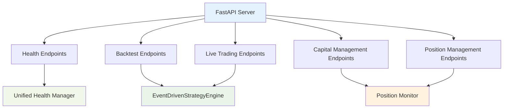

# API Documentation - Complete Reference 🚀

**Purpose**: Comprehensive API documentation covering all endpoints, request/response structures, and integration patterns  
**Status**: ✅ Complete API reference with new unified health system  
**Updated**: January 6, 2025  
**Last Reviewed**: January 6, 2025  
**Status**: ✅ Aligned with canonical sources and health system cleanup plan

---

## 📚 **Canonical Sources**

**This API documentation aligns with canonical architectural principles**:
- **Health System**: `.cursor/plans/health-system-cleanup-1eda130c.plan.md` - New unified health system (2 endpoints only)
- **Architectural Principles**: [REFERENCE_ARCHITECTURE_CANONICAL.md](REFERENCE_ARCHITECTURE_CANONICAL.md) - Canonical architectural principles
- **Strategy Specifications**: [MODES.md](MODES.md) - Canonical strategy mode definitions
- **Venue Architecture**: [VENUE_ARCHITECTURE.md](VENUE_ARCHITECTURE.md) - Venue client initialization and execution

## 📚 **Key References**

- **Component Details** → [COMPONENT_SPECS_INDEX.md](COMPONENT_SPECS_INDEX.md)
- **Workflow Guide** → [WORKFLOW_GUIDE.md](WORKFLOW_GUIDE.md)
- **Configuration** → [specs/19_CONFIGURATION.md](specs/19_CONFIGURATION.md)
- **Environment Variables** → [ENVIRONMENT_VARIABLES.md](ENVIRONMENT_VARIABLES.md)
- **Deployment Guide** → [DEPLOYMENT_GUIDE.md](DEPLOYMENT_GUIDE.md)

---

## 🎯 **API Overview**

The Basis Strategy API provides a comprehensive interface for:
- **Backtest Execution**: Historical strategy testing with full component chain
- **Live Trading**: Real-time strategy execution with venue integration
- **Health Monitoring**: System health and component status monitoring
- **Capital Management**: Deposit and withdrawal operations
- **Position Management**: Position updates and monitoring

### **API Architecture**



### **Base URL Structure**

```
Development: http://localhost:8001/api/v1
Staging: https://staging-api.basis-strategy.com/api/v1
Production: https://api.basis-strategy.com/api/v1
```

---

## 🏥 **Health Endpoints**

### **1. Basic Health Check**

**Endpoint**: `GET /health`

**Purpose**: Fast heartbeat check (< 50ms) for load balancers and monitoring systems

**Response Time**: < 50ms

**Authentication**: None required

**Response**:
```json
{
  "status": "healthy",
  "timestamp": "2025-01-06T12:00:00Z",
  "service": "basis-strategy-v1",
  "execution_mode": "backtest",
  "uptime_seconds": 3600,
  "system": {
    "cpu_percent": 15.2,
    "memory_percent": 45.8,
    "memory_available_gb": 8.5
  }
}
```

**Status Values**:
- `"healthy"`: All systems operational
- `"degraded"`: Some non-critical issues
- `"unhealthy"`: Critical system failures

### **2. Detailed Health Check**

**Endpoint**: `GET /health/detailed`

**Purpose**: Comprehensive health check including all components and system metrics

**Response Time**: < 500ms

**Authentication**: None required

**Response**:
```json
{
  "status": "healthy",
  "timestamp": "2025-01-06T12:00:00Z",
  "service": "basis-strategy-v1",
  "execution_mode": "backtest",
  "uptime_seconds": 3600,
  "system": {
    "cpu_percent": 15.2,
    "memory_percent": 45.8,
    "memory_available_gb": 8.5,
    "disk_percent": 23.1,
    "process": {
      "memory_mb": 256.5,
      "threads": 8,
      "connections": 3
    }
  },
  "components": {
    "position_monitor": {
      "status": "healthy",
      "timestamp": "2025-01-06T12:00:00Z",
      "error_code": null,
      "error_message": null,
      "readiness_checks": {
        "initialized": true,
        "redis_connected": true,
        "snapshot_available": true
      },
      "metrics": {
        "wallet_tokens": 12,
        "cex_accounts": 3
      }
    },
    "data_provider": {
      "status": "healthy",
      "timestamp": "2025-01-06T12:00:00Z",
      "error_code": null,
      "error_message": null,
      "readiness_checks": {
        "initialized": true,
        "data_loaded": true,
        "market_data_available": true
      },
      "metrics": {
        "data_sources": 8,
        "execution_mode": "backtest"
      }
    }
  },
  "summary": {
    "total_components": 11,
    "healthy_components": 11,
    "unhealthy_components": 0,
    "not_ready_components": 0,
    "unknown_components": 0
  }
}
```

**Component Status Values**:
- `"healthy"`: Component fully operational
- `"not_ready"`: Component initialized but not ready
- `"unhealthy"`: Component has critical failures
- `"unknown"`: Cannot determine status
- `"not_configured"`: Component intentionally not set up

**Mode-Aware Filtering**:
- **Backtest Mode**: Only includes components relevant to backtest execution (core components only)
- **Live Mode**: Includes all components including live trading health checks

---

## 🧪 **Backtest Endpoints**

### **1. Start Backtest**

**Endpoint**: `POST /api/v1/backtest/`

**Purpose**: Start a new backtest with specified strategy and parameters

**Request**:
```json
{
  "strategy_name": "usdt_market_neutral",
  "start_date": "2024-05-12T00:00:00Z",
  "end_date": "2024-09-10T23:59:59Z",
  "initial_capital": 100000.0,
  "config_overrides": {
    "component_config": {
      "risk_monitor": {
        "risk_limits": {
          "aave_health_factor_min": 1.2
        }
      },
      "pnl_calculator": {
        "reconciliation_tolerance": 0.01
      }
    }
  },
  "share_class": "USDT"
}
```

**Request Validation**:
- `strategy_name`: Must be valid strategy mode from `configs/modes/`
- `start_date`: Must be valid ISO 8601 datetime
- `end_date`: Must be after start_date
- `initial_capital`: Must be positive number
- `share_class`: Must be "USDT" or "ETH"

**Response**:
```json
{
  "backtest_id": "bt_20251013_123425_abc123",
  "status": "started",
  "strategy_name": "usdt_market_neutral",
  "start_date": "2024-05-12T00:00:00Z",
  "end_date": "2024-09-10T23:59:59Z",
  "initial_capital": 100000.0,
  "share_class": "USDT",
  "estimated_duration_minutes": 15,
  "created_at": "2025-10-13T12:34:25Z"
}
```

### **2. Get Backtest Status**

**Endpoint**: `GET /api/v1/backtest/{request_id}/status`

**Purpose**: Get current status of a running backtest

**Response**:
```json
{
  "backtest_id": "bt_20251013_123425_abc123",
  "status": "running",
  "progress_percent": 65.5,
  "current_timestamp": "2025-10-13T12:39:25Z",
  "events_processed": 1250,
  "estimated_completion": "2025-10-13T12:45:00Z",
  "current_equity": 102500.0,
  "current_pnl": 2500.0
}
```

**Status Values**:
- `"queued"`: Backtest queued for execution
- `"running"`: Backtest currently executing
- `"completed"`: Backtest finished successfully
- `"failed"`: Backtest failed with error
- `"cancelled"`: Backtest was cancelled

### **3. Cancel Backtest**

**Endpoint**: `DELETE /api/v1/backtest/{request_id}`

**Purpose**: Stop a running backtest

**Response**:
```json
{
  "backtest_id": "bt_20251013_123425_abc123",
  "status": "stopped",
  "stopped_at": "2024-01-15T10:35:00Z",
  "progress_percent": 45.2,
  "events_processed": 850
}
```

### **4. Get Backtest Results**

**Endpoint**: `GET /api/v1/backtest/{request_id}/result`

**Purpose**: Get complete results of a finished backtest

**Response**:
```json
{
  "backtest_id": "bt_20251013_123425_abc123",
  "status": "completed",
  "strategy_name": "usdt_market_neutral",
  "start_date": "2024-05-12T00:00:00Z",
  "end_date": "2024-09-10T23:59:59Z",
  "initial_capital": 100000.0,
  "final_capital": 105250.0,
  "total_return": 0.0525,
  "annualized_return": 0.68,
  "max_drawdown": 0.023,
  "sharpe_ratio": 1.85,
  "total_events": 2500,
  "execution_time_seconds": 900,
  "results_files": {
    "csv_report": "/results/bt_20240115_103000_abc123/results.csv",
    "html_plots": "/results/bt_20240115_103000_abc123/plots.html"
  },
  "performance_attribution": {
    "supply_yield": 0.008,
    "staking_yield_oracle": 0.0015,
    "staking_yield_rewards": 0.0005,
    "borrow_costs": -0.002,
    "funding_pnl": 0.018,
    "delta_pnl": 0.001,
    "transaction_costs": -0.0002
  },
  "risk_metrics": {
    "max_ltv_used": 0.89,
    "liquidation_events": 0,
    "rebalancing_events": 45
  }
}
```

### **Performance Attribution Breakdown**

The `performance_attribution` field breaks down the total return into specific sources of profit/loss, matching the comprehensive P&L Calculator specification:

**Component Details**:

1. **`supply_yield`** (0.008 = 0.8%):
   - Interest earned from **supplying assets to AAVE** (aUSDT, aETH, etc.)
   - Example: Supply USDT to AAVE and earn 5% APY
   - Primary return source for pure lending mode

2. **`staking_yield_oracle`** (0.0015 = 0.15%):
   - **LST price appreciation** (weETH/ETH grows ~2.8% APR)
   - Example: weETH appreciates relative to ETH due to staking rewards
   - Continuous, non-rebasing token appreciation

3. **`staking_yield_rewards`** (0.0005 = 0.05%):
   - **Seasonal rewards** (EIGEN weekly, ETHFI airdrops)
   - Example: Receive EIGEN tokens weekly, ETHFI airdrops
   - Discrete, event-based rewards

4. **`borrow_costs`** (-0.002 = -0.2%):
   - **Cost of borrowing** from AAVE (debt interest)
   - Example: Borrow ETH from AAVE at 3% APY
   - Always negative (cost), reduces total return

5. **`funding_pnl`** (0.018 = 1.8%):
   - Profit/loss from **funding rate payments** on perpetual positions
   - Example: Short ETH perp pays 0.01% funding every 8 hours
   - Positive when you receive funding, negative when you pay

6. **`delta_pnl`** (0.001 = 0.1%):
   - Profit/loss from **unhedged exposure** × price changes
   - Example: Small ETH exposure due to imperfect hedging
   - Can be positive or negative depending on market moves

7. **`transaction_costs`** (-0.0002 = -0.02%):
   - **Gas fees + execution costs** (slippage, trading fees)
   - Example: Gas for AAVE transactions, CEX trading fees
   - Always negative (cost), reduces total return

**Total Attribution**: 0.008 + 0.0015 + 0.0005 - 0.002 + 0.018 + 0.001 - 0.0002 = 0.0268 (2.68%)

### **Config-Driven Attribution**

**Note**: The attribution types calculated are determined by `component_config.pnl_calculator.attribution_types` in the mode configuration. Each strategy mode enables only the attribution types relevant to its operations:

- **Pure Lending**: `supply_yield`, `transaction_costs`
- **BTC Basis**: `funding_pnl`, `delta_pnl`, `basis_pnl`, `transaction_costs`
- **ETH Leveraged**: `supply_yield`, `staking_yield_oracle`, `staking_yield_rewards`, `borrow_costs`, `price_change_pnl`, `transaction_costs`
- **USDT Market Neutral**: All 8 attribution types (full complexity)

Unused attribution types return 0.0 (graceful handling). See [19_CONFIGURATION.md](specs/19_CONFIGURATION.md) for complete config schemas.

---

## 🚀 **Live Trading Endpoints**

### **1. Start Live Trading**

**Endpoint**: `POST /live/start`

**Purpose**: Start live trading with specified strategy

**Request**:
```json
{
  "strategy_name": "usdt_market_neutral",
  "share_class": "USDT",
  "max_trade_size_usd": 10000.0,
  "emergency_stop_loss_pct": 0.15,
  "config_overrides": {
    "component_config": {
      "risk_monitor": {
        "risk_limits": {
          "aave_health_factor_min": 1.2
        }
      },
      "execution_manager": {
        "supported_actions": ["aave_supply", "aave_withdraw", "cex_spot_buy", "cex_perp_short"]
      }
    }
  }
}
```

**Request Validation**:
- `strategy_name`: Must be valid strategy mode
- `share_class`: Must be "USDT" or "ETH"
- `max_trade_size_usd`: Must be positive number
- `emergency_stop_loss_pct`: Must be between 0.01 and 0.50

**Response**:
```json
{
  "live_trading_id": "lt_20240115_103000_def456",
  "status": "started",
  "strategy_name": "usdt_market_neutral",
  "share_class": "USDT",
  "max_trade_size_usd": 10000.0,
  "emergency_stop_loss_pct": 0.15,
  "venue_health": {
    "binance": "healthy",
    "bybit": "healthy",
    "okx": "healthy",
    "aave_v3": "healthy"
  },
  "started_at": "2024-01-15T10:30:00Z"
}
```

### **2. Get Live Trading Status**

**Endpoint**: `GET /api/v1/live/status/{request_id}`

**Purpose**: Get current status of live trading

**Response**:
```json
{
  "live_trading_id": "lt_20240115_103000_def456",
  "status": "running",
  "strategy_name": "usdt_market_neutral",
  "current_equity": 102500.0,
  "current_pnl": 2500.0,
  "total_trades": 15,
  "last_trade_at": "2024-01-15T10:25:00Z",
  "venue_status": {
    "binance": "healthy",
    "bybit": "healthy",
    "okx": "healthy",
    "aave_v3": "healthy"
  },
  "risk_metrics": {
    "current_ltv": 0.85,
    "liquidation_risk": "low",
    "margin_ratio": 1.18
  }
}
```

### **3. Stop Live Trading**

**Endpoint**: `POST /api/v1/live/stop/{request_id}`

**Purpose**: Stop live trading and close all positions

**Response**:
```json
{
  "live_trading_id": "lt_20240115_103000_def456",
  "status": "stopped",
  "stopped_at": "2024-01-15T10:35:00Z",
  "final_equity": 102500.0,
  "total_pnl": 2500.0,
  "positions_closed": 3,
  "closing_time_seconds": 45
}
```

### **4. Get Live Trading Performance**

**Endpoint**: `GET /api/v1/live/performance/{request_id}`

**Purpose**: Get performance metrics for a live trading strategy

**Response**:
```json
{
  "success": true,
  "data": {
    "request_id": "lt_20240115_103000_def456",
    "initial_capital": 100000.0,
    "current_value": 102500.0,
    "total_pnl": 2500.0,
    "return_pct": 0.025,
    "total_trades": 15,
    "current_drawdown": 0.005,
    "uptime_hours": 24.5,
    "engine_status": "running",
    "last_heartbeat": "2024-01-15T10:30:00Z"
  }
}
```

### **5. Emergency Stop Live Trading**

**Endpoint**: `POST /api/v1/live/emergency-stop/{request_id}`

**Purpose**: Emergency stop a live trading strategy with reason

**Query Parameters**:
- `reason` (optional): Reason for emergency stop (default: "Emergency stop requested")

**Response**:
```json
{
  "success": true,
  "data": {
    "message": "Live trading emergency stopped",
    "request_id": "lt_20240115_103000_def456",
    "reason": "Emergency stop requested"
  }
}
```

### **6. List Running Strategies**

**Endpoint**: `GET /api/v1/live/strategies`

**Purpose**: Get list of all currently running live trading strategies

**Response**:
```json
{
  "success": true,
  "data": {
    "strategies": [
      {
        "request_id": "lt_20240115_103000_def456",
        "strategy_name": "usdt_market_neutral",
        "status": "running",
        "started_at": "2024-01-15T10:30:00Z",
        "current_pnl": 2500.0
      }
    ],
    "count": 1
  }
}
```

### **7. Manual Rebalancing**

**Endpoint**: `POST /api/v1/live/rebalance`

**Purpose**: Trigger manual rebalancing for a running strategy

**Request**:
```json
{
  "strategy_id": "lt_20240115_103000_def456",
  "force": false
}
```

**Response**:
```json
{
  "success": true,
  "data": {
    "message": "Rebalancing request received",
    "strategy_id": "lt_20240115_103000_def456",
    "note": "Rebalancing logic handled by StrategyManager and TransferManager"
  }
}
```

---

## 🔐 **Authentication Endpoints**

### **1. User Login**

**Endpoint**: `POST /api/v1/auth/login`

**Purpose**: Authenticate user with username and password

**Request**:
```json
{
  "username": "admin",
  "password": "admin123"
}
```

**Response**:
```json
{
  "access_token": "eyJhbGciOiJIUzI1NiIsInR5cCI6IkpXVCJ9...",
  "token_type": "bearer",
  "expires_in": 1800
}
```

### **2. User Logout**

**Endpoint**: `POST /api/v1/auth/logout`

**Purpose**: Logout user and invalidate token

**Headers**:
```
Authorization: Bearer <access_token>
```

**Response**:
```json
{
  "message": "Successfully logged out"
}
```

### **3. Get Current User**

**Endpoint**: `GET /api/v1/auth/me`

**Purpose**: Get current authenticated user information

**Headers**:
```
Authorization: Bearer <access_token>
```

**Response**:
```json
{
  "username": "admin",
  "authenticated": true
}
```

---

## 💰 **Capital Management Endpoints**

### **1. Deposit Capital**

**Endpoint**: `POST /api/v1/capital/deposit`

**Purpose**: Add capital to the strategy

**Request**:
```json
{
  "amount": 50000.0,
  "currency": "USDT",
  "share_class": "USDT",
  "source": "external_wallet"
}
```

**Response**:
```json
{
  "deposit_id": "dep_20240115_103000_ghi789",
  "amount": 50000.0,
  "currency": "USDT",
  "share_class": "USDT",
  "status": "completed",
  "new_total_equity": 150000.0,
  "deposited_at": "2024-01-15T10:30:00Z"
}
```

### **2. Withdraw Capital**

**Endpoint**: `POST /api/v1/capital/withdraw`

**Purpose**: Withdraw capital from the strategy

**Request**:
```json
{
  "amount": 25000.0,
  "currency": "USDT",
  "share_class": "USDT",
  "withdrawal_type": "fast"
}
```

**Response**:
```json
{
  "withdrawal_id": "wth_20240115_103000_jkl012",
  "amount": 25000.0,
  "currency": "USDT",
  "share_class": "USDT",
  "status": "completed",
  "withdrawal_type": "fast",
  "new_total_equity": 125000.0,
  "withdrawn_at": "2024-01-15T10:30:00Z"
}
```

**Withdrawal Types**:
- `"fast"`: Withdraw from available reserves (immediate)
- `"slow"`: Unwind positions to free up capital (may take time)

---

## 📊 **Position Management Endpoints**

### **1. Get Current Positions**

**Endpoint**: `GET /api/v1/positions/current`

**Purpose**: Get current position snapshot across all venues

**Response**:
```json
{
  "timestamp": "2024-01-15T10:30:00Z",
  "total_equity": 125000.0,
  "share_class": "USDT",
  "positions": {
    "wallet": {
      "ETH": 10.5,
      "USDT": 5000.0,
      "weETH": 5.2
    },
    "cex": {
      "binance": {
        "spot": {
          "ETH": 2.5,
          "USDT": 10000.0
        },
        "futures": {
          "ETHUSDT": -5.0
        }
      }
    },
    "defi": {
      "aave_v3": {
        "aUSDT": 50000.0,
        "debt_ETH": -8.0
      }
    }
  },
  "exposure": {
    "net_delta_eth": 0.05,
    "net_delta_usdt": 125000.0,
    "lending_exposure": 50000.0,
    "staking_exposure": 15.7
  }
}
```

### **2. Update Position**

**Endpoint**: `POST /api/v1/positions/update`

**Purpose**: Manually update position (for external changes)

**Request**:
```json
{
  "venue": "binance",
  "asset": "ETH",
  "amount": 2.5,
  "position_type": "spot",
  "reason": "external_transfer"
}
```

**Response**:
```json
{
  "position_id": "pos_20240115_103000_mno345",
  "venue": "binance",
  "asset": "ETH",
  "amount": 2.5,
  "position_type": "spot",
  "status": "updated",
  "updated_at": "2024-01-15T10:30:00Z",
  "new_total_equity": 125000.0
}
```

---

## 📋 **Strategy Information Endpoints**

### **1. List Available Strategies**

**Endpoint**: `GET /api/v1/strategies/`

**Purpose**: Get a list of all available trading strategies from config files

**Query Parameters**:
- `share_class` (optional): Filter by share class (ETH or USDT)
- `risk_level` (optional): Filter by risk level

**Response**:
```json
{
  "success": true,
  "data": {
    "strategies": [
      {
        "name": "usdt_market_neutral",
        "display_name": "Usdt Market Neutral",
        "description": "Config-driven strategy: lending_staking_basis_trading",
        "share_class": "USDT",
        "risk_level": "high",
        "expected_return": "15-50% APR",
        "minimum_capital": 1000,
        "supported_venues": ["AAVE", "LIDO", "BYBIT"],
        "parameters": {
          "strategy_type": "lending_staking_basis_trading",
          "complexity": "complex",
          "architecture": "config_driven_components",
          "features": {
            "lending_enabled": true,
            "staking_enabled": true,
            "leverage_enabled": true,
            "basis_trade_enabled": true
          }
        }
      }
    ],
    "total": 1
  }
}
```

### **2. Get Strategy Details**

**Endpoint**: `GET /api/v1/strategies/{strategy_name}`

**Purpose**: Get detailed information about a specific strategy from its config

**Response**:
```json
{
  "success": true,
  "data": {
    "name": "usdt_market_neutral",
    "display_name": "Usdt Market Neutral",
    "description": "Config-driven strategy: lending_staking_basis_trading",
    "share_class": "USDT",
    "risk_level": "high",
    "expected_return": "15-50% APR",
    "minimum_capital": 1000,
    "supported_venues": ["AAVE", "LIDO", "BYBIT"],
    "parameters": {
      "strategy_type": "lending_staking_basis_trading",
      "complexity": "complex",
      "architecture": "config_driven_components",
      "features": {
        "lending_enabled": true,
        "staking_enabled": true,
        "leverage_enabled": true,
        "basis_trade_enabled": true
      }
    }
  }
}
```

### **3. Get Merged Strategy Config**

**Endpoint**: `GET /api/v1/strategies/{strategy_name}/config/merged`

**Purpose**: Get merged configuration for a strategy (infrastructure + scenario)

**Query Parameters**:
- `start_date` (optional): Backtest start date YYYY-MM-DD
- `end_date` (optional): Backtest end date YYYY-MM-DD
- `initial_capital` (optional): Initial capital amount (default: 10000.0)
- `share_class` (optional): Share class (default: USDT)

**Response**:
```json
{
  "success": true,
  "data": {
    "strategy_name": "usdt_market_neutral",
    "config_json": {
      "strategy": {
        "share_class": "USDT",
        "lending_enabled": true,
        "staking_enabled": true,
        "staking_leverage_enabled": true,
        "basis_trade_enabled": true
      },
      "backtest": {
        "start_date": "2024-05-12",
        "end_date": "2024-09-10",
        "initial_capital": 10000.0
      }
    },
    "config_yaml": "strategy:\n  share_class: USDT\n  lending_enabled: true\n..."
  }
}
```

---

## 📊 **Results & Export Endpoints**

### **1. Get Result Events**

**Endpoint**: `GET /api/v1/results/{result_id}/events`

**Purpose**: Return chronological actions with balances and P&L attribution

**Query Parameters**:
- `limit` (optional): Max events to return (default: 500, max: 10000)
- `offset` (optional): Offset for pagination (default: 0)

**Response**:
```json
{
  "success": true,
  "data": {
    "events": [
      {
        "timestamp": "2024-05-12T12:00:00Z",
        "event_type": "ORDER_FILLED",
        "venue": "AAVE",
        "token": "USDT",
        "amount": 1000.0,
        "balance_after": {...}
      }
    ],
    "total_events": 1500,
    "has_event_log": true,
    "component_summaries": {...},
    "balances_by_venue": {...}
  }
}
```

### **2. Get Export Information**

**Endpoint**: `GET /api/v1/results/{result_id}/export`

**Purpose**: Get information about available export files (charts and CSV)

**Response**:
```json
{
  "success": true,
  "data": {
    "result_id": "bt_20240115_103000_abc123",
    "available_files": {
      "csv_report": "/results/bt_20240115_103000_abc123/results.csv",
      "html_plots": "/results/bt_20240115_103000_abc123/plots.html",
      "event_log": "/results/bt_20240115_103000_abc123/event_log.csv"
    },
    "file_sizes": {
      "csv_report": "2.5MB",
      "html_plots": "1.2MB",
      "event_log": "5.8MB"
    }
  }
}
```

### **3. List Results**

**Endpoint**: `GET /api/v1/results/`

**Purpose**: List all available results with filtering options

**Query Parameters**:
- `strategy` (optional): Filter by strategy name
- `start_date` (optional): Filter by start date after this date
- `end_date` (optional): Filter by start date before this date
- `limit` (optional): Maximum results to return (default: 1000, max: 10000)
- `offset` (optional): Results offset for pagination (default: 0)

**Response**:
```json
{
  "success": true,
  "data": {
    "results": [
      {
        "result_id": "bt_20251013_123425_abc123",
        "strategy_name": "usdt_market_neutral",
        "start_date": "2024-05-12T00:00:00Z",
        "end_date": "2024-09-10T23:59:59Z",
        "status": "completed",
        "total_return": 0.0525,
        "created_at": "2025-10-13T12:34:25Z"
      }
    ],
    "total": 25,
    "has_more": false
  }
}
```

---

## 📈 **Charts Endpoints**

### **1. List Charts**

**Endpoint**: `GET /api/v1/results/{request_id}/charts`

**Purpose**: Get available chart files for a specific backtest result

**Response**:
```json
{
  "success": true,
  "data": {
    "request_id": "bt_20240115_103000_abc123",
    "available_charts": [
      {
        "name": "equity_curve",
        "title": "Equity Curve",
        "file_path": "/results/bt_20240115_103000_abc123/charts/equity_curve.png",
        "description": "Portfolio value over time"
      },
      {
        "name": "drawdown",
        "title": "Drawdown Chart",
        "file_path": "/results/bt_20240115_103000_abc123/charts/drawdown.png",
        "description": "Maximum drawdown over time"
      }
    ]
  }
}
```

---

## 🏠 **Root Endpoint**

### **1. API Information**

**Endpoint**: `GET /`

**Purpose**: Root endpoint with API information

**Response**:
```json
{
  "name": "Basis Strategy API",
  "version": "2.0.0",
  "description": "DeFi Basis Trading Strategy Platform",
  "status": "operational",
  "documentation": "/docs",
  "health": "/health",
  "detailed_health": "/health/detailed",
  "metrics": "/metrics"
}
```

---

## 🔧 **Error Handling**

### **Error Response Format**

All API endpoints return errors in a consistent format:

```json
{
  "error": {
    "code": "VALIDATION_ERROR",
    "message": "Invalid strategy name provided",
    "details": {
      "field": "strategy_name",
      "value": "invalid_strategy",
      "allowed_values": ["usdt_market_neutral", "btc_basis", "eth_leveraged"]
    },
    "timestamp": "2024-01-15T10:30:00Z",
    "request_id": "req_20240115_103000_pqr678"
  }
}
```

### **Common Error Codes**

| Code | HTTP Status | Description |
|------|-------------|-------------|
| `VALIDATION_ERROR` | 400 | Request validation failed |
| `STRATEGY_NOT_FOUND` | 404 | Strategy mode not found |
| `BACKTEST_NOT_FOUND` | 404 | Backtest ID not found |
| `LIVE_TRADING_NOT_FOUND` | 404 | Live trading ID not found |
| `INSUFFICIENT_CAPITAL` | 400 | Not enough capital for operation |
| `VENUE_UNAVAILABLE` | 503 | Venue API unavailable |
| `SYSTEM_ERROR` | 500 | Internal system error |
| `RATE_LIMIT_EXCEEDED` | 429 | API rate limit exceeded |

---

## 🔐 **Authentication & Security**

### **API Key Authentication**

For production endpoints, include API key in header:

```bash
curl -H "X-API-Key: your-api-key" \
     -H "Content-Type: application/json" \
     https://api.basis-strategy.com/api/v1/backtest/start
```

### **Rate Limiting**

- **Health Endpoints**: 100 requests/minute
- **Backtest Endpoints**: 10 requests/minute
- **Live Trading Endpoints**: 5 requests/minute
- **Capital/Position Endpoints**: 20 requests/minute

### **CORS Configuration**

```json
{
  "allowed_origins": [
    "https://app.basis-strategy.com",
    "https://staging-app.basis-strategy.com"
  ],
  "allowed_methods": ["GET", "POST", "PUT", "DELETE"],
  "allowed_headers": ["Content-Type", "X-API-Key"]
}
```

---

## 📈 **Integration Examples**

### **1. Start Backtest with Error Handling**

```python
import requests
import json

def start_backtest(strategy_name, start_date, end_date, initial_capital):
    url = "https://api.basis-strategy.com/api/v1/backtest/start"
    headers = {
        "Content-Type": "application/json",
        "X-API-Key": "your-api-key"
    }
    data = {
        "strategy_name": strategy_name,
        "start_date": start_date,
        "end_date": end_date,
        "initial_capital": initial_capital,
        "share_class": "USDT"
    }
    
    try:
        response = requests.post(url, headers=headers, json=data)
        response.raise_for_status()
        return response.json()
    except requests.exceptions.HTTPError as e:
        error_data = response.json()
        print(f"Error: {error_data['error']['message']}")
        return None
```

### **2. Monitor Backtest Progress**

```python
def monitor_backtest(backtest_id):
    url = f"https://api.basis-strategy.com/api/v1/backtest/{backtest_id}/status"
    headers = {"X-API-Key": "your-api-key"}
    
    while True:
        response = requests.get(url, headers=headers)
        data = response.json()
        
        print(f"Progress: {data['progress_percent']:.1f}%")
        print(f"Current P&L: ${data['current_pnl']:.2f}")
        
        if data['status'] in ['completed', 'failed', 'cancelled']:
            break
            
        time.sleep(30)  # Check every 30 seconds
```

### **3. Health Check Integration**

```python
def check_system_health():
    # Fast health check
    url = "https://api.basis-strategy.com/health"
    response = requests.get(url)
    data = response.json()
    
    if data['status'] == 'healthy':
        print("✅ System healthy")
        return True
    else:
        print(f"❌ System unhealthy: {data['status']}")
        return False

def check_detailed_health():
    # Comprehensive health check
    url = "https://api.basis-strategy.com/health/detailed"
    response = requests.get(url)
    data = response.json()
    
    print(f"Overall Status: {data['status']}")
    print(f"Execution Mode: {data['execution_mode']}")
    print(f"Components: {data['summary']['healthy_components']}/{data['summary']['total_components']} healthy")
    
    return data['status'] == 'healthy'
```

---

## 🎯 **API Versioning**

### **Current Version**: v1

**Version Header**:
```bash
curl -H "API-Version: v1" \
     https://api.basis-strategy.com/api/v1/health/
```

### **Backward Compatibility**

- **v1**: Current stable version
- **Future versions**: Will maintain backward compatibility for at least 6 months
- **Deprecation**: 3-month notice before removing deprecated endpoints

---

## 📋 **API Testing**

### **Health Check Test**

```bash
# Basic health check
curl https://api.basis-strategy.com/health

# Detailed health check
curl https://api.basis-strategy.com/health/detailed
```

### **Backtest Test**

```bash
# Start backtest
curl -X POST https://api.basis-strategy.com/api/v1/backtest/start \
  -H "Content-Type: application/json" \
  -H "X-API-Key: your-api-key" \
  -d '{
    "strategy_name": "usdt_market_neutral",
    "start_date": "2024-05-12T00:00:00Z",
    "end_date": "2024-09-10T23:59:59Z",
    "initial_capital": 100000.0,
    "share_class": "USDT"
  }'
```

---

## 🎯 **Summary**

**Key Points**:
1. **Unified Health System**: Only 2 health endpoints (basic + detailed)
2. **Mode-Aware**: Health checks filter components based on execution mode
3. **Comprehensive Coverage**: All system operations covered by API
4. **Error Handling**: Consistent error format across all endpoints
5. **Security**: API key authentication and rate limiting

**API Endpoints**:
- **Health**: 2 endpoints (basic + detailed)
- **Authentication**: 3 endpoints (login, logout, me)
- **Backtest**: 4 endpoints (start, status, result, cancel)
- **Live Trading**: 7 endpoints (start, status, performance, stop, emergency-stop, strategies, rebalance)
- **Capital Management**: 2 endpoints (deposit, withdraw)
- **Position Management**: 2 endpoints (current, update)
- **Strategies**: 5 endpoints (list, details, merged config, mode config, list modes)
- **Results**: 3 endpoints (events, export, list)
- **Charts**: 1 endpoint (charts)
- **Root**: 1 endpoint (API info)

**Total**: 30 endpoints covering all system functionality

---

**Remember**: All API endpoints are documented with complete request/response examples! 🚀

*Last Updated: October 2025*
