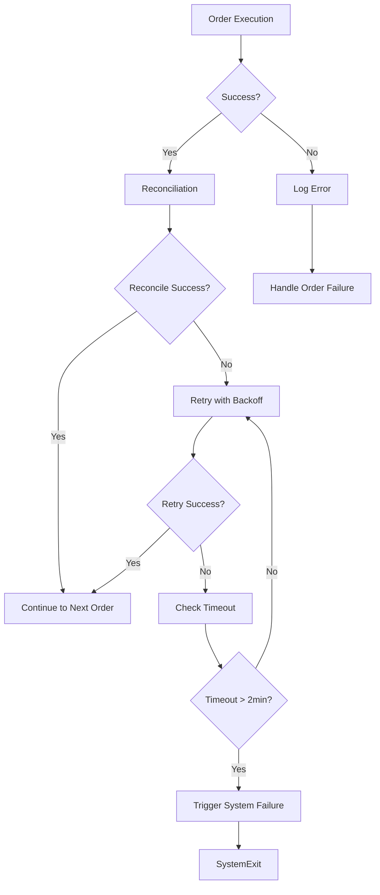

# Error Handling Patterns

**Purpose**: Consolidated error handling and reconciliation patterns for the tight loop architecture  
**Status**: ✅ CANONICAL REFERENCE  
**Last Updated**: October 15, 2025

---

## Overview

This guide documents standardized error handling patterns for reconciliation failures, retry logic, system failure triggers, and health system integration. These patterns ensure robust execution and proper failure recovery across backtest and live modes.

**Key Principle**: Fail-fast in backtest mode for immediate feedback. Retry with exponential backoff in live mode for resilience.

## Canonical Sources

**This guide aligns with canonical architectural principles**:
- **Architectural Principles**: [REFERENCE_ARCHITECTURE_CANONICAL.md](REFERENCE_ARCHITECTURE_CANONICAL.md) - Canonical architectural principles
- **Workflow Architecture**: [WORKFLOW_GUIDE.md](WORKFLOW_GUIDE.md) - Complete workflow documentation
- **Tight Loop Architecture**: [TIGHT_LOOP_ARCHITECTURE.md](TIGHT_LOOP_ARCHITECTURE.md) - Tight loop orchestration patterns
- **Health & Error Systems**: [HEALTH_ERROR_SYSTEMS.md](HEALTH_ERROR_SYSTEMS.md) - Health monitoring infrastructure (complementary doc)

**Scope**: This document focuses on **operational runtime error handling patterns** (retry logic, timeouts, reconciliation). For **health monitoring infrastructure** (error registry, health checkers, API endpoints), see [HEALTH_ERROR_SYSTEMS.md](HEALTH_ERROR_SYSTEMS.md).

---

## Reconciliation Error Handling

### Reconciliation Failure Detection

```python
def _handle_reconciliation_failure(self, reconciliation_result):
    """
    Handle reconciliation failure with retry logic and system failure triggers.
    """
    if reconciliation_result.get('reconciliation_type') == 'live_mismatch':
        # Log mismatch details
        mismatches = reconciliation_result.get('mismatches', [])
        for mismatch in mismatches:
            logger.error(f"Position mismatch: {mismatch}")
        
        # Trigger system failure after 2 minutes of failures
        if self.reconciliation_failure_duration > 120:
            self._trigger_system_failure("Reconciliation timeout exceeded")
    
    elif reconciliation_result.get('reconciliation_type') == 'backtest_simulation':
        # Backtest reconciliation should never fail
        logger.critical("Backtest reconciliation failed - this should never happen")
        self._trigger_system_failure("Backtest reconciliation failure")
```

### Mode-Specific Handling

**Backtest Mode**:
- Reconciliation failures indicate bugs (simulated = real always)
- Immediate system failure without retry
- No tolerance for reconciliation failures

**Live Mode**:
- Reconciliation failures may be temporary
- Retry with exponential backoff (up to 3 attempts)
- System failure after 2-minute timeout
- Tolerance-based comparison (configurable threshold)

---

## Retry Logic with Exponential Backoff

### Implementation Pattern

```python
def _reconcile_with_retry(self, timestamp, execution_result, order_number):
    """
    Retry reconciliation up to 3 times with exponential backoff.
    """
    max_retries = 3
    start_time = time.time()
    
    for attempt in range(max_retries):
        try:
            reconciliation_result = self.position_update_handler.update_state(
                timestamp=timestamp,
                trigger_source='execution_manager',
                execution_deltas=execution_result
            )
            
            if reconciliation_result.get('success'):
                return True
            
            # Wait before retry (exponential backoff)
            wait_time = 2 ** attempt  # 1s, 2s, 4s
            time.sleep(wait_time)
            
        except Exception as e:
            logger.error(f"Reconciliation attempt {attempt + 1} failed: {e}")
    
    # Check if we've exceeded 2-minute timeout
    if time.time() - start_time > 120:  # 2 minutes
        self._trigger_system_failure(f"Reconciliation timeout for order {order_number}")
    
    return False
```

### Backoff Schedule

| Attempt | Wait Time | Cumulative Time |
|---------|-----------|-----------------|
| 1       | 1 second  | 1 second        |
| 2       | 2 seconds | 3 seconds       |
| 3       | 4 seconds | 7 seconds       |

**Total Max Time**: 7 seconds for 3 retries + 2-minute timeout = 127 seconds maximum

### Retry Decision Logic

```python
# In ExecutionManager.process_orders()
if not reconciliation_result.get('success'):
    # Retry reconciliation up to 3 times
    reconciliation_success = self._reconcile_with_retry(
        timestamp, execution_result, i
    )
    
    if not reconciliation_success:
        self._trigger_system_failure(f"Reconciliation failed for order {i}")
        return []
```

**Key Points**:
- Retry only occurs in live mode
- Backtest mode fails immediately (no retries)
- Exponential backoff prevents overwhelming venue APIs
- 2-minute total timeout prevents infinite hangs

---

## System Failure Triggers

### System Failure Handler

```python
def _trigger_system_failure(self, failure_reason):
    """
    Trigger system failure and restart via health/error systems.
    Reference: docs/HEALTH_ERROR_SYSTEMS.md
    """
    # Update health status to critical
    self.health_status = "critical"
    
    # Log critical error with structured logging
    logger.critical(f"SYSTEM FAILURE: {failure_reason}", extra={
        'error_code': 'SYSTEM_FAILURE',
        'failure_reason': failure_reason,
        'component': self.__class__.__name__,
        'timestamp': pd.Timestamp.now()
    })
    
    # Raise SystemExit to trigger deployment restart
    # For deployment restart details, see: docs/DEPLOYMENT_GUIDE.md#-automatic-health-monitoring-and-restart
    raise SystemExit(f"System failure: {failure_reason}")
```

**Deployment Restart Flow**: When `SystemExit` is raised, the deployment system automatically restarts the backend service. See [DEPLOYMENT_GUIDE.md](DEPLOYMENT_GUIDE.md#-automatic-health-monitoring-and-restart) for complete restart workflow including:
- Docker: Native healthcheck monitors and restarts backend container
- Non-Docker: Health monitor script (`scripts/health_monitor.sh`) monitors and executes `platform.sh restart`
- Retry logic: Up to 3 attempts with exponential backoff (5s, 10s, 20s)

### Failure Trigger Conditions

1. **Reconciliation Timeout**: Reconciliation fails for more than 2 minutes
2. **Backtest Reconciliation Failure**: Simulated ≠ Real positions (should never happen)
3. **Order Processing Exception**: Unhandled exception during order processing
4. **Component Health Critical**: Component reports critical health status

### System Exit vs Exception

**Use SystemExit for**:
- Reconciliation timeouts
- Critical system failures requiring restart
- Unrecoverable errors

**Use Exception for**:
- Recoverable errors within retry logic
- Component-specific errors
- Validation errors

---

## Health Status Integration

### Health Status Update Pattern

```python
def update_health_status(self, status, error_count=0):
    """
    Update component health status for monitoring.
    """
    self.health_status = status
    self.error_count = error_count
    
    # Log health status change
    logger.info(f"Health status updated: {status}", extra={
        'component': self.__class__.__name__,
        'status': status,
        'error_count': error_count
    })
```

### Health Status Levels

| Status | Condition | Action |
|--------|-----------|--------|
| `healthy` | No errors, normal operations | Continue |
| `degraded` | Minor errors, retries succeeding | Monitor |
| `unhealthy` | Multiple errors, some failures | Alert |
| `critical` | System failure triggered | Restart |

### Health Check Integration

```python
def _health_check(self) -> Dict:
    """Component-specific health check."""
    return {
        'status': 'healthy' if self.error_count < 10 else 'degraded',
        'last_update': self.last_update_timestamp,
        'metrics': {
            'error_count': self.error_count,
            'reconciliation_success_rate': self._calculate_success_rate(),
            'avg_retry_count': self.avg_retry_count
        }
    }
```

---

## Error Propagation Patterns

### ExecutionManager Error Flow



### Component Error Propagation

**Pattern 1: Propagate Up**
```python
try:
    result = self.component.do_work()
except ComponentError as e:
    # Add context and propagate
    raise SystemError(f"Higher level failure: {e}") from e
```

**Pattern 2: Handle and Continue**
```python
try:
    result = self.component.do_work()
except ComponentError as e:
    logger.error(f"Component error (continuing): {e}")
    # Use fallback or skip
    result = self.fallback_value
```

**Pattern 3: Retry and Fail**
```python
for attempt in range(max_retries):
    try:
        result = self.component.do_work()
        break
    except ComponentError as e:
        if attempt == max_retries - 1:
            raise
        time.sleep(2 ** attempt)
```

---

## Timeout Management

### 2-Minute Timeout Implementation

```python
class TimeoutTracker:
    def __init__(self, timeout_seconds=120):
        self.timeout_seconds = timeout_seconds
        self.start_time = None
        
    def start(self):
        """Start timeout tracking."""
        self.start_time = time.time()
        
    def check(self):
        """Check if timeout exceeded."""
        if self.start_time is None:
            return False
        
        elapsed = time.time() - self.start_time
        return elapsed > self.timeout_seconds
        
    def reset(self):
        """Reset timeout tracker."""
        self.start_time = None
```

### Usage in Reconciliation

```python
# In ExecutionManager
self.timeout_tracker = TimeoutTracker(timeout_seconds=120)

def process_orders(self, timestamp, orders):
    self.timeout_tracker.start()
    
    for i, order in enumerate(orders):
        # ... process order ...
        
        if not reconciliation_success:
            reconciliation_success = self._reconcile_with_retry(
                timestamp, execution_result, i
            )
            
        # Check timeout after retry attempts
        if self.timeout_tracker.check():
            self._trigger_system_failure("Reconciliation timeout exceeded")
            
    self.timeout_tracker.reset()
```

---

## Structured Error Logging

### Error Log Format

```python
logger.error("Error occurred", extra={
    'error_code': 'RECON-001',
    'component': 'ExecutionManager',
    'operation': 'process_orders',
    'order_number': order_number,
    'timestamp': timestamp,
    'execution_mode': self.execution_mode,
    'retry_attempt': attempt_number,
    'details': {
        'simulated': simulated_positions,
        'real': real_positions,
        'difference': position_difference
    }
})
```

### Error Code Hierarchy

| Prefix | Component | Example |
|--------|-----------|---------|
| `VM-` | ExecutionManager | `VM-001: Order execution failed` |
| `PUH-` | PositionUpdateHandler | `PUH-001: Reconciliation failed` |
| `PM-` | PositionMonitor | `PM-001: Position query failed` |
| `SYS-` | System-level | `SYS-001: System failure triggered` |

---

## Best Practices

### 1. Fail-Fast in Backtest

```python
if self.execution_mode == 'backtest':
    # No retries - fail immediately for fast feedback
    if not result.success:
        raise BacktestError(f"Operation failed: {result.error}")
```

### 2. Retry in Live Mode

```python
if self.execution_mode == 'live':
    # Retry with exponential backoff
    for attempt in range(max_retries):
        if result.success:
            break
        time.sleep(2 ** attempt)
```

### 3. Log Before Raising

```python
try:
    result = self.risky_operation()
except Exception as e:
    # Always log before raising
    logger.error(f"Operation failed: {e}", extra={'context': 'detailed_context'})
    raise
```

### 4. Clean Up on Failure

```python
try:
    self.start_operation()
    result = self.do_work()
except Exception as e:
    self.cleanup()  # Always cleanup
    raise
```

### 5. Preserve Error Context

```python
try:
    result = self.component.process()
except ComponentError as e:
    # Preserve original exception
    raise SystemError(f"System failure: {e}") from e
```

---

## Related Documentation

### Component Specifications
- **Venue Manager**: [specs/06_VENUE_MANAGER.md](specs/06_VENUE_MANAGER.md) - Tight loop orchestration
- **Position Update Handler**: [specs/11_POSITION_UPDATE_HANDLER.md](specs/11_POSITION_UPDATE_HANDLER.md) - Reconciliation ownership
- **Position Monitor**: [specs/01_POSITION_MONITOR.md](specs/01_POSITION_MONITOR.md) - Position state management

### Architecture Documentation
- **Health & Error Systems**: [HEALTH_ERROR_SYSTEMS.md](HEALTH_ERROR_SYSTEMS.md) - Complete health monitoring
- **Tight Loop Architecture**: [TIGHT_LOOP_ARCHITECTURE.md](TIGHT_LOOP_ARCHITECTURE.md) - Orchestration patterns
- **Mode-Specific Behavior**: [MODE_SPECIFIC_BEHAVIOR_GUIDE.md](MODE_SPECIFIC_BEHAVIOR_GUIDE.md) - Mode differences
- **Workflow Guide**: [WORKFLOW_GUIDE.md](WORKFLOW_GUIDE.md) - Complete workflow patterns

---

**Status**: Complete technical reference for error handling patterns  
**Last Reviewed**: October 15, 2025  
**Reviewer**: Documentation Refactor Implementation


