# Full Loop Architecture - Canonical Reference 🏗️

**Purpose**: Canonical definition of the full loop architecture that orchestrates all system components  
**Status**: ✅ CANONICAL - Single source of truth for full loop architecture  
**Updated**: January 2025  
**Last Reviewed**: January 2025  

---

## 📚 **Canonical Sources**

**This document is the single source of truth for full loop architecture**:
- **Tight Loop Architecture**: [TIGHT_LOOP_ARCHITECTURE.md](TIGHT_LOOP_ARCHITECTURE.md) - Core execution reconciliation pattern
- **Component Specifications**: [specs/](specs/) - Detailed component implementation guides
- **Strategy Modes**: [MODES.md](MODES.md) - Strategy mode definitions and behaviors
- **Reference Architecture**: [REFERENCE_ARCHITECTURE_CANONICAL.md](REFERENCE_ARCHITECTURE_CANONICAL.md) - Canonical architectural principles

---

## 🎯 **Full Loop Architecture Definition**

### **Core Concept**

The **Full Loop** is the complete system workflow that orchestrates all 11 components in a coordinated sequence to:
1. **Update System State**: Refresh positions, calculate exposures, assess risks
2. **Make Strategy Decisions**: Generate trading instructions based on current state
3. **Execute Instructions**: Process trades through venue interfaces with tight loop validation
4. **Update Performance**: Calculate P&L and maintain audit trails

### **Full Loop vs Tight Loop Relationship**

```
FULL LOOP = Time-Based Workflow + Embedded Tight Loops
```

- **Full Loop**: Complete system state update + strategy decision making
- **Tight Loop**: Fast execution reconciliation pattern (Order → Execution → Reconciliation)
- **Integration**: Full loop contains multiple tight loops during execution phases

---

## 🔄 **Full Loop Component Sequence**

### **Primary Full Loop Sequence**

```mermaid
graph TD
    A[Time Trigger 60s] --> B[1. Position Monitor: Get Current Positions]
    B --> C[2. Exposure Monitor: Calculate Exposure]
    C --> D[3. Risk Monitor: Assess Risk]
    D --> E[4. Strategy Manager: Make Decision]
    E --> F{Orders Generated?}
    F -->|Yes| G[5. Execute Orders via Tight Loop]
    F -->|No| H[6. P&L Monitor: Calculate P&L]
    G --> I[Tight Loop: Execution → Reconciliation → Verification]
    I --> J{Execution Success?}
    J -->|Yes| H
    J -->|No| K[Handle Execution Failure]
    H --> L[7. Event Logger: Log Events]
    L --> M[8. Results Store: Persist Results]
    M --> N[Full Loop Complete]
    K --> O[Log Error & Continue]
    O --> N
    
    style A fill:#e3f2fd
    style B fill:#fff3e0
    style C fill:#fff3e0
    style D fill:#fff3e0
    style E fill:#e8f5e8
    style F fill:#fff3e0
    style G fill:#fce4ec
    style H fill:#fff3e0
    style I fill:#e8f5e8
    style J fill:#fff3e0
    style K fill:#ffebee
    style L fill:#f1f8e9
    style M fill:#e1f5fe
    style N fill:#e8f5e8
```



### **Component Responsibilities**

| Component | Method | Purpose | Input | Output |
|-----------|--------|---------|-------|--------|
| **Position Monitor** | `get_current_positions()` | Get current positions from all venues | None | Position dict |
| **Exposure Monitor** | `calculate_exposure()` | Convert positions to share class currency | timestamp, position, market_data | Exposure dict |
| **Risk Monitor** | `assess_risk()` | Calculate risk metrics and warnings | exposure, market_data | Risk dict |
| **Strategy Manager** | `make_strategy_decision()` | Generate trading instructions | exposure, risk, market_data | Strategy decision |
| **Execution Manager** | `process_orders()` | Execute orders via tight loop | strategy_decision | Execution results |
| **P&L Monitor** | `update_state()` | Calculate performance metrics | timestamp, trigger_source | None (stores in cache) |
| **Event Logger** | `log_event()` | Record all events for audit trail | event_data, timestamp | Event logged |
| **Results Store** | `persist_results()` | Store timestep data | results_data | Results stored |

---

## ⚙️ **Execution Mode Deviations**

### **Backtest Mode**

**Behavior**: Simulated execution with historical data
- **Data Source**: Historical CSV files
- **Execution**: Simulated venue operations
- **Retry Logic**: None (fail-fast)
- **Time Triggers**: Simulated hourly data loop
- **Position Updates**: Simulated via execution interfaces

**Key Characteristics**:
- No real API calls to venues
- Simulated responses for all operations
- Historical data only
- Fail-fast error handling
- No retry logic

### **Live Mode**

**Behavior**: Real execution with live data
- **Data Source**: Real-time APIs
- **Execution**: Real venue operations
- **Retry Logic**: 3 attempts with exponential backoff
- **Time Triggers**: Real-time configurable interval (60s default)
- **Position Updates**: Real external API calls

**Key Characteristics**:
- Real API calls to venues
- Real responses and confirmations
- Live data feeds
- Retry logic with exponential backoff
- Heartbeat tests for venue connectivity

### **Staging Mode**

**Behavior**: Hybrid approach for testing
- **Data Source**: Live APIs with testnet
- **Execution**: Real operations on testnet
- **Retry Logic**: Limited retry logic
- **Time Triggers**: Real-time with test data
- **Position Updates**: Real testnet operations

---

## 🎯 **Strategy Mode Deviations**

### **Pure Lending Mode**

**Full Loop Behavior**:
- **Position Updates**: Simple AAVE supply positions
- **Exposure Calculation**: USDT lending exposure only
- **Risk Assessment**: LTV and liquidation risk
- **Strategy Decisions**: Maintain target lending allocation
- **Execution**: AAVE supply/withdraw operations

**Key Differences**:
- No complex delta calculations
- No CEX operations
- Simple risk metrics
- Minimal execution complexity

### **Basis Trading Mode**

**Full Loop Behavior**:
- **Position Updates**: CEX spot + futures positions
- **Exposure Calculation**: Complex delta calculations
- **Risk Assessment**: Funding risk, margin requirements
- **Strategy Decisions**: Basis arbitrage opportunities
- **Execution**: CEX spot and futures trades

**Key Differences**:
- Complex delta exposure calculations
- CEX venue operations
- Funding rate monitoring
- High execution frequency

### **Leveraged Strategies Mode**

**Full Loop Behavior**:
- **Position Updates**: Multi-venue positions (AAVE, LST, CEX)
- **Exposure Calculation**: Leverage ratios and delta exposure
- **Risk Assessment**: LTV, liquidation risk, margin calls
- **Strategy Decisions**: Leverage optimization and risk management
- **Execution**: Complex multi-step operations

**Key Differences**:
- Multi-venue position management
- Complex leverage calculations
- Advanced risk management
- Atomic transaction handling

### **ML Strategies Mode**

**Full Loop Behavior**:
- **Position Updates**: All venue types
- **Exposure Calculation**: ML-driven exposure calculations
- **Risk Assessment**: ML-enhanced risk models
- **Strategy Decisions**: ML-generated trading signals
- **Execution**: All execution types

**Key Differences**:
- ML model integration
- Enhanced data requirements
- Complex decision logic
- Advanced execution patterns

---

## 🔄 **Tight Loop Integration**

### **Tight Loop Within Full Loop**

The full loop integrates tight loops during execution phases:


### **Tight Loop Responsibilities**

- **Execution Manager**: Orchestrates tight loop sequence
- **Venue Interfaces**: Execute venue-specific operations
- **Position Update Handler**: Manages reconciliation logic
- **Reconciliation**: Verifies execution consistency

---

## 🏗️ **Component Integration Patterns**

### **Dependency Injection**

All components receive dependencies at initialization:

```python
# Component initialization with dependencies
position_monitor = PositionMonitor(
    data_provider=data_provider,
    event_logger=event_logger,
    config=config
)

exposure_monitor = ExposureMonitor(
    position_monitor=position_monitor,
    utility_manager=utility_manager,
    config=config
)
```

### **Shared Clock Pattern**

All components receive synchronized timestamps:

```python
# All components use engine timestamp
def process_timestep(self, timestamp: datetime):
    position_data = self.position_monitor.get_current_positions(timestamp)
    exposure_data = self.exposure_monitor.calculate_exposure(timestamp, position_data)
    risk_data = self.risk_monitor.assess_risk(timestamp, exposure_data)
```

### **State Persistence**

All components maintain state across runs:

```python
# Components maintain state without resetting
class PositionMonitor:
    def __init__(self):
        self.positions = {}  # Persistent state
        self.last_update = None
    
    def get_current_positions(self, timestamp):
        # Update state, don't reset
        self.positions = self._refresh_positions(timestamp)
        return self.positions
```

---

## ⚙️ **Configuration-Driven Behavior**

### **Mode-Agnostic Components**

Components use configuration to determine behavior:

```yaml
# Pure Lending Mode Config
component_config:
  risk_monitor:
    enabled_risk_types: []  # No liquidation risk
  exposure_monitor:
    track_assets: ["USDT"]
    conversion_methods:
      USDT: "direct"

# BTC Basis Mode Config  
component_config:
  risk_monitor:
    enabled_risk_types: ["funding_risk", "margin_risk"]
  exposure_monitor:
    track_assets: ["BTC", "USDT"]
    conversion_methods:
      BTC: "usd_price"
      USDT: "direct"
```

### **Strategy-Specific Behavior**

Strategy modes determine component behavior:

```python
# Mode-agnostic component logic
def calculate_exposure(self, timestamp, position_data):
    exposure = {}
    for asset in self.config.track_assets:
        if asset in position_data:
            exposure[asset] = self._convert_to_share_class(
                asset, position_data[asset]
            )
    return exposure
```

---

## 🚨 **Error Handling Patterns**

### **Execution Mode Error Handling**

**Backtest Mode**:
- **Fail-Fast**: Immediate error propagation
- **No Retries**: Single attempt execution
- **Simulated Errors**: Test error scenarios

**Live Mode**:
- **Retry Logic**: 3 attempts with exponential backoff
- **Timeout Handling**: 2-minute timeout for system failure
- **System Restart**: `SystemExit` on critical failures

### **Strategy Mode Error Handling**

**Pure Lending**:
- **Simple Errors**: Basic validation and logging
- **Graceful Degradation**: Continue with available data

**Complex Strategies**:
- **Advanced Error Handling**: Complex retry logic
- **Rollback Capabilities**: Transaction rollback on failures
- **Circuit Breakers**: Emergency stop mechanisms

---

## 📊 **Performance Characteristics**

### **Full Loop Timing**

| Phase | Duration | Notes |
|-------|----------|-------|
| **Position Refresh** | 100-500ms | Depends on venue count |
| **Exposure Calculation** | 50-200ms | Depends on asset count |
| **Risk Assessment** | 50-150ms | Depends on risk types |
| **Strategy Decision** | 100-1000ms | Depends on strategy complexity |
| **Execution (Tight Loop)** | 1-10s | Depends on venue operations |
| **P&L Calculation** | 50-200ms | Depends on position complexity |
| **Event Logging** | 10-50ms | Async operations |

### **Scalability Considerations**

- **Component Count**: 11 components in sequence
- **Venue Count**: 3-8 venues per strategy mode
- **Asset Count**: 2-10 assets per strategy mode
- **Execution Frequency**: 60-second intervals (configurable)

---

## 🔧 **Implementation Requirements**

### **Mandatory Patterns**

1. **Sequential Processing**: Components must execute in dependency order
2. **State Persistence**: No state clearing between timesteps
3. **Error Propagation**: Fail-fast in backtest, retry in live
4. **Audit Logging**: Complete event trail for all operations
5. **Configuration Validation**: All configs must be validated at startup

### **Quality Gates**

1. **Component Health**: All components must be healthy before execution
2. **Data Availability**: Required data must be available
3. **Configuration Completeness**: All required configs must be present
4. **Venue Connectivity**: All required venues must be accessible (live mode)

---

## 📚 **Cross-References**

### **Related Documents**

- **Tight Loop Architecture**: [TIGHT_LOOP_ARCHITECTURE.md](TIGHT_LOOP_ARCHITECTURE.md)
- **Component Specifications**: [specs/](specs/)
- **Strategy Modes**: [MODES.md](MODES.md)
- **Reference Architecture**: [REFERENCE_ARCHITECTURE_CANONICAL.md](REFERENCE_ARCHITECTURE_CANONICAL.md)
- **Workflow Guide**: [WORKFLOW_GUIDE.md](WORKFLOW_GUIDE.md)

### **Implementation Files**

- **Event Engine**: `backend/src/basis_strategy_v1/core/event_engine/event_driven_strategy_engine.py`
- **Component Chain**: `backend/src/basis_strategy_v1/core/event_engine/event_driven_strategy_engine.py:_process_timestep()`
- **Tight Loop Integration**: `backend/src/basis_strategy_v1/core/execution/execution_manager.py:process_orders()`

---

## 🎯 **Summary**

The **Full Loop Architecture** is the canonical orchestration pattern that:

1. **Coordinates All Components**: Manages the complete 11-component sequence
2. **Integrates Tight Loops**: Embeds execution reconciliation during trading phases
3. **Supports All Modes**: Works for both execution modes (backtest/live) and strategy modes
4. **Maintains State**: Ensures persistent state across all timesteps
5. **Handles Errors**: Provides mode-appropriate error handling and recovery
6. **Enables Scaling**: Supports multiple venues, assets, and strategy complexities

This architecture ensures the system can handle complex multi-venue trading strategies while maintaining consistency, reliability, and auditability across all operational modes.

**Status**: Full loop architecture defined as canonical reference! ✅

*Last Updated: January 6, 2025*
