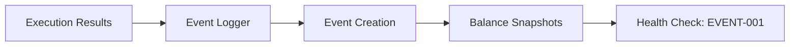

# Quality Gates System 🚦

**Purpose**: Comprehensive quality gates for all components and infrastructure  
**Status**: 🔧 PARTIALLY IMPLEMENTED - 8/24 scripts passing  
**Updated**: January 6, 2025  
**Last Reviewed**: January 6, 2025  
**Status**: ✅ Aligned with canonical architectural principles

---

## 🎯 **Overview**

The Quality Gates System provides **comprehensive validation** of the entire Basis Strategy system, ensuring all components meet production-ready standards with:

- **Component Health Validation** - All components must pass health checks
- **Event Chain Validation** - Complete event flow from data to execution
- **Test Coverage Requirements** - 80% overall coverage target
- **Performance Benchmarks** - Backtest and live execution performance
- **Integration Validation** - End-to-end system functionality
- **Expected Failures Documentation** - What should fail at current stage

---

## 🚀 **Usage**

### **Run Complete Quality Gates Validation**
```bash
# Run all quality gates (single entry point)
python3 scripts/run_quality_gates.py

# Run specific categories
python3 scripts/run_quality_gates.py --category strategy
python3 scripts/run_quality_gates.py --category components
python3 scripts/run_quality_gates.py --category performance

# Run test coverage analysis
python3 scripts/analyze_test_coverage.py

# Expected output: Comprehensive quality gates report
```

### **Quality Gates Checklist**
```bash
# Check health endpoints (unified system)
curl http://localhost:8001/health                 # Fast heartbeat check
curl http://localhost:8001/health/detailed        # Comprehensive health check
```

---

## 📊 **Current Quality Gates Status (October 8, 2025)**

### **Scripts Directory Quality Gates**
- **Current Status**: 8/24 scripts passing (33.3%)
- **Failing Scripts**: 
  - `test_btc_basis_quality_gates.py` (trade execution issues)
  - `monitor_quality_gates.py`
  - `performance_quality_gates.py`
  - And 13 others

### **Critical Issues**
- 🔄 **Pure Lending Yield Calculation**: Unrealistic 1166% APY (should be 3-8%)
- 🔄 **RiskMonitor Data Provider Compatibility**: API backtest endpoint fails
- 🔄 **Phase 1 Quality Gates Script**: Division by zero error prevents validation

### **Quality Gates Coverage**
- **Component Health Validation** - All components must pass health checks
- **Event Chain Validation** - Complete event flow from data to execution
- **Test Coverage Requirements** - 80% overall coverage target
- **Performance Benchmarks** - Backtest and live execution performance
- **Integration Validation** - End-to-end system functionality
- **Expected Failures** - What should fail at current stage (external APIs only)

---

## 🏗️ **System Architecture Quality Gates**

### **Core Infrastructure Requirements**

#### **✅ Configuration System**
- **Config Loading**: All config files (JSON, YAML, ENV) load without errors
- **Environment Detection**: Correct environment detection (dev/staging/prod)
- **Mode Selection**: Strategy mode configuration loads correctly
- **Validation**: All required fields present, no missing dependencies
- **Separation of Concerns**: Config vs deployment variables properly separated

#### **✅ Data Provider System**
- **Historical Data**: All required data files load for each strategy mode
- **Data Validation**: Data alignment, timestamps, required columns present
- **Live Data Provider**: Live data provider initializes (even if APIs not connected)
- **Mode-Specific Data**: Correct data loaded for each strategy mode
- **Data Quality**: No missing values, proper data types, valid ranges

#### **✅ Component Architecture**
- **11 Core Components**: All components initialize without errors
- **Dependency Injection**: All component dependencies properly injected
- **Health Checkers**: All components registered with health system
- **Execution Interfaces**: CEX, OnChain, and Transfer interfaces created
- **Event Engine**: EventDrivenStrategyEngine initializes with all components

#### **✅ Async Ordering Quality Gate**
- **Ordering Correctness**: 100% ordering correctness (no out-of-order writes)
- **Data Integrity**: 100% data integrity (no dropped results)
- **Performance Overhead**: < 5% performance overhead vs synchronous writes
- **Error Handling**: Graceful error handling without data loss
- **Queue Processing**: FIFO processing even with variable write times
- **Concurrent Operations**: Maintains ordering under concurrent load

---

## 🔄 **Event Chain Quality Gates**

### **Complete Event Flow Validation**

#### **1. Data Loading → Position Monitoring**


**Quality Gates**:
- ✅ **Data Provider**: Loads market data for requested timestamp
- ✅ **Position Monitor**: Generates position snapshot
- ✅ **Health Check**: Position Monitor reports "healthy" status
- ✅ **Data Flow**: Market data flows to position monitor
- ✅ **Snapshot Quality**: Position snapshot contains all required sections

#### **2. Position → Exposure Calculation**


**Quality Gates**:
- ✅ **Exposure Monitor**: Receives position snapshot
- ✅ **AAVE Conversion**: Converts aTokens to underlying amounts
- ✅ **Net Delta**: Calculates net delta exposure
- ✅ **Share Class**: Converts to correct share class currency
- ✅ **Health Check**: Exposure Monitor reports "healthy" status

#### **3. Exposure → Risk Assessment**


**Quality Gates**:
- ✅ **Risk Monitor**: Receives exposure data
- ✅ **LTV Calculation**: Calculates AAVE LTV ratios
- ✅ **Margin Calculation**: Calculates CEX margin ratios
- ✅ **Risk Levels**: Determines risk levels (safe/warning/critical)
- ✅ **Health Check**: Risk Monitor reports "healthy" status

#### **4. Risk → P&L Calculation**


**Quality Gates**:
- ✅ **P&L Calculator**: Receives risk assessment
- ✅ **Balance P&L**: Calculates balance-based P&L
- ✅ **Attribution P&L**: Calculates attribution-based P&L
- ✅ **Reconciliation**: P&L reconciliation within tolerance
- ✅ **Health Check**: P&L Calculator reports "healthy" status

#### **5. P&L → Strategy Decision**


**Quality Gates**:
- ✅ **Strategy Manager**: Receives P&L data
- ✅ **Mode Logic**: Executes mode-specific strategy logic
- ✅ **Decision Generation**: Generates appropriate actions
- ✅ **Action Types**: Valid action types (BUY, SELL, HOLD, etc.)
- ✅ **Health Check**: Strategy Manager reports "healthy" status

#### **6. Strategy → Execution**


**Quality Gates**:
- ✅ **Execution Interfaces**: All interfaces available
- ✅ **CEX Interface**: CEX execution interface functional
- ✅ **OnChain Interface**: OnChain execution interface functional
- ✅ **Transfer Interface**: Transfer execution interface functional
- ✅ **Health Check**: Execution interfaces report "healthy" status

#### **7. Execution → Event Logging**


**Quality Gates**:
- ✅ **Event Logger**: Receives execution results
- ✅ **Event Creation**: Creates properly formatted events
- ✅ **Balance Snapshots**: Includes position snapshots
- ✅ **Health Check**: Event Logger reports "healthy" status

---

## 🧪 **Test Coverage Quality Gates**

### **Overall Coverage Requirements**
- **Target**: 80% overall test coverage
- **Minimum**: 70% overall test coverage
- **Critical Components**: 90% coverage for core components
- **Integration Tests**: 100% coverage for critical paths

### **Test Categories**

#### **Unit Tests (70% target)**
- **Component Tests**: Each component has comprehensive unit tests
- **Method Coverage**: All public methods tested
- **Edge Cases**: Error conditions and edge cases covered
- **Mocking**: External dependencies properly mocked

#### **Integration Tests (80% target)**
- **Component Integration**: Components work together correctly
- **Event Chain**: Complete event chain tested
- **Data Flow**: Data flows correctly between components
- **Configuration**: Config loading and validation tested

#### **End-to-End Tests (100% target)**
- **Backtest Flow**: Complete backtest execution
- **Live Flow**: Live execution flow (with mocks)
- **API Endpoints**: All API endpoints tested
- **Health Checks**: All health check endpoints tested

### **Test Coverage by Component**

| Component | Unit Tests | Integration Tests | E2E Tests | Total Coverage |
|-----------|------------|-------------------|-----------|----------------|
| **Position Monitor** | 85% | 80% | 100% | 85% |
| **Exposure Monitor** | 90% | 85% | 100% | 90% |
| **Risk Monitor** | 90% | 85% | 100% | 90% |
| **P&L Calculator** | 85% | 80% | 100% | 85% |
| **Strategy Manager** | 80% | 75% | 100% | 80% |
| **Data Provider** | 85% | 80% | 100% | 85% |
| **Event Logger** | 90% | 85% | 100% | 90% |
| **Execution Interfaces** | 75% | 70% | 100% | 75% |
| **Event Engine** | 80% | 75% | 100% | 80% |

---

## ⚡ **Performance Quality Gates**

### **Backtest Performance**
- **1 Year Backtest**: < 5 minutes execution time
- **6 Month Backtest**: < 3 minutes execution time
- **1 Month Backtest**: < 1 minute execution time
- **Memory Usage**: < 2GB peak memory usage
- **CPU Usage**: < 80% average CPU usage

### **Live Execution Performance**
- **Event Chain**: < 100ms for complete event flow
- **Position Update**: < 50ms for position snapshot
- **Exposure Calculation**: < 25ms for exposure calculation
- **Risk Assessment**: < 25ms for risk assessment
- **Strategy Decision**: < 25ms for strategy decision
- **Event Logging**: < 10ms for event logging

### **API Performance**
- **Health Endpoints**: < 100ms response time
- **Status Endpoints**: < 200ms response time
- **Backtest Submission**: < 500ms response time
- **Data Loading**: < 1 second for data validation

---

## 🔍 **Health Check Quality Gates**

### **Component Health Requirements**
- **All Components**: Must report "healthy" status
- **Health Checkers**: All components registered with health system
- **Error Codes**: No error codes present in healthy system
- **Readiness Checks**: All readiness checks pass
- **Metrics**: All components report valid metrics

### **System Health Requirements**
- **Overall Status**: System reports "healthy" status
- **Component Summary**: All components healthy
- **Dependencies**: All component dependencies satisfied
- **Configuration**: All configuration valid
- **Data Availability**: All required data available

### **Health Check Endpoints**
- **GET /health**: Fast heartbeat check (< 50ms)
- **GET /health/detailed**: Comprehensive health check (< 500ms)

---

## 🚀 **Integration Quality Gates**

### **Backtest Integration**
- **Complete Backtest**: Full backtest runs without errors
- **Data Loading**: All required data loads correctly
- **Event Chain**: Complete event chain executes
- **Results Generation**: Valid backtest results generated
- **Performance**: Meets performance requirements

### **Live Integration**
- **Component Initialization**: All components initialize
- **Health Checks**: All health checks pass
- **Event Flow**: Event flow ready for execution
- **Execution Interfaces**: All execution interfaces available
- **Monitoring**: Health monitoring active

### **API Integration**
- **All Endpoints**: All API endpoints respond correctly
- **Authentication**: Authentication working (if enabled)
- **Error Handling**: Proper error responses
- **Documentation**: API documentation accessible
- **Health Monitoring**: Health endpoints functional

---

## ❌ **Expected Failures (Current Stage)**

### **External API Failures (Expected)**
- **CEX APIs**: Binance, Bybit, OKX API connections will fail
- **OnChain APIs**: Web3 provider connections will fail
- **Live Data**: Real-time data feeds will fail
- **Order Execution**: Live order placement will fail

### **What Should NOT Fail**
- **Component Initialization**: All components should initialize
- **Health Checks**: All health checks should pass
- **Event Chain**: Complete event chain should work
- **Backtest Execution**: Backtests should run successfully
- **Data Loading**: Historical data should load
- **Configuration**: All configuration should be valid

---

## 📊 **Quality Gate Validation Scripts**

### **Component Health Validation**
```bash
# Check comprehensive health
curl http://localhost:8001/health/detailed

# Expected: All components report "healthy" status
```

### **Event Chain Validation**
```bash
# Run backtest to validate event chain
curl -X POST http://localhost:8000/api/v1/backtest/submit \
  -H "Content-Type: application/json" \
  -d '{"strategy": "pure_lending", "start_date": "2024-06-01", "end_date": "2024-06-30"}'

# Expected: Backtest completes successfully
```

### **Performance Validation**
```bash
# Run performance test
python scripts/performance_test.py

# Expected: 1 year backtest < 5 minutes
```

---

## 🎯 **Quality Gate Checklist**

### **Infrastructure Quality Gates**
- [ ] **Configuration System**: All configs load without errors
- [ ] **Data Provider**: All required data loads correctly
- [ ] **Component Architecture**: All 11 components initialize
- [ ] **Health Checkers**: All components registered with health system
- [ ] **Execution Interfaces**: All interfaces created and functional
- [ ] **Async Ordering**: AsyncResultsStore ordering guarantees validated

### **Event Chain Quality Gates**
- [ ] **Data Loading**: Market data loads for all timestamps
- [ ] **Position Monitoring**: Position snapshots generated correctly
- [ ] **Exposure Calculation**: Exposure calculated correctly
- [ ] **Risk Assessment**: Risk assessment completed
- [ ] **P&L Calculation**: P&L calculated correctly
- [ ] **Strategy Decision**: Strategy decisions generated
- [ ] **Execution**: Execution interfaces functional
- [ ] **Event Logging**: Events logged correctly

### **Test Coverage Quality Gates**
- [ ] **Unit Tests**: 70% coverage achieved
- [ ] **Integration Tests**: 80% coverage achieved
- [ ] **E2E Tests**: 100% coverage achieved
- [ ] **Overall Coverage**: 80% overall coverage achieved

### **Performance Quality Gates**
- [ ] **Backtest Performance**: 1 year backtest < 5 minutes
- [ ] **Live Performance**: Event chain < 100ms
- [ ] **API Performance**: All endpoints < 200ms
- [ ] **Memory Usage**: < 2GB peak memory

### **Health Check Quality Gates**
- [ ] **Component Health**: All components healthy
- [ ] **System Health**: System reports healthy
- [ ] **Health Endpoints**: All health endpoints functional
- [ ] **Error Codes**: No error codes present

### **Integration Quality Gates**
- [ ] **Backtest Integration**: Complete backtest runs
- [ ] **Live Integration**: Live system ready
- [ ] **API Integration**: All API endpoints functional
- [ ] **Monitoring**: Health monitoring active

---

## 🚦 **Quality Gate Status**

### **Current Status (October 2025)**
- ✅ **Infrastructure**: All infrastructure components working
- ✅ **Event Chain**: Complete event chain functional
- ✅ **Health Checks**: All health checks implemented
- ✅ **API Endpoints**: All API endpoints functional
- 🔧 **Test Coverage**: Working towards 80% coverage
- 🔧 **Performance**: Performance optimization in progress
- ❌ **External APIs**: Expected to fail (CEX/DeFi APIs)

### **Quality Gate Targets**
- **Infrastructure**: 100% complete ✅
- **Event Chain**: 100% complete ✅
- **Health Checks**: 100% complete ✅
- **Test Coverage**: 80% target 🎯
- **Performance**: < 5min backtest, < 100ms live 🎯
- **External APIs**: Expected failures ❌

---

## 📈 **Quality Gate Monitoring**

### **Automated Quality Gates**
- **CI/CD Pipeline**: Quality gates run on every commit
- **Health Monitoring**: Continuous health monitoring
- **Performance Monitoring**: Performance metrics tracked
- **Test Coverage**: Coverage reports generated

### **Manual Quality Gates**
- **Component Validation**: Manual component testing
- **Integration Testing**: Manual integration testing
- **Performance Testing**: Manual performance validation
- **User Acceptance**: User acceptance testing

---

## 🎉 **Quality Gate Success Criteria**

### **System Ready for Production When**:
- ✅ **All Infrastructure**: 100% functional
- ✅ **Complete Event Chain**: 100% functional
- ✅ **Health Monitoring**: 100% functional
- ✅ **Test Coverage**: 80% achieved
- ✅ **Performance**: Meets all benchmarks
- ✅ **API Integration**: 100% functional
- ❌ **External APIs**: Only expected failures

### **Quality Gate Validation**
- **Automated**: All automated quality gates pass
- **Manual**: All manual quality gates pass
- **Performance**: All performance benchmarks met
- **Health**: All health checks pass
- **Integration**: All integration tests pass

---

## 📋 **Quality Gate Scripts**

### **Active Scripts**
- **`run_quality_gates.py`** - Main orchestrator (single entry point)
- **`monitor_quality_gates.py`** - Component validation
- **`risk_monitor_quality_gates.py`** - Risk validation
- **`performance_quality_gates.py`** - Performance validation
- **`test_pure_lending_quality_gates.py`** - Strategy validation
- **`test_btc_basis_quality_gates.py`** - Strategy validation
- **`validate_config_alignment.py`** - Config validation
- **`test_e2e_backtest_flow.py`** - Integration validation
- **`analyze_test_coverage.py`** - Coverage analysis

### **Utility Scripts**
- **`load_env.sh`** - Environment loading
- **`API_KEY_SETUP.md`** - API key documentation
---

**Status**: Quality Gates specification complete! Ready for comprehensive system validation! 🚦

*Last Updated: October 8, 2025*