# Workflow Guide - Complete System Architecture 🏗️

**Purpose**: Comprehensive workflow documentation for all system activities triggered by internal events and external API calls  
**Status**: ✅ COMPLETE - Comprehensive system documentation with all workflow patterns  
**Updated**: January 2025  
**Last Reviewed**: January 2025  
**Status**: ✅ Aligned with canonical architectural principles

---

## 📚 **Canonical Sources**

**This workflow guide aligns with canonical architectural principles**:
- **Architectural Principles**: [REFERENCE_ARCHITECTURE_CANONICAL.md](REFERENCE_ARCHITECTURE_CANONICAL.md) - Canonical architectural principles
- **Strategy Specifications**: [MODES.md](MODES.md) - Canonical strategy mode definitions
- **Venue Architecture**: [VENUE_ARCHITECTURE.md](VENUE_ARCHITECTURE.md) - Venue client initialization and execution
- **Deployment Architecture**: [DEPLOYMENT_GUIDE.md](DEPLOYMENT_GUIDE.md) - Deployment and startup architecture
- **Component Specifications**: [specs/](specs/) - Detailed component implementation guides

## 📚 **Key References**

- **Component Details** → [COMPONENT_SPECS_INDEX.md](COMPONENT_SPECS_INDEX.md)
- **Architecture Decisions** → [REFERENCE_ARCHITECTURE_CANONICAL.md](REFERENCE_ARCHITECTURE_CANONICAL.md)
- **Configuration** → [specs/CONFIGURATION.md](specs/CONFIGURATION.md)
- **Environment Variables** → [ENVIRONMENT_VARIABLES.md](ENVIRONMENT_VARIABLES.md)
- **Deployment Guide** → [DEPLOYMENT_GUIDE.md](DEPLOYMENT_GUIDE.md)

---

## 🎯 **System Overview**

The Basis Strategy system is a **component-based, event-driven architecture** that seamlessly switches between backtest and live modes while maintaining the same execution interfaces and data flow patterns.

### **Core Architecture Principles**
- **Component-Based**: 11 core components with clear responsibilities
- **Event-Driven**: Synchronous event chain with audit logging
- **Mode-Agnostic**: Same interfaces for backtest and live execution
- **Fail-Fast**: Explicit configuration with no hidden defaults
- **Audit-Grade**: Complete event trail with balance snapshots

### **Workflow Trigger Types**

The system supports four main types of workflow triggers:

1. **Time Triggers**: Periodic execution of full component chain
2. **Position Update Triggers**: External position changes triggering component chain
3. **Trade Flow Triggers**: Internal trade execution triggering execution manager loops
4. **Start/Stop Triggers**: System lifecycle management

### **Backtest vs Live Mode Differences**

| **Aspect** | **Backtest Mode** | **Live Mode** |
|------------|-------------------|---------------|
| **Time Triggers** | Simulated hourly data loop | Real-time configurable interval (60s default) |
| **Position Updates** | Simulated via execution interfaces and startup loop | Real external API calls (CEX, Web3) |
| **Trade Flows** | Simulated execution | Real execution with confirmation |
| **Start/Stop** | Backtest start/stop only | Live start/stop only |
| **Data Source** | Historical CSV files or DB | Real-time APIs |
| **Execution** | Simulated venues | Real venues with heartbeat tests |

### **Simplified Architecture Philosophy**

**Key Design Decision**: The system is **not highly event-driven** to avoid complex async patterns. Instead:

- **Time Triggers**: Handle most business logic (deposits, withdrawals, risk checks) every 60 seconds
- **Trade Flows**: Drive fast component chains only when needed
- **Position Updates**: Logged for analytics but don't trigger separate workflows
- **Start/Stop**: Trigger different initialization workflows

This keeps the architecture simple while maintaining all required functionality.

---

## 🚀 **External API Call Workflows**

### **1. Start Backtest Workflow**

**Trigger**: External API call to `/api/v1/backtest/start`

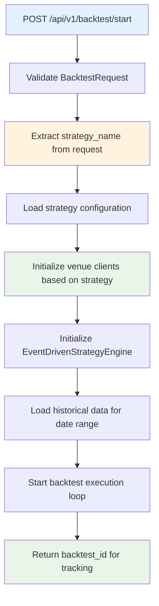

**Key Parameters**:
- `strategy_name`: Strategy mode selection (validates against `MODES.md`)
- `start_date`/`end_date`: Historical data range
- `initial_capital`: Starting capital amount
- `share_class`: USDT or ETH share class

**Venue Client Initialization**:
- **Environment-Specific**: Uses `BASIS_ENVIRONMENT` to route to dev/staging/prod credentials
- **Strategy-Specific**: Only initializes venues required by strategy mode
- **Execution Mode**: Backtest mode uses simulated venues (no real API calls)

### **2. Stop Backtest Workflow**

**Trigger**: External API call to `/api/v1/backtest/stop`

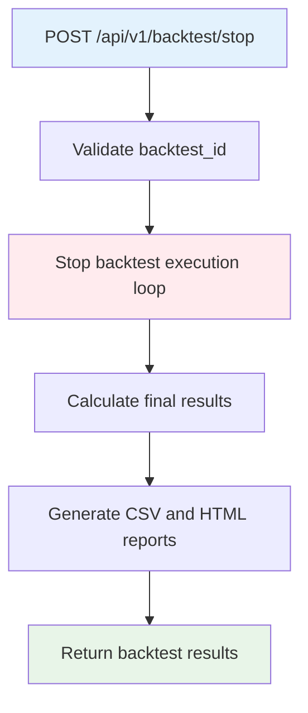

### **3. Start Live Trading Workflow**

**Trigger**: External API call to `/api/v1/live/start`

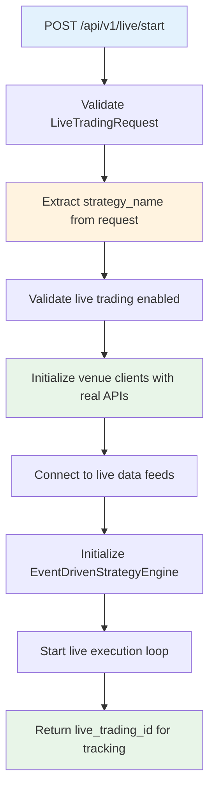

**Key Differences from Backtest**:
- **Real Venue APIs**: Uses actual CEX and Web3 APIs
- **Live Data Feeds**: Connects to real-time market data
- **Heartbeat Tests**: Validates venue connectivity
- **Environment Credentials**: Uses environment-specific API keys

### **4. Stop Live Trading Workflow**

**Trigger**: External API call to `/api/v1/live/stop`

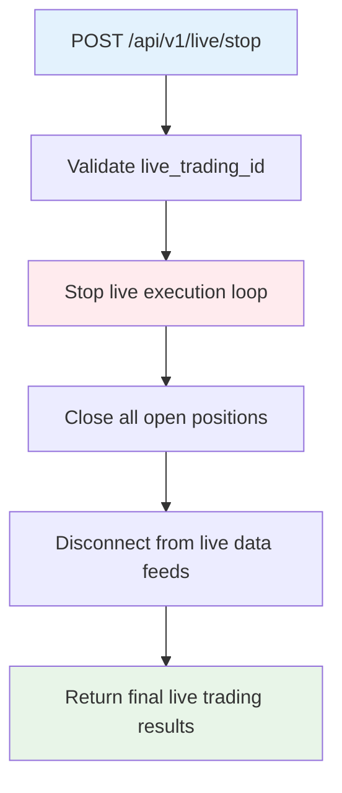

### **5. Deposit Capital Workflow**

**Trigger**: External API call to `/api/v1/capital/deposit`

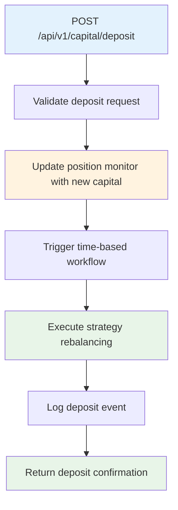

**Note**: Deposits don't trigger immediate workflows. They update balances and are processed during the next time-triggered workflow.

### **6. Withdraw Capital Workflow**

**Trigger**: External API call to `/api/v1/capital/withdraw`

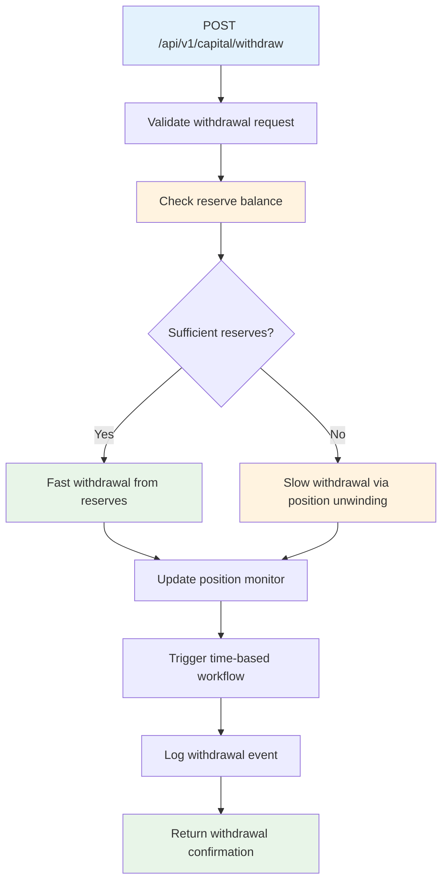

### **7. Position Update Workflow**

**Trigger**: External API call to `/api/v1/positions/update`

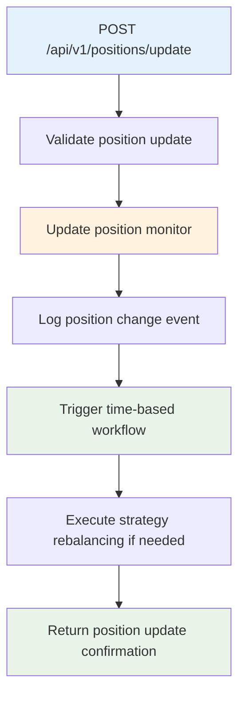

**Note**: Position updates are logged for analytics but don't trigger immediate workflows. They're processed during the next time-triggered workflow.

### **8. Health Check Workflows**

**Trigger**: External API calls to health endpoints

#### **8.1. Basic Health Check Workflow**

**Trigger**: External API call to `GET /health`

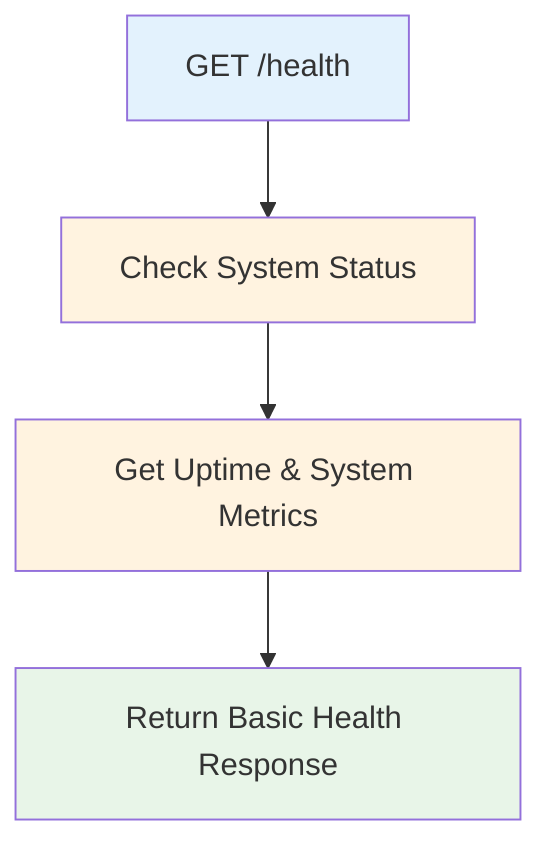

**Response Time**: < 50ms for load balancer health checks

#### **8.2. Detailed Health Check Workflow**

**Trigger**: External API call to `GET /health/detailed`

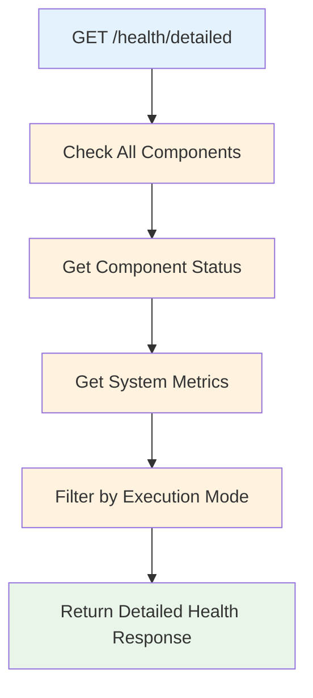

**Response Time**: < 500ms for comprehensive health monitoring

### **9. Backtest Status & Results Workflows**

#### **9.1. Get Backtest Status Workflow**

**Trigger**: External API call to `GET /api/v1/backtest/{request_id}/status`

```mermaid
graph TD
    A[GET /api/v1/backtest/{request_id}/status] --> B[Validate Request ID]
    B --> C[Check Backtest Status]
    C --> D[Get Progress & Metrics]
    D --> E[Return Status Response]
    
    style A fill:#e3f2fd
    style B fill:#fff3e0
    style C fill:#fff3e0
    style D fill:#fff3e0
    style E fill:#e8f5e8
```

#### **9.2. Get Backtest Results Workflow**

**Trigger**: External API call to `GET /api/v1/backtest/{request_id}/result`

```mermaid
graph TD
    A[GET /api/v1/backtest/{request_id}/result] --> B[Validate Request ID]
    B --> C[Check Completion Status]
    C --> D[Load Results Data]
    D --> E[Format Performance Metrics]
    E --> F[Return Results Response]
    
    style A fill:#e3f2fd
    style B fill:#fff3e0
    style C fill:#fff3e0
    style D fill:#fff3e0
    style E fill:#fff3e0
    style F fill:#e8f5e8
```

### **10. Live Trading Status & Performance Workflows**

#### **10.1. Get Live Trading Status Workflow**

**Trigger**: External API call to `GET /api/v1/live/status/{request_id}`

```mermaid
graph TD
    A[GET /api/v1/live/status/{request_id}] --> B[Validate Request ID]
    B --> C[Check Live Trading Status]
    C --> D[Get Performance Metrics]
    D --> E[Get Risk Metrics]
    E --> F[Return Status Response]
    
    style A fill:#e3f2fd
    style B fill:#fff3e0
    style C fill:#fff3e0
    style D fill:#fff3e0
    style E fill:#fff3e0
    style F fill:#e8f5e8
```

#### **10.2. Get Live Trading Performance Workflow**

**Trigger**: External API call to `GET /api/v1/live/performance/{request_id}`

```mermaid
graph TD
    A[GET /api/v1/live/performance/{request_id}] --> B[Validate Request ID]
    B --> C[Get Performance Data]
    C --> D[Calculate Metrics]
    D --> E[Return Performance Response]
    
    style A fill:#e3f2fd
    style B fill:#fff3e0
    style C fill:#fff3e0
    style D fill:#fff3e0
    style E fill:#e8f5e8
```

### **11. Strategy Information Workflows**

#### **11.1. List Available Strategies Workflow**

**Trigger**: External API call to `GET /api/v1/strategies/`

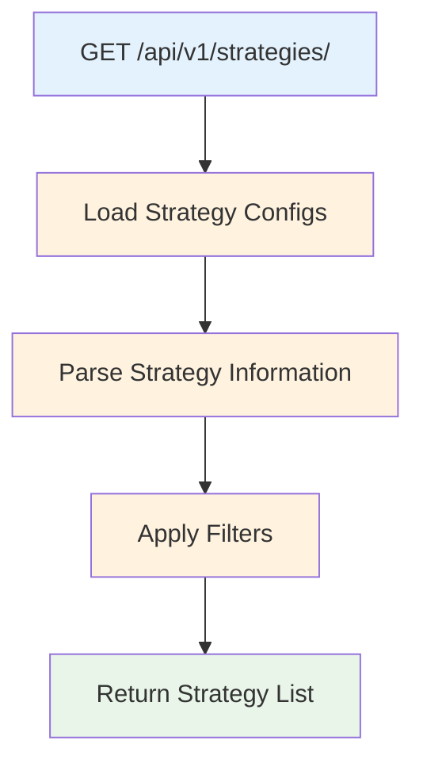

#### **11.2. Get Strategy Details Workflow**

**Trigger**: External API call to `GET /api/v1/strategies/{strategy_name}`

```mermaid
graph TD
    A[GET /api/v1/strategies/{strategy_name}] --> B[Validate Strategy Name]
    B --> C[Load Strategy Config]
    C --> D[Derive Strategy Info]
    D --> E[Return Strategy Details]
    
    style A fill:#e3f2fd
    style B fill:#fff3e0
    style C fill:#fff3e0
    style D fill:#fff3e0
    style E fill:#e8f5e8
```

### **12. Results & Export Workflows**

#### **12.1. Get Result Events Workflow**

**Trigger**: External API call to `GET /api/v1/results/{result_id}/events`

```mermaid
graph TD
    A[GET /api/v1/results/{result_id}/events] --> B[Validate Result ID]
    B --> C[Load Event Log]
    C --> D[Apply Pagination]
    D --> E[Return Events Response]
    
    style A fill:#e3f2fd
    style B fill:#fff3e0
    style C fill:#fff3e0
    style D fill:#fff3e0
    style E fill:#e8f5e8
```

#### **12.2. Get Export Information Workflow**

**Trigger**: External API call to `GET /api/v1/results/{result_id}/export`

```mermaid
graph TD
    A[GET /api/v1/results/{result_id}/export] --> B[Validate Result ID]
    B --> C[Check Available Files]
    C --> D[Get Export Information]
    D --> E[Return Export Response]
    
    style A fill:#e3f2fd
    style B fill:#fff3e0
    style C fill:#fff3e0
    style D fill:#fff3e0
    style E fill:#e8f5e8
```

#### **12.3. List Results Workflow**

**Trigger**: External API call to `GET /api/v1/results/`

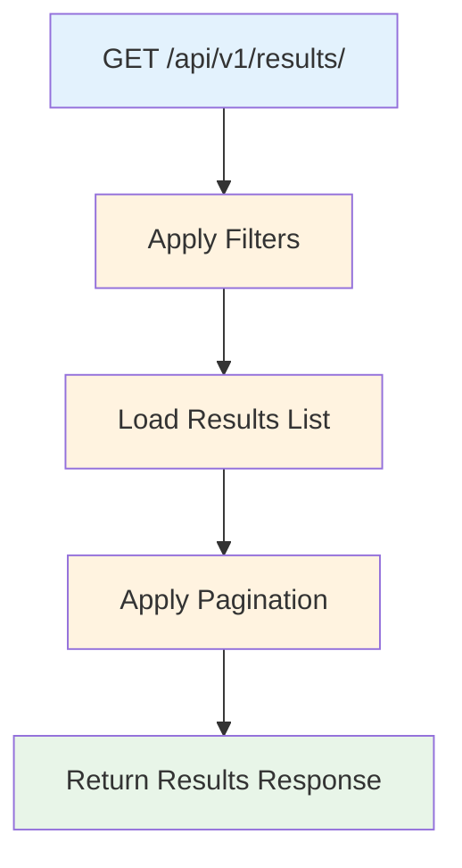

### **13. Charts Workflows**

#### **13.1. List Charts Workflow**

**Trigger**: External API call to `GET /api/v1/results/{request_id}/charts`

```mermaid
graph TD
    A[GET /api/v1/results/{request_id}/charts] --> B[Validate Request ID]
    B --> C[Check Available Charts]
    C --> D[Get Chart Information]
    D --> E[Return Charts Response]
    
    style A fill:#e3f2fd
    style B fill:#fff3e0
    style C fill:#fff3e0
    style D fill:#fff3e0
    style E fill:#e8f5e8
```

### **14. Root API Workflows**

#### **14.1. API Information Workflow**

**Trigger**: External API call to `GET /`

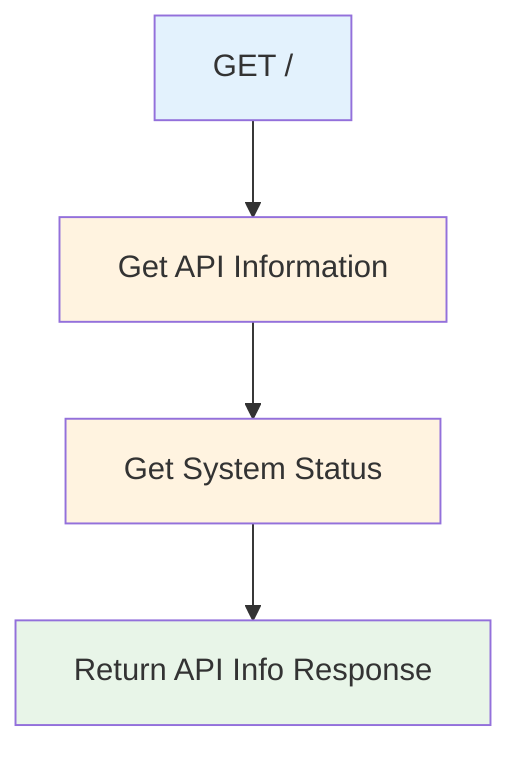

### **15. Live Trading Additional Workflows**

#### **15.1. Emergency Stop Live Trading Workflow**

**Trigger**: External API call to `POST /api/v1/live/emergency-stop/{request_id}`

```mermaid
graph TD
    A[POST /api/v1/live/emergency-stop/{request_id}] --> B[Validate Request ID]
    B --> C[Check Strategy Status]
    C --> D[Execute Emergency Stop]
    D --> E[Close All Positions]
    E --> F[Log Emergency Stop Event]
    F --> G[Return Emergency Stop Response]
    
    style A fill:#e3f2fd
    style B fill:#fff3e0
    style C fill:#fff3e0
    style D fill:#ffebee
    style E fill:#ffebee
    style F fill:#f1f8e9
    style G fill:#e8f5e8
```

#### **15.2. List Running Strategies Workflow**

**Trigger**: External API call to `GET /api/v1/live/strategies`

```mermaid
graph TD
    A[GET /api/v1/live/strategies] --> B[Get Running Strategies]
    B --> C[Get Strategy Status]
    C --> D[Format Response]
    D --> E[Return Strategies List]
    
    style A fill:#e3f2fd
    style B fill:#fff3e0
    style C fill:#fff3e0
    style D fill:#fff3e0
    style E fill:#e8f5e8
```

#### **15.3. Manual Rebalancing Workflow**

**Trigger**: External API call to `POST /api/v1/live/rebalance`

```mermaid
graph TD
    A[POST /api/v1/live/rebalance] --> B[Validate Strategy ID]
    B --> C[Check Strategy Status]
    C --> D[Trigger Rebalancing]
    D --> E[Execute Rebalancing Logic]
    E --> F[Return Rebalancing Response]
    
    style A fill:#e3f2fd
    style B fill:#fff3e0
    style C fill:#fff3e0
    style D fill:#e8f5e8
    style E fill:#e8f5e8
    style F fill:#e8f5e8
```

### **16. Strategy Information Additional Workflows**

#### **16.1. Get Merged Strategy Config Workflow**

**Trigger**: External API call to `GET /api/v1/strategies/{strategy_name}/config/merged`

```mermaid
graph TD
    A[GET /api/v1/strategies/{strategy_name}/config/merged] --> B[Validate Strategy Name]
    B --> C[Load Base Config]
    C --> D[Apply Query Parameters]
    D --> E[Merge Configurations]
    E --> F[Return Merged Config]
    
    style A fill:#e3f2fd
    style B fill:#fff3e0
    style C fill:#fff3e0
    style D fill:#fff3e0
    style E fill:#fff3e0
    style F fill:#e8f5e8
```

#### **16.2. Get Strategy Mode Config Workflow**

**Trigger**: External API call to `GET /api/v1/strategies/{strategy_name}/config/mode`

```mermaid
graph TD
    A[GET /api/v1/strategies/{strategy_name}/config/mode] --> B[Validate Strategy Name]
    B --> C[Load Mode Config]
    C --> D[Return Mode Config]
    
    style A fill:#e3f2fd
    style B fill:#fff3e0
    style C fill:#fff3e0
    style D fill:#e8f5e8
```

#### **16.3. List Strategy Modes Workflow**

**Trigger**: External API call to `GET /api/v1/strategies/modes`

```mermaid
graph TD
    A[GET /api/v1/strategies/modes] --> B[Load All Mode Configs]
    B --> C[Extract Mode Information]
    C --> D[Return Modes List]
    
    style A fill:#e3f2fd
    style B fill:#fff3e0
    style C fill:#fff3e0
    style D fill:#e8f5e8
```

---

## ⚙️ **Internal System Event Workflows**

### **1. Time-Triggered Workflow (Primary)**

**Trigger**: Periodic execution every 60 seconds (configurable)

```mermaid
graph TD
    A[Time Trigger] --> B[Position Monitor: Get Current Positions]
    B --> C[Exposure Monitor: Calculate Exposure]
    C --> D[Risk Monitor: Assess Risk]
    D --> E[Strategy Manager: Make Decision]
    E --> F{Need Execution?}
    F -->|Yes| G[Execute Trades via Tight Loop]
    F -->|No| H[P&L Monitor: Calculate P&L]
    G --> I[P&L Monitor: Calculate P&L on Final Positions]
    H --> J[Results Store: Persist Results]
    I --> J
    J --> K[Log All Events]
    K --> L[Wait for Next Time Trigger]
    
    style A fill:#e3f2fd
    style B fill:#fff3e0
    style C fill:#fff3e0
    style D fill:#fff3e0
    style E fill:#f3e5f5
    style F fill:#ffebee
    style G fill:#e8f5e8
    style H fill:#fff3e0
    style I fill:#fff3e0
    style J fill:#e1f5fe
    style K fill:#f1f8e9
    style L fill:#e8f5e8
```

**Business Logic Handled**:
- **Deposit Processing**: Check for new deposits and rebalance
- **Withdrawal Processing**: Check for withdrawal requests and execute
- **Risk Checks**: Monitor liquidation risks and margin requirements
- **Reserve Management**: Check reserve balances and trigger rebalancing
- **Dust Management**: Convert small token amounts to share class currency
- **Equity Tracking**: Update equity calculations and position sizing

### **2. Trade Flow Workflow (Execution Manager Loops)**

**Trigger**: Internal trade execution requiring sequential operations

```mermaid
graph TD
    A[Trade Flow Trigger] --> B[Execution Manager: Get Next Instruction]
    B --> C[Execution Interface Manager: Route Instruction]
    C --> D[Venue-Specific Interface: Execute]
    D --> E[Position Update Handler: Orchestrate Tight Loop]
    E --> F[Position Monitor: Update Position]
    F --> G[Reconciliation Component: Verify]
    G --> H{Reconciliation Success?}
    H -->|Yes| I[Move to Next Instruction]
    H -->|No| J[Retry or Fail]
    I --> K{More Instructions?}
    K -->|Yes| B
    K -->|No| L[Complete Trade Flow]
    J --> M[Log Error]
    M --> N[End Trade Flow]
    
    style A fill:#e3f2fd
    style B fill:#e8f5e8
    style C fill:#e8f5e8
    style D fill:#e8f5e8
    style E fill:#fff3e0
    style F fill:#fff3e0
    style G fill:#fff3e0
    style H fill:#ffebee
    style I fill:#e8f5e8
    style J fill:#ffebee
    style K fill:#ffebee
    style L fill:#e8f5e8
    style M fill:#ffebee
    style N fill:#ffebee
```

**Key Characteristics**:
- **Sequential Execution**: Each instruction must complete before next
- **Execution Manager Orchestration**: Orchestrates Execution Interface Manager
- **Venue Routing**: Execution Interface Manager routes to appropriate venue interfaces
- **Tight Loop Integration**: Position Update Handler orchestrates reconciliation
- **No Race Conditions**: Execution manager waits for reconciliation success
- **Atomic Operations**: Complex multi-step operations handled as units

### **3. Reserve Management Workflow**

**Trigger**: Time-triggered workflow checking reserve balances

```mermaid
graph TD
    A[Time Trigger] --> B[Check Reserve Balance]
    B --> C{Reserve < Threshold?}
    C -->|Yes| D[Publish Reserve Low Event]
    C -->|No| E[Continue Normal Operations]
    D --> F[Trigger Fast Withdrawal Mode]
    F --> G[Maintain Reserve Buffer]
    G --> E
    
    style A fill:#e3f2fd
    style B fill:#fff3e0
    style C fill:#e1f5fe
    style D fill:#fff3e0
    style F fill:#e8f5e8
    style E fill:#e8f5e8
```

**Reserve Management**:
- **Separate Wallet**: Dedicated wallet for share class currency (USDT/ETH)
- **Threshold Monitoring**: Check reserve balance against configured threshold
- **Fast Withdrawals**: Use reserves for immediate client redemptions
- **Slow Withdrawals**: Unwind positions when reserves insufficient

### **4. Dust Management Workflow**

**Trigger**: Time-triggered workflow checking for dust amounts

```mermaid
graph TD
    A[Time Trigger] --> B[Check Token Balances]
    B --> C{Any Dust Amounts?}
    C -->|Yes| D[Identify Dust Tokens]
    C -->|No| E[Continue Normal Operations]
    D --> F[Convert Dust to Share Class]
    F --> G[Update Position Monitor]
    G --> H[Log Dust Conversion Event]
    H --> E
    
    style A fill:#e3f2fd
    style B fill:#fff3e0
    style C fill:#e1f5fe
    style D fill:#fff3e0
    style F fill:#e8f5e8
    style E fill:#e8f5e8
```

**Dust Management**:
- **Threshold Detection**: Identify tokens below dust threshold
- **Share Class Conversion**: Convert dust to share class currency
- **Gas Optimization**: Batch dust conversions to minimize gas costs
- **Analytics Logging**: Track dust conversion events for analysis

### **5. Equity Tracking Workflow**

**Trigger**: Time-triggered workflow updating equity calculations

```mermaid
graph TD
    A[Time Trigger] --> B[Calculate Total Equity]
    B --> C[Update Position Sizing]
    C --> D[Check Rebalancing Needs]
    D --> E{Need Rebalancing?}
    E -->|Yes| F[Execute Rebalancing]
    E -->|No| G[Continue Normal Operations]
    F --> H[Update All Positions]
    H --> I[Log Rebalancing Event]
    I --> G
    
    style A fill:#e3f2fd
    style B fill:#fff3e0
    style C fill:#fff3e0
    style D fill:#e1f5fe
    style E fill:#e1f5fe
    style F fill:#e8f5e8
    style G fill:#e8f5e8
```

**Equity Tracking**:
- **Total Equity Calculation**: Sum of all assets minus liabilities
- **Position Sizing**: Adjust positions based on equity changes
- **Dynamic Rebalancing**: Scale positions up/down with equity changes
- **Share Class Reporting**: Report equity in share class currency

### **6. Position Update Workflow (External Triggers)**

**Trigger**: External position changes (CEX liquidation, AAVE liquidation, deposits, withdrawals)

```mermaid
graph TD
    A[External Position Change] --> B[Position Monitor: Update Position]
    B --> C[Log Position Change Event]
    C --> D[Trigger Time-Based Workflow]
    D --> E[Execute Strategy Rebalancing]
    E --> F[Update All Components]
    F --> G[Continue Normal Operations]
    
    style A fill:#e3f2fd
    style B fill:#fff3e0
    style C fill:#f1f8e9
    style D fill:#e3f2fd
    style E fill:#e8f5e8
    style G fill:#e8f5e8
```

**External Position Changes**:
- **CEX Liquidations**: Position monitor detects liquidation events
- **AAVE Liquidations**: Smart contract liquidation events
- **Investor Deposits**: New capital added to system
- **Investor Withdrawals**: Capital removed from system
- **Analytics Logging**: All position changes logged for analysis

---

## 🎯 **Strategy Mode Selection & Venue Architecture Integration**

### **Strategy Mode Selection Workflow**

**Trigger**: API parameter `strategy_name` in `BacktestRequest` or `LiveTradingRequest`

```mermaid
graph TD
    A[API Request with strategy_name] --> B[Validate strategy_name against MODES.md]
    B --> C[Load Strategy Configuration]
    C --> D[Extract Venue Requirements]
    D --> E[Initialize Venue Clients]
    E --> F[Set Environment-Specific Credentials]
    F --> G[Validate Venue Connectivity]
    G --> H[Start Strategy Execution]
    
    style A fill:#e3f2fd
    style B fill:#fff3e0
    style C fill:#fff3e0
    style D fill:#e1f5fe
    style E fill:#e8f5e8
    style F fill:#e8f5e8
    style H fill:#e8f5e8
```

**Strategy Mode to Venue Mapping**:

| **Strategy Mode** | **Required Venues** | **Venue Types** |
|-------------------|---------------------|-----------------|
| **pure_lending** | AAVE V3, Alchemy | DeFi, Infrastructure |
| **btc_basis** | Binance, Bybit, OKX, Alchemy | CEX, Infrastructure |
| **eth_basis** | Binance, Bybit, OKX, Alchemy | CEX, Infrastructure |
| **eth_staking_only** | Lido/EtherFi, Alchemy | DeFi, Infrastructure |
| **eth_leveraged** | Lido/EtherFi, AAVE V3, Morpho, Alchemy, Instadapp | DeFi, Infrastructure |
| **usdt_market_neutral_no_leverage** | Binance, Bybit, OKX, Lido/EtherFi, Alchemy | CEX, DeFi, Infrastructure |
| **usdt_market_neutral** | Binance, Bybit, OKX, Lido/EtherFi, AAVE V3, Morpho, Alchemy, Instadapp | CEX, DeFi, Infrastructure |

### **Environment-Specific Credential Routing**

**Trigger**: `BASIS_ENVIRONMENT` variable determines credential routing

```mermaid
graph TD
    A[BASIS_ENVIRONMENT] --> B{Environment Type?}
    B -->|dev| C[Use DEV Credentials]
    B -->|staging| D[Use STAGING Credentials]
    B -->|production| E[Use PROD Credentials]
    
    C --> F[Testnet APIs]
    D --> G[Testnet APIs]
    E --> H[Mainnet APIs]
    
    F --> I[Initialize Venue Clients]
    G --> I
    H --> I
    
    style A fill:#e3f2fd
    style B fill:#e1f5fe
    style C fill:#fff3e0
    style D fill:#fff3e0
    style E fill:#fff3e0
    style I fill:#e8f5e8
```

**Environment-Specific Credential Pattern**:
```bash
# Development Environment - Testnet APIs
BASIS_DEV__ALCHEMY__PRIVATE_KEY=testnet_key
BASIS_DEV__CEX__BINANCE_SPOT_API_KEY=testnet_key

# Production Environment - Mainnet APIs
BASIS_PROD__ALCHEMY__PRIVATE_KEY=mainnet_key
BASIS_PROD__CEX__BINANCE_SPOT_API_KEY=mainnet_key
```

### **Execution Mode Impact on Venue Behavior**

**Trigger**: `BASIS_EXECUTION_MODE` determines venue execution behavior

```mermaid
graph TD
    A[BASIS_EXECUTION_MODE] --> B{Execution Mode?}
    B -->|backtest| C[Simulated Venue Execution]
    B -->|live| D[Real Venue Execution]
    
    C --> E[No Real API Calls]
    C --> F[Simulated Responses]
    C --> G[Historical Data Only]
    
    D --> H[Real API Calls]
    D --> I[Real Responses]
    D --> J[Live Data Feeds]
    D --> K[Heartbeat Tests]
    
    style A fill:#e3f2fd
    style B fill:#e1f5fe
    style C fill:#fff3e0
    style D fill:#e8f5e8
```

**Backtest Mode**:
- **Simulated Execution**: All venue operations are simulated
- **No Credentials Required**: No real API keys needed
- **Historical Data**: Uses CSV files for market data
- **Code Alignment**: Venue interfaces exist for code alignment only

**Live Mode**:
- **Real Execution**: All venue operations are real
- **Credentials Required**: Environment-specific API keys required
- **Live Data**: Uses real-time APIs for market data
- **Heartbeat Tests**: Validates venue connectivity

### **Venue Client Initialization Factory**

**Trigger**: Strategy mode selection triggers venue client creation

```mermaid
graph TD
    A[Strategy Mode Selected] --> B[Execution Interface Factory]
    B --> C[Create Required Venue Clients]
    C --> D[Set Environment-Specific Credentials]
    D --> E[Initialize Client Connections]
    E --> F[Validate Client Health]
    F --> G[Register Clients with Execution Interfaces]
    G --> H[Venue Clients Ready]
    
    style A fill:#e3f2fd
    style B fill:#e8f5e8
    style C fill:#e8f5e8
    style D fill:#e8f5e8
    style E fill:#e8f5e8
    style F fill:#e8f5e8
    style H fill:#e8f5e8
```

**Venue Client Types**:
- **CEX Clients**: Binance, Bybit, OKX (spot + futures)
- **DeFi Clients**: AAVE V3, Lido, EtherFi, Morpho
- **Infrastructure Clients**: Alchemy, Uniswap, Instadapp

---

## 🔄 **High-Level System Workflow**

```mermaid
graph TB
    subgraph "Configuration Layer"
        A[Config Loading] --> B[Environment Detection]
        B --> C[Mode Selection]
        C --> D[Strategy Configuration]
    end
    
    subgraph "Data Layer"
        E[Data Provider] --> F{Execution Mode?}
        F -->|Backtest| G[Historical CSV Data]
        F -->|Live| H[Real-time APIs]
    end
    
    subgraph "Event Engine"
        I[EventDrivenStrategyEngine] --> J[Component Initialization]
        J --> K[Event Loop]
    end
    
    subgraph "Event Chain"
        L[Position Monitor] --> M[Exposure Monitor]
        M --> N[Risk Monitor]
        N --> O[P&L Calculator]
        O --> P[Strategy Manager]
    end
    
    subgraph "Execution Layer"
        Q[Execution Interfaces] --> R{Interface Type?}
        R -->|CEX| S[CEX Execution Interface]
        R -->|OnChain| T[OnChain Execution Interface]
        R -->|Transfer| U[Transfer Execution Interface]
    end
    
    subgraph "Logging Layer"
        V[Event Logger] --> X[Audit Trail]
    end
    
    A --> E
    E --> I
    I --> L
    P --> Q
    Q --> V
    
    style A fill:#e1f5fe
    style E fill:#f3e5f5
    style I fill:#e8f5e8
    style L fill:#fff3e0
    style Q fill:#fce4ec
    style V fill:#f1f8e9
```

---

## 🏗️ **Environment & Configuration Workflow**

### **Configuration Loading Hierarchy**

```mermaid
graph TD
    A[System Start] --> B[Load YAML Mode Configs]
    B --> C[Load YAML Venue Configs]
    C --> D[Load YAML Share Class Configs]
    D --> E[Load Environment Variables]
    E --> F[Validate Configuration]
    F --> G{Valid?}
    G -->|Yes| H[Initialize Components]
    G -->|No| I[Fail Fast with Error]
    
    style B fill:#ccffcc
    style C fill:#ccffcc
    style D fill:#ccffcc
    style E fill:#ffffcc
    style F fill:#ccffcc
    
    style A fill:#e3f2fd
    style H fill:#e8f5e8
    style I fill:#ffebee
```

### **Configuration Files Structure**

| File | Purpose | Environment | Priority | Status |
|------|---------|-------------|----------|---------|
| YAML Mode Configs | Strategy-specific parameters | All | ✅ Implemented | ✅ Working |
| YAML Venue Configs | Venue-specific configurations | All | ✅ Implemented | ✅ Working |
| YAML Share Class Configs | Share class definitions | All | ✅ Implemented | ✅ Working |
| `env.unified` | Application variables | All | ✅ Implemented | ✅ Working |
| `deploy/.env*` | Deployment variables | Specific | ✅ Implemented | ✅ Working |

### **Configuration Separation of Concerns**

**YAML Configuration Files** (Static Strategy/Venue Configs):
- **Purpose**: Static configuration that rarely changes based on deployment
- **Content**: Strategy parameters, venue capabilities, share class definitions
- **Examples**: `target_apy`, `max_drawdown`, `lst_type`, `hedge_allocation`, venue trading parameters
- **Location**: `configs/modes/*.yaml`, `configs/venues/*.yaml`, `configs/share_classes/*.yaml`

**Environment Variables** (Deployment-Specific Configs):
- **Purpose**: Configuration that changes per deployment environment
- **Content**: Database URLs, API ports, venue credentials, data sources
- **Examples**: `BASIS_DATABASE__URL`, `BASIS_DEV__CEX__BINANCE_SPOT_API_KEY`
- **Location**: `backend/env.unified` (overridden by deployment-specific files)

**Deployment Configuration** (`deploy/.env*`):
- **Purpose**: Caddy-specific deployment variables only
- **Content**: Domain names, TLS settings, port mappings, basic auth
- **Examples**: `APP_DOMAIN`, `ACME_EMAIL`, `BASIC_AUTH_HASH`
- **Location**: `deploy/.env*` files

### **Code References**
- **Config Loading**: `backend/src/basis_strategy_v1/infrastructure/config/settings.py:get_settings()`
- **Environment Detection**: `backend/src/basis_strategy_v1/infrastructure/config/settings.py:detect_strategy_mode()`
- **Validation**: `backend/src/basis_strategy_v1/infrastructure/config/config_validator.py`

---

## 📊 **Data Provider Workflow**

### **Data Loading by Strategy Mode**

```mermaid
graph TD
    A[DataProvider.__init__] --> B{Execution Mode?}
    B -->|backtest| C[Load Historical Data]
    B -->|live| D[Initialize LiveDataProvider]
    
    C --> E{Strategy Mode?}
    E -->|pure_lending| F[Load USDT AAVE Rates]
    E -->|btc_basis| G[Load BTC Spot + Futures]
    E -->|eth_leveraged| H[Load ETH + LST Data]
    E -->|usdt_market_neutral| I[Load ETH + LST + CEX Data]
    
    F --> J[Load Gas Costs]
    G --> J
    H --> J
    I --> J
    J --> K[Validate Data Alignment]
    K --> L[Data Ready]
    
    D --> M[Configure Live APIs]
    M --> N[Initialize WebSocket Connections]
    N --> L
    
    style A fill:#e1f5fe
    style C fill:#f3e5f5
    style D fill:#f3e5f5
    style L fill:#e8f5e8
```

### **Data Requirements by Mode**

| Mode | Required Data | Files |
|------|---------------|-------|
| **pure_lending** | USDT AAVE rates, gas costs | `aave_v3_aave-v3-ethereum_USDT_rates_*.csv` |
| **btc_basis** | BTC spot, futures, funding | `binance_BTCUSDT_spot_*.csv`, `binance_BTCUSDT_futures_*.csv` |
| **eth_leveraged** | ETH prices, LST data, AAVE rates | `binance_ETHUSDT_spot_*.csv`, `curve_weETHWETH_*.csv` |
| **usdt_market_neutral** | All ETH data + CEX futures | All above + `bybit_ETHUSDT_futures_*.csv` |

### **Code References**
- **Historical Data**: `backend/src/basis_strategy_v1/infrastructure/data/historical_data_provider.py:_load_data_for_mode()`
- **Live Data**: `backend/src/basis_strategy_v1/infrastructure/data/live_data_provider.py:get_market_data_snapshot()`
- **Data Validation**: `backend/src/basis_strategy_v1/infrastructure/data/historical_data_provider.py:_validate_timestamps()`

---

## ⚙️ **Event Engine Initialization Workflow**

### **Component Initialization Sequence**

```mermaid
graph TD
    A[EventDrivenStrategyEngine.__init__] --> B[Load Configuration]
    B --> C[Detect Mode & Share Class]
    C --> D[Initialize DataProvider]
    D --> E[Initialize PositionMonitor]
    E --> F[Initialize EventLogger]
    F --> G[Initialize ExposureMonitor]
    G --> H[Initialize RiskMonitor]
    H --> I[Initialize PnLCalculator]
    I --> J[Initialize StrategyManager]
    J --> K[Initialize CEXExecutionManager]
    K --> L[Initialize OnChainExecutionManager]
    L --> M[Create Execution Interfaces]
    M --> N[Set Interface Dependencies]
    N --> O[Engine Ready]
    
    style A fill:#e3f2fd
    style O fill:#e8f5e8
```

### **Runtime Initialization Details**

#### **Backtest Request Processing**
When a backtest request is made:

1. **Request Queuing**: Backtest requests are queued to avoid race conditions
2. **Mode Validation**: Must be in backtest mode, else fail
3. **Fresh Configuration Loading**:
   - Load config for specific strategy mode
   - Apply any overrides and revalidate against pydantic schemas
   - Fresh config instance per backtest (reset after each backtest)
4. **Fresh Data Provider Loading**:
   - Filter data to backtest start/end range
   - Update data subscriptions for specific strategy mode
   - Fresh data instance per backtest

#### **Component Initialization for Runtime**
Initializing the backtest (orchestrated by backtest_service):

1. **EventDrivenStrategyEngine Initialization**:
   - Initialize with strategy mode, start/end dates, initial capital, share class
   - Run `self._initialize_components()` for all components requiring STATE
2. **Component Health Registration**:
   - Register components with health checker
   - Query component health via endpoint and propagate to UI
   - Fail if components aren't healthy
3. **Backtest Execution**:
   - Call `run_backtest()` in EventDrivenStrategyEngine
   - Loop through timestamps with proper data filtering

#### **Position Monitor Initialization**
- **Simulated Initial Position**: Get from share_class and initial_capital
- **Not Market Update Trigger**: Kicks off the backtest, not triggered by market data
- **Strategy Mode Specific**: Different initial positions per strategy mode

#### **Data Provider Runtime Validation**
- **Startup vs Runtime**: Startup validates data availability, runtime validates data functionality
- **Strategy Mode Specific**: Data ranges and subscriptions change per strategy mode
- **Fresh Instances**: New config and data instances for each backtest to avoid state pollution

#### **Deposit/Withdrawal Simulation**
The system supports simulating deposits and withdrawals during backtests:

1. **Backtest Configuration**: 
   - Provision for backtest config to simulate deposits/withdrawals at specific times
   - Simulate rebalancing behavior through capital changes
   - Test withdrawal speed and reserve management

2. **Live Trading Endpoints**:
   - Expose endpoints for deposit and withdrawal requests
   - Trigger similar behavior to backtest simulation
   - Update position monitor and trigger rebalancing

3. **Position Updates**:
   - **Backtest**: Updates simulated positions in position monitor
   - **Live**: Triggers revaluation of position monitor and strategy manager rebalancing

### **Execution Interface Creation**

```mermaid
graph TD
    A[ExecutionInterfaceFactory.create_all_interfaces] --> B[Create CEXExecutionInterface]
    B --> C[Create OnChainExecutionInterface]
    C --> D[Create TransferExecutionInterface]
    D --> E[Set Dependencies]
    E --> F[Connect Transfer Interface]
    F --> G[Interfaces Ready]
    
    style A fill:#e1f5fe
    style G fill:#e8f5e8
```

### **Code References**
- **Engine Init**: `backend/src/basis_strategy_v1/core/event_engine/event_driven_strategy_engine.py:_initialize_components()`
- **Interface Factory**: `backend/src/basis_strategy_v1/core/interfaces/execution_interface_factory.py:create_all_interfaces()`
- **Dependencies**: `backend/src/basis_strategy_v1/core/interfaces/execution_interface_factory.py:set_interface_dependencies()`

---

## 🔄 **Component-to-Component Workflows**

### **Detailed Component Interaction Patterns**

The system follows specific component interaction patterns that ensure data flows correctly between all components:

#### **1. Data Provider → Position Monitor Workflow**

```mermaid
graph TD
    A[Data Provider] --> B[Market Data Snapshot]
    B --> C[Position Monitor]
    C --> D[Get Current Positions]
    D --> E[Update Position State]
    E --> F[Position Snapshot Ready]
    
    style A fill:#e3f2fd
    style B fill:#f3e5f5
    style C fill:#fff3e0
    style F fill:#e8f5e8
```

**Component Interaction Details**:
- **Data Provider**: Provides market data snapshot with current prices, funding rates, etc.
- **Position Monitor**: Queries all venues (CEX, DeFi, wallets) for current positions
- **State Update**: Position monitor maintains persistent state across all timesteps
- **Output**: Complete position snapshot with all venue balances

#### **2. Position Monitor → Exposure Monitor Workflow**

```mermaid
graph TD
    A[Position Monitor] --> B[Position Snapshot]
    B --> C[Exposure Monitor]
    C --> D[Calculate Asset Exposures]
    D --> E[Convert to Share Class Currency]
    E --> F[Calculate Net Delta]
    F --> G[Exposure Report Ready]
    
    style A fill:#fff3e0
    style B fill:#f3e5f5
    style C fill:#fff3e0
    style G fill:#e8f5e8
```

**Component Interaction Details**:
- **Input**: Position snapshot from position monitor
- **Processing**: Calculate exposures for each asset (ETH, BTC, USDT, etc.)
- **Conversion**: Convert all exposures to share class currency (USDT or ETH)
- **Output**: Net delta exposure and per-asset breakdowns

#### **3. Exposure Monitor → Risk Monitor Workflow**

```mermaid
graph TD
    A[Exposure Monitor] --> B[Exposure Report]
    B --> C[Risk Monitor]
    C --> D[Calculate LTV Ratios]
    D --> E[Assess Liquidation Risk]
    E --> F[Check Margin Requirements]
    F --> G[Risk Assessment Ready]
    
    style A fill:#fff3e0
    style B fill:#f3e5f5
    style C fill:#fff3e0
    style G fill:#e8f5e8
```

**Component Interaction Details**:
- **Input**: Exposure report with net delta and asset breakdowns
- **Processing**: Calculate loan-to-value ratios, liquidation thresholds
- **Risk Assessment**: Evaluate liquidation risk, margin requirements
- **Output**: Risk metrics and warnings if thresholds exceeded

#### **4. Risk Monitor → P&L Monitor Workflow**

```mermaid
graph TD
    A[Risk Monitor] --> B[Risk Assessment]
    B --> C[P&L Monitor]
    C --> D[Calculate Total Equity]
    D --> E[Calculate P&L Attribution]
    E --> F[Update Performance History]
    F --> G[P&L Report Ready]
    
    style A fill:#fff3e0
    style B fill:#f3e5f5
    style C fill:#fff3e0
    style G fill:#e8f5e8
```

**Component Interaction Details**:
- **Input**: Risk assessment and exposure data
- **Processing**: Calculate total equity across all venues
- **Attribution**: Break down P&L by source (basis, funding, lending, staking)
- **Output**: Complete P&L report in share class currency

#### **5. P&L Monitor → Strategy Manager Workflow**

```mermaid
graph TD
    A[P&L Monitor] --> B[P&L Report]
    B --> C[Strategy Manager]
    C --> D[Analyze Performance]
    D --> E[Check Rebalancing Needs]
    E --> F[Generate Strategy Decision]
    F --> G[Strategy Instructions Ready]
    
    style A fill:#fff3e0
    style B fill:#f3e5f5
    style C fill:#e8f5e8
    style G fill:#e8f5e8
```

**Component Interaction Details**:
- **Input**: P&L report with performance metrics
- **Analysis**: Compare current performance to targets
- **Decision Making**: Determine if rebalancing is needed
- **Output**: Strategy decision with specific instructions

#### **6. Strategy Manager → Execution Interfaces Workflow**

```mermaid
graph TD
    A[Strategy Manager] --> B[Strategy Instructions]
    B --> C[Execution Manager]
    C --> D[Route to Appropriate Interface]
    D --> E[CEX Execution Interface]
    D --> F[OnChain Execution Interface]
    D --> G[Transfer Execution Interface]
    E --> H[Execute Trades]
    F --> H
    G --> H
    H --> I[Update Position Monitor]
    
    style A fill:#e8f5e8
    style B fill:#f3e5f5
    style C fill:#fce4ec
    style E fill:#fce4ec
    style F fill:#fce4ec
    style G fill:#fce4ec
    style I fill:#fff3e0
```

**Component Interaction Details**:
- **Input**: Strategy instructions from strategy manager
- **Routing**: Execution manager routes to appropriate interface
- **Execution**: Each interface handles specific venue operations
- **Feedback**: Position monitor updated with execution results

#### **7. Execution Interfaces → Event Logger Workflow**

```mermaid
graph TD
    A[Execution Interfaces] --> B[Execution Results]
    B --> C[Event Logger]
    C --> D[Create Event Record]
    D --> E[Add Position Snapshot]
    E --> F[Store Event]
    F --> H[Audit Trail Complete]
    
    style A fill:#fce4ec
    style B fill:#f3e5f5
    style C fill:#f1f8e9
    style H fill:#e8f5e8
```

**Component Interaction Details**:
- **Input**: Execution results from all interfaces
- **Event Creation**: Create structured event records
- **Position Snapshots**: Include position state before/after
- **Storage**: Store events locally

### **Complete Component Chain Workflow**

```mermaid
graph TD
    A[Data Provider] --> B[Position Monitor]
    B --> C[Exposure Monitor]
    C --> D[Risk Monitor]
    D --> E[P&L Monitor]
    E --> F[Strategy Manager]
    F --> G[Execution Manager]
    G --> H[Execution Interfaces]
    H --> I[Event Logger]
    I --> J[Position Monitor Update]
    J --> K[Next Iteration]
    
    style A fill:#e3f2fd
    style B fill:#fff3e0
    style C fill:#fff3e0
    style D fill:#fff3e0
    style E fill:#fff3e0
    style F fill:#e8f5e8
    style G fill:#fce4ec
    style H fill:#fce4ec
    style I fill:#f1f8e9
    style J fill:#fff3e0
    style K fill:#e3f2fd
```

## 🔄 **Tight Loop Architecture (MANDATORY)**

### **NEW TIGHT LOOP DEFINITION - Execution Reconciliation Pattern**

**CRITICAL REDEFINITION**: Tight loop is now the execution reconciliation pattern that ensures position updates are verified before proceeding to the next instruction.

**NEW TIGHT LOOP**:
```mermaid
graph TD
    A[Execution Manager] --> B[Send Instruction]
    B --> C[Position Monitor Updates]
    C --> D[Verify Reconciliation]
    D --> E{Position Matches Expected?}
    E -->|Yes| F[Next Instruction]
    E -->|No| G[Retry/Error]
    F --> H[Continue Execution]
    G --> I[Handle Error]
    
    style A fill:#fce4ec
    style B fill:#fce4ec
    style C fill:#fff3e0
    style D fill:#fff3e0
    style E fill:#e1f5fe
    style F fill:#e8f5e8
    style G fill:#ffebee
    style H fill:#e8f5e8
```

### **Full Loop Pattern - Time-Based Workflow with Embedded Tight Loops**

**FULL LOOP** = Time-Based Workflow with Embedded Tight Loops:

```mermaid
graph TD
    A[Time Trigger 60s] --> B[Position Monitor]
    B --> C[Exposure Monitor]
    C --> D[Risk Monitor]
    D --> E[Strategy Decision]
    E --> F{Need Execution?}
    F -->|Yes| G[Instruction 1]
    F -->|No| H[P&L Calculator]
    G --> I[Tight Loop 1: execution_manager → execution_interface_manager → position_update_handler → position_monitor → reconciliation_component]
    I --> J[Instruction 2]
    J --> K[Tight Loop 2: execution_manager → execution_interface_manager → position_update_handler → position_monitor → reconciliation_component]
    K --> L[Instruction N]
    L --> M[Tight Loop N: execution_manager → execution_interface_manager → position_update_handler → position_monitor → reconciliation_component]
    M --> N[P&L Calculator: Calculate P&L on Final Positions]
    H --> O[Results Store: Persist Results]
    N --> O
    O --> P[Full Loop Complete]
    
    style A fill:#e3f2fd
    style B fill:#e8f5e8
    style D fill:#fff3e0
    style F fill:#fff3e0
    style O fill:#e1f5fe
    style P fill:#e8f5e8
    style H fill:#fff3e0
    style I fill:#e8f5e8
```

### **DEPRECATED MONITORING CASCADE (NO LONGER USED)**

**OLD CONCEPT** (DEPRECATED):
```
position_monitor → exposure_monitor → risk_monitor → pnl_monitor
```

**Why Deprecated**:
- Nothing triggers this cascade anymore
- Components may exist independently for reporting/analytics
- NOT part of the execution flow

### **Tight Loop Component Responsibilities**

| Component | Method | Purpose | Input | Output |
|-----------|--------|---------|-------|--------|
| **Position Monitor** | `get_snapshot()` | Get current positions | None | Position dict |
| **Exposure Monitor** | `calculate_exposure()` | Convert to share class | timestamp, position, market_data | Exposure dict |
| **Risk Monitor** | `assess_risk()` | Calculate risk metrics | exposure, market_data | Risk dict |
| **P&L Monitor** | `calculate_pnl()` | Calculate performance | exposure, timestamp | P&L dict |

### **State Persistence Requirements**

**CRITICAL**: All components must maintain state across runs without resetting:
- **Position monitor**: Maintains position state across all timesteps
- **Exposure monitor**: Maintains exposure calculations
- **Risk monitor**: Maintains risk assessments  
- **P&L monitor**: Maintains P&L calculations and history

### **Atomic Transaction Handling**

**Special Handling for Atomic Transactions**:
- **Blockchain chain**: Essential one blockchain chain of transactions
- **All or nothing**: Happen at same time or all fail
- **Bypass iteration**: Skip normal iteration for atomic transactions
- **Complete or rollback**: Entire transaction sequence must complete or fail

### **Code References**
- **Tight Loop Processing**: `backend/src/basis_strategy_v1/core/event_engine/event_driven_strategy_engine.py:_process_timestep()`
- **Position Monitor**: `backend/src/basis_strategy_v1/core/strategies/components/position_monitor.py:get_snapshot()`
- **Exposure Monitor**: `backend/src/basis_strategy_v1/core/strategies/components/exposure_monitor.py:calculate_exposure()`
- **Risk Monitor**: `backend/src/basis_strategy_v1/core/strategies/components/risk_monitor.py:assess_risk()`
- **P&L Monitor**: `backend/src/basis_strategy_v1/core/math/pnl_calculator.py:calculate_pnl()`

---

## 🧮 **Mode-Agnostic P&L Monitor & Utility Manager**

### **Mode-Agnostic P&L Monitor**

The P&L Monitor must be **completely mode-agnostic** and work for both backtest and live modes:

```mermaid
graph TD
    A[P&L Monitor] --> B[Universal Balance Calculation]
    B --> C[Wallet Balances]
    B --> D[Smart Contract Balances]
    B --> E[CEX Spot Balances]
    B --> F[CEX Derivatives Balances]
    C --> G[Total USDT Balance]
    D --> G
    E --> G
    F --> G
    G --> H[Total Share Class Balance]
    H --> I[P&L Change Calculation]
    I --> J[Generic Attribution System]
    J --> K[Basis Attribution]
    J --> L[Funding Attribution]
    J --> M[Delta Attribution]
    J --> N[Lending Attribution]
    J --> O[Staking Attribution]
    
    style A fill:#e8f5e8
    style B fill:#fff3e0
    style G fill:#e1f5fe
    style H fill:#e1f5fe
    style I fill:#f3e5f5
    style J fill:#fce4ec
```

### **Universal Balance Calculation**

P&L monitor calculates balances across **ALL** venues:

#### **1. Wallet Balances**
- **All tokens**: ETH, USDT, BTC, etc.
- **All venues**: Binance, Bybit, OKX, etc.
- **USDT equivalent**: Convert all to USDT using market prices

#### **2. Smart Contract Balances**
- **AAVE**: aUSDT, aETH, etc. (convert using liquidity index)
- **Lido**: stETH (convert using market price)
- **EtherFi**: eETH (convert using market price)
- **Other protocols**: All other smart contract positions

#### **3. CEX Spot Balances**
- **All exchanges**: Binance, Bybit, OKX, etc.
- **All tokens**: All spot positions
- **USDT equivalent**: Convert all to USDT

#### **4. CEX Derivatives Balances**
- **All exchanges**: Binance, Bybit, OKX, etc.
- **All derivatives**: Futures, options, etc.
- **USDT equivalent**: Convert all to USDT

### **Centralized Utility Manager**

**CRITICAL**: All utility methods must be centralized, not in execution interfaces:

```mermaid
graph TD
    A[Utility Manager] --> B[Liquidity Index Methods]
    A --> C[Market Price Methods]
    A --> D[Conversion Methods]
    A --> E[Share Class Methods]
    
    B --> F[get_liquidity_index()]
    C --> G[get_market_price()]
    D --> H[convert_to_usdt()]
    D --> I[convert_from_liquidity_index()]
    E --> J[get_share_class_from_mode()]
    E --> K[convert_to_share_class_currency()]
    
    style A fill:#e8f5e8
    style B fill:#fff3e0
    style C fill:#fff3e0
    style D fill:#fff3e0
    style E fill:#fff3e0
```

### **Generic P&L Attribution System**

**Universal attribution logic** that works across all modes:

- **Basis Attribution**: Any spot long + perp short position
- **Funding Attribution**: Short perp exposure × funding rate
- **Delta Attribution**: Net delta exposure
- **Lending Attribution**: Lending yield
- **Staking Attribution**: Staking yield

**Key Principles**:
- **Mode-agnostic**: No mode-specific if statements
- **Unused attributions**: Return 0 P&L (no mode-specific logic)
- **Share class driven**: Report in share class currency (ETH or USDT)
- **Config-driven**: Use config parameters, not strategy mode logic

### **Code References**
- **P&L Monitor**: `backend/src/basis_strategy_v1/core/math/pnl_calculator.py`
- **Utility Manager**: `backend/src/basis_strategy_v1/core/utilities/utility_manager.py`
- **Mode-Agnostic Design**: [docs/REFERENCE_ARCHITECTURE_CANONICAL.md](REFERENCE_ARCHITECTURE_CANONICAL.md) - Mode-Agnostic Architecture
- **P&L Calculator Fix**: [docs/REFERENCE_ARCHITECTURE_CANONICAL.md](REFERENCE_ARCHITECTURE_CANONICAL.md) - Mode-Specific PnL Calculator

---

## 🚀 **Execution Workflow**

### **Execution Interface Selection**

```mermaid
graph TD
    A[Strategy Decision] --> B{Instruction Type?}
    B -->|CEX Trade| C[CEXExecutionInterface]
    B -->|OnChain Op| D[OnChainExecutionInterface]
    B -->|Cross-Venue Transfer| E[TransferExecutionInterface]
    
    C --> F{Execution Mode?}
    D --> F
    E --> F
    
    F -->|backtest| G[Simulate Execution]
    F -->|live| H[Real Execution]
    
    G --> I[Update Position Monitor]
    H --> I
    I --> J[Log Event]
    J --> K[Return Result]
    
    style A fill:#e3f2fd
    style C fill:#fce4ec
    style D fill:#fce4ec
    style E fill:#fce4ec
    style G fill:#fff3e0
    style H fill:#e8f5e8
```

**Implementation Note**: Execution managers are implemented as interfaces (`CEXExecutionInterface`, `OnChainExecutionInterface`, `TransferExecutionInterface`) rather than separate manager classes. The interfaces are created by `ExecutionInterfaceFactory` and handle both backtest simulation and live execution.

### **Cross-Venue Transfer Workflow**

```mermaid
graph TD
    A[Transfer Instruction] --> B[TransferExecutionInterface]
    B --> C[CrossVenueTransferManager]
    C --> D[Plan Transfer Steps]
    D --> E[Validate Safety]
    E --> F{Valid?}
    F -->|No| G[Return Error]
    F -->|Yes| H[Execute Steps]
    
    H --> I{Step Type?}
    I -->|CEX| J[CEXExecutionInterface]
    I -->|OnChain| K[OnChainExecutionInterface]
    
    J --> L[Execute Step]
    K --> L
    L --> M[Wait for Completion]
    M --> N{More Steps?}
    N -->|Yes| I
    N -->|No| O[Return Success]
    
    style A fill:#e3f2fd
    style C fill:#e8f5e8
    style G fill:#ffebee
    style O fill:#e8f5e8
```

### **Code References**
- **Execution Routing**: `backend/src/basis_strategy_v1/core/event_engine/event_driven_strategy_engine.py:_execute_strategy_decision()`
- **Transfer Interface**: `backend/src/basis_strategy_v1/core/interfaces/transfer_execution_interface.py:execute_transfer()`
- **Transfer Manager**: `backend/src/basis_strategy_v1/core/rebalancing/transfer_manager.py:execute_optimal_transfer()`

---

## 📝 **Event Logging Workflow**

### **Event Logging Chain**

```mermaid
graph TD
    A[Event Occurs] --> B[EventLogger.log_event]
    B --> C[Assign Global Order]
    C --> D[Create Event Object]
    D --> E[Add Position Snapshot]
    E --> F[Store in Memory]
    F --> G{Execution Mode?}
    G -->|backtest| H[Store Locally]
    G -->|live| I[Store Locally]
    H --> L[Audit Trail]
    I --> L
    K --> L
    
    style A fill:#e3f2fd
    style B fill:#f1f8e9
    style L fill:#e8f5e8
```

**Implementation Note**: All components use direct method calls for communication. No Redis pub/sub messaging is used.

### **Event Structure**

```json
{
  "timestamp": "2024-06-01T12:00:00Z",
  "order": 12345,
  "event_type": "ATOMIC_LEVERAGE_ENTRY",
  "venue": "AAVE",
  "token": "weETH",
  "amount": 100.0,
  "status": "completed",
  "wallet_balance_after": {...},
  "cex_balance_after": {...},
  "aave_position_after": {...}
}
```

### **Code References**
- **Event Logging**: `backend/src/basis_strategy_v1/core/strategies/components/event_logger.py:log_event()`
- **Event Storage**: `backend/src/basis_strategy_v1/core/strategies/components/event_logger.py:_store_event()`
- **Position Snapshots**: `backend/src/basis_strategy_v1/core/strategies/components/position_monitor.py:get_snapshot()`

---

## 🔄 **Backtest vs Live Mode Workflows**

### **Backtest Mode Workflow**

```mermaid
graph TD
    A[Backtest Start] --> B[Load Historical Data]
    B --> C[Initialize Engine]
    C --> D[Set Date Range]
    D --> E[Loop Through Timestamps]
    E --> F[Get Market Data Snapshot]
    F --> G[Process Timestep]
    G --> H[Execute Strategy Decision]
    H --> I[Log Events]
    I --> J{More Timestamps?}
    J -->|Yes| E
    J -->|No| K[Calculate Final Results]
    K --> L[Return Backtest Results]
    
    style A fill:#e3f2fd
    style B fill:#f3e5f5
    style L fill:#e8f5e8
```

### **Live Mode Workflow**

```mermaid
graph TD
    A[Live Start] --> B[Initialize LiveDataProvider]
    B --> C[Connect to APIs]
    C --> D[Initialize Engine]
    D --> E[Start Event Loop]
    E --> F[Get Current Market Data]
    F --> G[Process Current Timestep]
    G --> H[Execute Strategy Decision]
    H --> I[Log Events]
    I --> J[Wait for Next Cycle]
    J --> K{Still Running?}
    K -->|Yes| F
    K -->|No| L[Stop Execution]
    
    style A fill:#e3f2fd
    style B fill:#f3e5f5
    style E fill:#e8f5e8
    style L fill:#ffebee
```

### **Code References**
- **Backtest**: `backend/src/basis_strategy_v1/core/event_engine/event_driven_strategy_engine.py:run_backtest()`
- **Live**: `backend/src/basis_strategy_v1/core/event_engine/event_driven_strategy_engine.py:run_live()`
- **Timestep Processing**: `backend/src/basis_strategy_v1/core/event_engine/event_driven_strategy_engine.py:_process_timestep()`

---

## 🎯 **Strategy Mode Workflows**

### **Pure Lending Mode**

```mermaid
graph TD
    A[Pure Lending Start] --> B[Supply USDT to AAVE]
    B --> C[Monitor AAVE Position]
    C --> D[Calculate Supply Interest]
    D --> E[Log Interest Events]
    E --> F[Update P&L]
    F --> G[Continue Monitoring]
    
    style A fill:#e3f2fd
    style B fill:#e8f5e8
    style G fill:#e8f5e8
```

### **BTC Basis Mode**

```mermaid
graph TD
    A[BTC Basis Start] --> B[Buy BTC Spot]
    B --> C[Short BTC Perp]
    C --> D[Monitor Funding Rates]
    D --> E[Calculate Basis P&L]
    E --> F[Rebalance if Needed]
    F --> G[Log Trading Events]
    G --> H[Continue Monitoring]
    
    style A fill:#e3f2fd
    style B fill:#e8f5e8
    style C fill:#e8f5e8
    style H fill:#e8f5e8
```

### **ETH Leveraged Mode**

```mermaid
graph TD
    A[ETH Leveraged Start] --> B[Stake ETH to LST]
    B --> C[Supply LST to AAVE]
    C --> D[Borrow ETH from AAVE]
    D --> E[Stake Borrowed ETH]
    E --> F[Atomic Leveraged Position]
    F --> G[Monitor LTV]
    G --> H{Need Rebalance?}
    H -->|Yes| I[Adjust Leverage]
    H -->|No| J[Continue Monitoring]
    I --> J
    
    style A fill:#e3f2fd
    style B fill:#e8f5e8
    style C fill:#e8f5e8
    style D fill:#e8f5e8
    style E fill:#e8f5e8
    style J fill:#e8f5e8
```

### **USDT Market Neutral Mode**

```mermaid
graph TD
    A[USDT Market Neutral Start] --> B[Buy ETH Spot]
    B --> C[Stake ETH to LST]
    C --> D[Supply LST to AAVE]
    D --> E[Borrow ETH from AAVE]
    E --> F[Short ETH Perps]
    F --> G[Monitor Delta Exposure]
    G --> H{Delta Neutral?}
    H -->|No| I[Rebalance Hedge]
    H -->|Yes| J[Continue Monitoring]
    I --> J
    
    style A fill:#e3f2fd
    style B fill:#e8f5e8
    style C fill:#e8f5e8
    style D fill:#e8f5e8
    style E fill:#e8f5e8
    style F fill:#e8f5e8
    style J fill:#e8f5e8
```

### **Code References**
- **Strategy Manager**: `backend/src/basis_strategy_v1/core/strategies/components/strategy_manager.py:make_strategy_decision()`
- **Mode Detection**: `backend/src/basis_strategy_v1/infrastructure/config/settings.py:detect_strategy_mode()`
- **Mode Configs**: `configs/modes/*.yaml`

---

## 🔧 **Error Handling & Monitoring Workflow**

### **Error Handling Chain**

```mermaid
graph TD
    A[Error Occurs] --> B[Log Error with Code]
    B --> C{Error Type?}
    C -->|Config Error| D[Fail Fast]
    C -->|Data Error| E[Retry with Fallback]
    C -->|Execution Error| F[Rollback Transaction]
    C -->|Risk Error| G[Emergency Stop]
    
    D --> H[Return Error to User]
    E --> I[Continue with Available Data]
    F --> J[Log Rollback Event]
    G --> K[Close All Positions]
    
    style A fill:#ffebee
    style D fill:#ffebee
    style H fill:#ffebee
    style I fill:#e8f5e8
    style J fill:#fff3e0
    style K fill:#ffebee
```

### **Code References**
- **Error Codes**: `backend/src/basis_strategy_v1/core/strategies/components/event_logger.py:ERROR_CODES`
- **Config Validation**: `backend/src/basis_strategy_v1/infrastructure/config/config_validator.py`
- **Risk Monitoring**: `backend/src/basis_strategy_v1/core/rebalancing/risk_monitor.py:assess_risk()`

---

## 📊 **Performance Monitoring Workflow**

### **Real-time Monitoring**

```mermaid
graph TD
    A[System Running] --> B[Health Checker]
    B --> C[Monitor Components]
    C --> D[Check Data Freshness]
    D --> E[Monitor Risk Metrics]
    E --> F[Check Execution Status]
    F --> G[Update Dashboard]
    G --> H[Alert if Issues]
    H --> I[Continue Monitoring]
    
    style A fill:#e3f2fd
    style B fill:#f1f8e9
    style G fill:#e8f5e8
    style H fill:#fff3e0
```

### **Code References**
- **Health Checker**: `backend/src/basis_strategy_v1/infrastructure/config/health_check.py`
- **Monitoring**: `backend/src/basis_strategy_v1/infrastructure/monitoring/health.py`
- **Metrics**: `backend/src/basis_strategy_v1/infrastructure/monitoring/metrics.py`

---

## 🎯 **Key Workflow Patterns**

### **1. Configuration → Data → Engine → Execution**
```
Config Loading → Data Provider → Event Engine → Execution Interfaces → Event Logging
```

### **2. Tight Loop Pattern (MANDATORY)**
```
Position Monitor → Exposure Monitor → Risk Monitor → P&L Monitor → [Strategy Manager] → Execution Managers
```

**Two Execution Paths**:
- **Strategy Path**: Include Strategy Manager for decision-making
- **Tight Loop Path**: Bypass Strategy Manager for pre-planned execution sequences

### **3. Mode-Agnostic Component Pattern**
```
Same Component Logic → Different Data Sources → Same Result Format
```

**Key Components**:
- **P&L Monitor**: Mode-agnostic, works for both backtest and live
- **Utility Manager**: Centralized methods for all components
- **Generic Attribution**: Universal P&L attribution across all modes

### **4. State Persistence Pattern**
```
Component State → Maintain Across Runs → No Reset Required
```

**Critical Requirements**:
- All components maintain state across timesteps
- No state clearing or resetting
- Persistent position, risk, and P&L data

### **5. Atomic Transaction Pattern**
```
Plan → Validate → Execute All → Complete or Rollback → Log
```

**Special Handling**:
- Bypass normal iteration for atomic transactions
- All-or-nothing execution
- Complete blockchain transaction chain

---

## 🚀 **Getting Started with Workflows**

### **1. Understanding the System**
1. Read this workflow guide
2. Review component specifications
3. Examine configuration files
4. Run infrastructure tests

### **2. Running a Backtest**
1. Configure strategy mode
2. Set date range
3. Initialize engine
4. Run backtest
5. Analyze results

### **3. Setting Up Live Trading**
1. Configure API keys
2. Set execution mode to 'live'
3. Initialize live data provider
4. Start event loop
5. Monitor execution

### **4. Debugging Issues**
1. Check configuration validation
2. Verify data availability
3. Review event logs
4. Check component health
5. Monitor error codes

---

## 🛡️ **Quality Gate Workflows**

### **Backtest Mode Quality Gates**

**Trigger**: Code deployment and backtest execution

```mermaid
graph TD
    A[Backtest Start] --> B[Data Provider Initialization]
    B --> C[Configuration Validation]
    C --> D[Component Health Checks]
    D --> E[Strategy Execution]
    E --> F[Results Generation]
    F --> G[Quality Gate Validation]
    G --> H{Quality Gates Pass?}
    H -->|Yes| I[Backtest Complete]
    H -->|No| J[Quality Gate Failure]
    
    style A fill:#e3f2fd
    style B fill:#f3e5f5
    style C fill:#fff3e0
    style D fill:#fff3e0
    style E fill:#e8f5e8
    style F fill:#e8f5e8
    style G fill:#fff3e0
    style I fill:#e8f5e8
    style J fill:#ffebee
```

**Backtest Quality Gate Requirements**:
- **Data Provider Initialization**: All required data must be loaded at startup
- **First Runtime Loop**: Must perform required actions (no "do nothing" strategy)
- **Time-Based Triggers**: Time as the only trigger for event loops
- **Results Generation**: CSV and HTML plots must be generated
- **Component State**: All components must maintain state across runs

### **Live Mode Quality Gates**

**Trigger**: Code deployment and live trading execution

```mermaid
graph TD
    A[Live Trading Start] --> B[Venue API Health Checks]
    B --> C[Credential Validation]
    C --> D[Component Health Checks]
    D --> E[Live Data Feed Validation]
    E --> F[Strategy Execution]
    F --> G[Quality Gate Validation]
    G --> H{Quality Gates Pass?}
    H -->|Yes| I[Live Trading Active]
    H -->|No| J[Quality Gate Failure]
    
    style A fill:#e3f2fd
    style B fill:#f3e5f5
    style C fill:#fff3e0
    style D fill:#fff3e0
    style E fill:#f3e5f5
    style F fill:#e8f5e8
    style G fill:#fff3e0
    style I fill:#e8f5e8
    style J fill:#ffebee
```

**Live Mode Quality Gate Requirements**:
- **Client Validation**: All required clients must be available and functional
- **Configuration-Driven**: Client requirements determined by config YAML files
- **Environment-Specific**: Testnet vs production client configurations
- **API Connectivity**: All required APIs must be accessible
- **Authentication**: All required authentication must be valid

### **Quality Gate Integration**

**Quality gates are integrated into the deployment workflow**:

```mermaid
graph TD
    A[Code Push] --> B[Run Quality Gates]
    B --> C{Quality Gates Pass?}
    C -->|Yes| D[Deploy to Main Branch]
    C -->|No| E[Block Deployment]
    E --> F[Fix Issues]
    F --> B
    
    style A fill:#e3f2fd
    style B fill:#fff3e0
    style C fill:#e1f5fe
    style D fill:#e8f5e8
    style E fill:#ffebee
    style F fill:#fff3e0
```

**Quality Gate Types**:
- **Backtest Mode Gates**: Validate backtest execution and results
- **Live Mode Gates**: Validate live trading capabilities
- **Architecture Compliance**: Validate architectural requirements
- **Component Health**: Validate component initialization and health

---

## 🔍 **Implementation vs Documentation Discrepancies**

### **Current Implementation Status**

**✅ Implemented and Working**:
- All 9 core components exist and function
- YAML-based configuration system
- Event-driven architecture with synchronous communication
- Execution interfaces (not separate manager classes)
- Event Logger with local storage
- Error code system
- Frontend wizard components
- Transfer manager for cross-venue operations

**❌ CRITICAL ARCHITECTURAL VIOLATIONS**:
- **Missing Tight Loop Architecture**: Current implementation doesn't follow mandatory tight loop pattern
- **Mode-Specific P&L Logic**: P&L calculator has different logic for backtest vs live modes
- **Utility Methods in Execution Interfaces**: `_get_liquidity_index` should be centralized
- **Missing Utility Manager**: No centralized utility manager for shared methods
- **Missing Generic Attribution System**: P&L attribution is mode-specific instead of generic
- **State Clearing Issues**: Components may be clearing state instead of maintaining persistence

**❌ Documented but Not Implemented**:
- YAML configuration system (modes/, venues/, share_classes/)
- Redis pub/sub communication between all components (removed - no Redis used)
- Separate execution manager classes (implemented as interfaces instead)

**🔄 Partially Implemented**:
- Configuration loading uses YAML files with environment variable overrides
- No Redis messaging used - all components use direct function calls

### **CRITICAL FIXES REQUIRED**

1. **Implement Tight Loop Architecture**:
   - Enforce mandatory sequential component chain: `position_monitor → exposure_monitor → risk_monitor → pnl_monitor`
   - Support both execution paths (strategy and tight loop bypass)
   - Implement atomic transaction special handling

2. **Make P&L Monitor Mode-Agnostic**:
   - Remove mode-specific P&L calculation logic
   - Implement universal balance calculation across all venues
   - Create generic P&L attribution system
   - Ensure no mode-specific if statements

3. **Create Centralized Utility Manager**:
   - Move utility methods out of execution interfaces
   - Centralize liquidity index, market price, and conversion methods
   - Ensure all components use shared utility manager
   - Remove duplicated utility methods across components

4. **Fix State Persistence**:
   - Ensure all components maintain state across runs
   - Remove any state clearing or resetting methods
   - Implement proper component lifecycle without state manipulation

### **Future Improvements to Match Documentation**

1. **Complete Configuration System**:
   - All configuration is handled through YAML files and environment variables
   - No JSON configuration hierarchy needed

2. **Remove Redis Dependencies**:
   - All components use direct function calls for communication
   - No Redis pub/sub messaging needed
   - Maintain synchronous communication for both backtest and live modes

3. **Separate Execution Manager Classes**:
   - Create separate `CEXExecutionManager` and `OnChainExecutionManager` classes
   - Keep execution interfaces for abstraction
   - Update Strategy Manager to use manager classes instead of interfaces

**Status**: Workflow guide updated with comprehensive workflow documentation covering all trigger types and system activities! ✅

*Last Updated: January 6, 2025*
