# Workflow Guide - Complete System Architecture 🏗️

**Purpose**: Visual roadmap of all workflows, environments, and strategy modes  
**Status**: ✅ COMPLETE - Comprehensive system documentation (core components implemented, critical issues remain)  
**Updated**: January 6, 2025

---

## 📚 **Key References**

- **Component Details** → [COMPONENT_SPECS_INDEX.md](COMPONENT_SPECS_INDEX.md)
- **Architecture Decisions** → [ARCHITECTURAL_DECISIONS.md](ARCHITECTURAL_DECISIONS.md)
- **Configuration** → [CONFIG_WORKFLOW.md](CONFIG_WORKFLOW.md)
- **Implementation Status** → [REPO_INTEGRATION_PLAN.md](REPO_INTEGRATION_PLAN.md)

---

## 🎯 **System Overview**

The Basis Strategy system is a **component-based, event-driven architecture** that seamlessly switches between backtest and live modes while maintaining the same execution interfaces and data flow patterns.

### **Core Architecture Principles**
- **Component-Based**: 9 core components with clear responsibilities
- **Event-Driven**: Synchronous event chain with audit logging
- **Mode-Agnostic**: Same interfaces for backtest and live execution
- **Fail-Fast**: Explicit configuration with no hidden defaults
- **Audit-Grade**: Complete event trail with balance snapshots

---

## 🔄 **High-Level System Workflow**

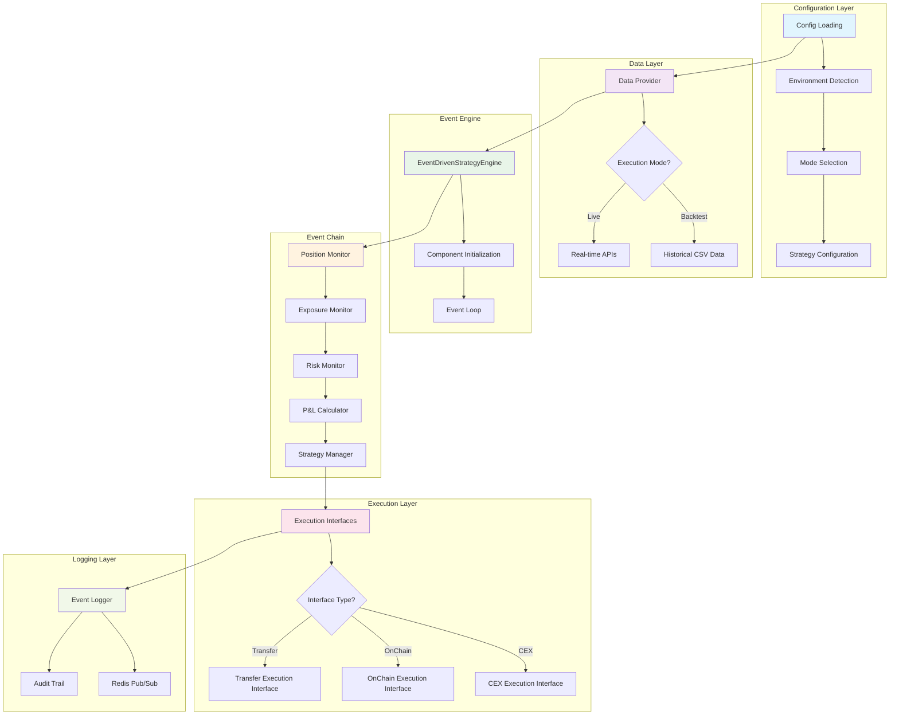

---

## 🏗️ **Environment & Configuration Workflow**

### **Configuration Loading Hierarchy**

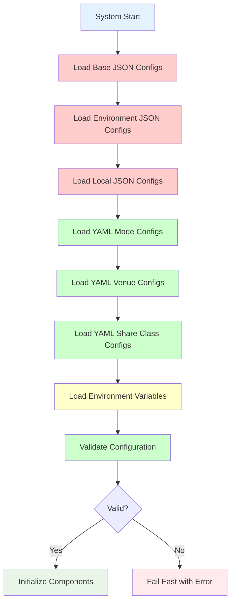

**Note**: JSON base configuration files (`default.json`, `{environment}.json`, `local.json`) are documented but not implemented. The system currently uses YAML-based configuration only.

### **Configuration Files Structure**

| File | Purpose | Environment | Priority | Status |
|------|---------|-------------|----------|---------|
| YAML Configs | Mode/Venue/Share Class | Current implementation | ✅ Implemented | ✅ Working |
| JSON Hierarchy | Base/Environment/Local | Documented but missing | ❌ Not implemented | ❌ Missing |
| `env.unified` | Application variables | All | 4 | ✅ Working |
| `deploy/.env*` | Deployment variables | Specific | 5 (highest) | ✅ Working |

**Implementation Note**: The configuration loader attempts to load JSON files first, but they don't exist. The system falls back to YAML-only configuration successfully.

### **Code References**
- **Config Loading**: `backend/src/basis_strategy_v1/infrastructure/config/settings.py:get_settings()`
- **Environment Detection**: `backend/src/basis_strategy_v1/infrastructure/config/settings.py:detect_strategy_mode()`
- **Validation**: `backend/src/basis_strategy_v1/infrastructure/config/config_validator.py`

---

## 📊 **Data Provider Workflow**

### **Data Loading by Strategy Mode**

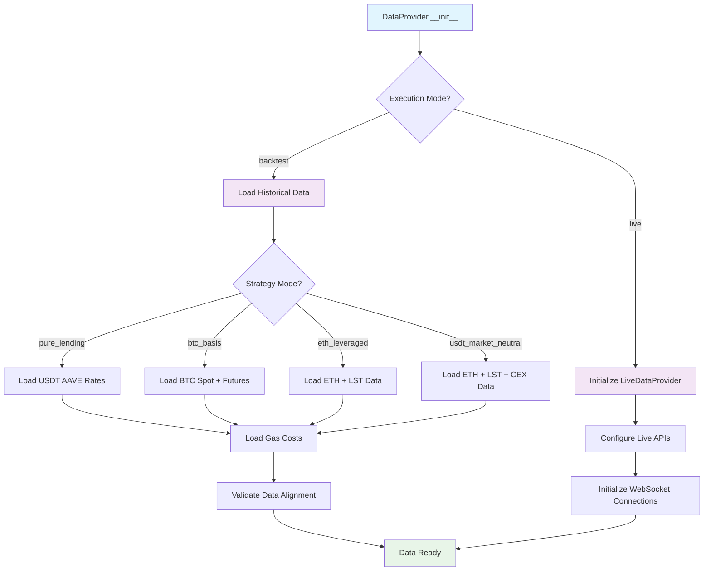

### **Data Requirements by Mode**

| Mode | Required Data | Files |
|------|---------------|-------|
| **pure_lending** | USDT AAVE rates, gas costs | `aave_v3_aave-v3-ethereum_USDT_rates_*.csv` |
| **btc_basis** | BTC spot, futures, funding | `binance_BTCUSDT_spot_*.csv`, `binance_BTCUSDT_futures_*.csv` |
| **eth_leveraged** | ETH prices, LST data, AAVE rates | `binance_ETHUSDT_spot_*.csv`, `curve_weETHWETH_*.csv` |
| **usdt_market_neutral** | All ETH data + CEX futures | All above + `bybit_ETHUSDT_futures_*.csv` |

### **Code References**
- **Historical Data**: `backend/src/basis_strategy_v1/infrastructure/data/historical_data_provider.py:_load_data_for_mode()`
- **Live Data**: `backend/src/basis_strategy_v1/infrastructure/data/live_data_provider.py:get_market_data_snapshot()`
- **Data Validation**: `backend/src/basis_strategy_v1/infrastructure/data/historical_data_provider.py:_validate_timestamps()`

---

## ⚙️ **Event Engine Initialization Workflow**

### **Component Initialization Sequence**

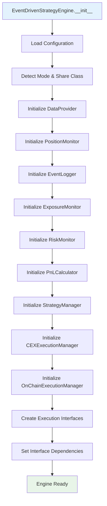

### **Execution Interface Creation**

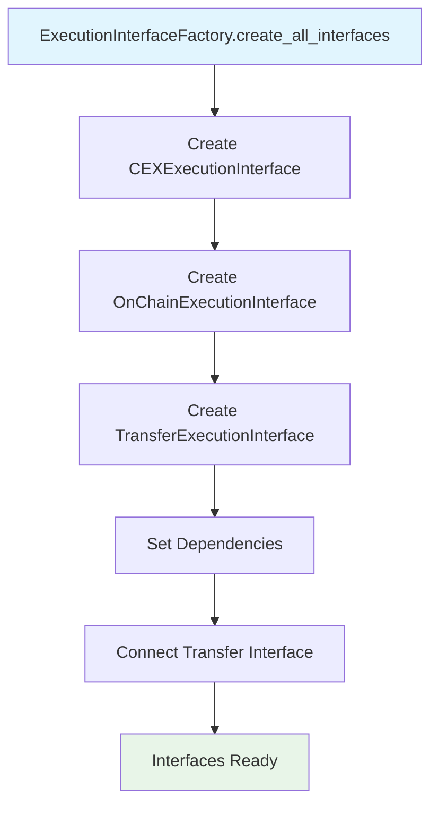

### **Code References**
- **Engine Init**: `backend/src/basis_strategy_v1/core/event_engine/event_driven_strategy_engine.py:_initialize_components()`
- **Interface Factory**: `backend/src/basis_strategy_v1/core/interfaces/execution_interface_factory.py:create_all_interfaces()`
- **Dependencies**: `backend/src/basis_strategy_v1/core/interfaces/execution_interface_factory.py:set_interface_dependencies()`

---

## 🔄 **Event Chain Workflow**

### **Synchronous Event Processing**

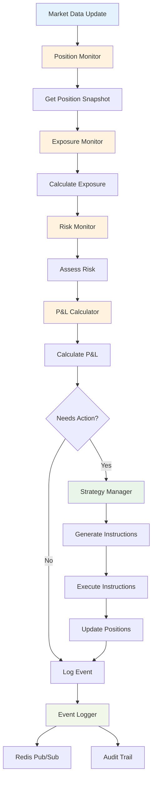

### **Event Chain Methods**

| Component | Method | Purpose | Input | Output |
|-----------|--------|---------|-------|--------|
| **Position Monitor** | `get_snapshot()` | Get current positions | None | Position dict |
| **Exposure Monitor** | `calculate_exposure()` | Convert to share class | timestamp, position, market_data | Exposure dict |
| **Risk Monitor** | `assess_risk()` | Calculate risk metrics | exposure, market_data | Risk dict |
| **P&L Calculator** | `calculate_pnl()` | Calculate performance | exposure, timestamp | P&L dict |
| **Strategy Manager** | `make_strategy_decision()` | Generate instructions | exposure, risk | Instructions list |

### **Code References**
- **Event Processing**: `backend/src/basis_strategy_v1/core/event_engine/event_driven_strategy_engine.py:_process_timestep()`
- **Position Monitor**: `backend/src/basis_strategy_v1/core/strategies/components/position_monitor.py:get_snapshot()`
- **Exposure Monitor**: `backend/src/basis_strategy_v1/core/strategies/components/exposure_monitor.py:calculate_exposure()`
- **Risk Monitor**: `backend/src/basis_strategy_v1/core/rebalancing/risk_monitor.py:assess_risk()`

---

## 🚀 **Execution Workflow**

### **Execution Interface Selection**

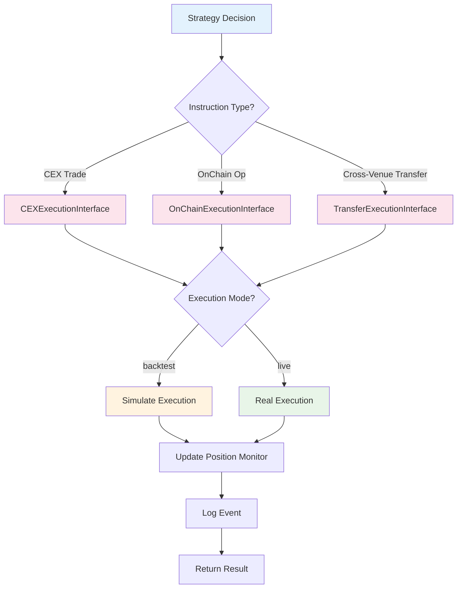

**Implementation Note**: Execution managers are implemented as interfaces (`CEXExecutionInterface`, `OnChainExecutionInterface`, `TransferExecutionInterface`) rather than separate manager classes. The interfaces are created by `ExecutionInterfaceFactory` and handle both backtest simulation and live execution.

### **Cross-Venue Transfer Workflow**

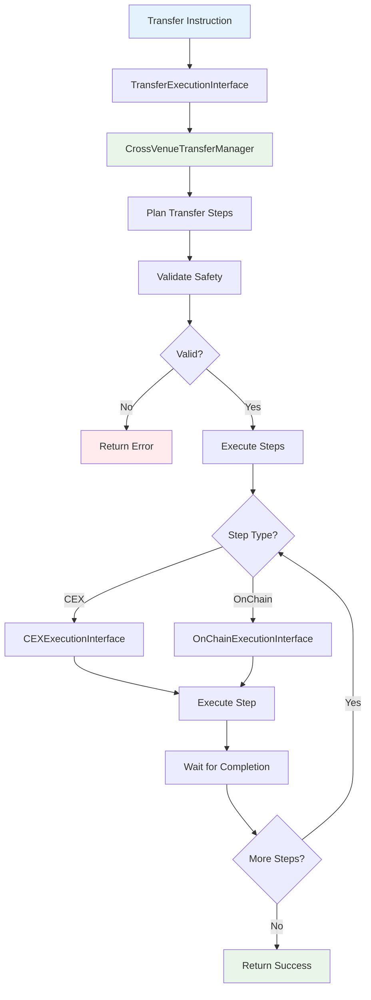

### **Code References**
- **Execution Routing**: `backend/src/basis_strategy_v1/core/event_engine/event_driven_strategy_engine.py:_execute_strategy_decision()`
- **Transfer Interface**: `backend/src/basis_strategy_v1/core/interfaces/transfer_execution_interface.py:execute_transfer()`
- **Transfer Manager**: `backend/src/basis_strategy_v1/core/rebalancing/transfer_manager.py:execute_optimal_transfer()`

---

## 📝 **Event Logging Workflow**

### **Event Logging Chain**

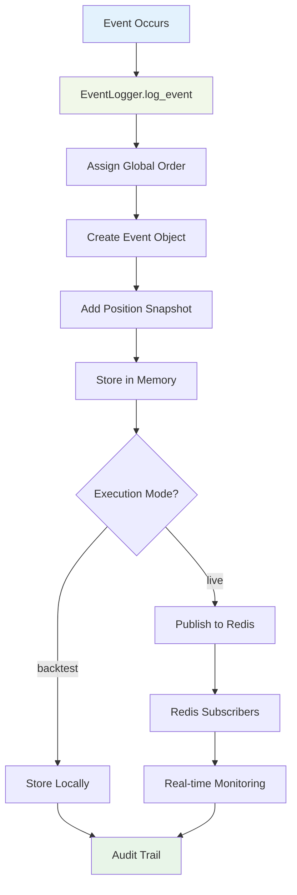

**Implementation Note**: Redis is only used in the Event Logger component for live mode. Other components use direct method calls for communication, not Redis pub/sub as described in the Redis Messaging Standard.

### **Event Structure**

```json
{
  "timestamp": "2024-06-01T12:00:00Z",
  "order": 12345,
  "event_type": "ATOMIC_LEVERAGE_ENTRY",
  "venue": "AAVE",
  "token": "weETH",
  "amount": 100.0,
  "status": "completed",
  "wallet_balance_after": {...},
  "cex_balance_after": {...},
  "aave_position_after": {...}
}
```

### **Code References**
- **Event Logging**: `backend/src/basis_strategy_v1/core/strategies/components/event_logger.py:log_event()`
- **Redis Publishing**: `backend/src/basis_strategy_v1/core/strategies/components/event_logger.py:_publish_event()`
- **Position Snapshots**: `backend/src/basis_strategy_v1/core/strategies/components/position_monitor.py:get_snapshot()`

---

## 🔄 **Backtest vs Live Mode Workflows**

### **Backtest Mode Workflow**

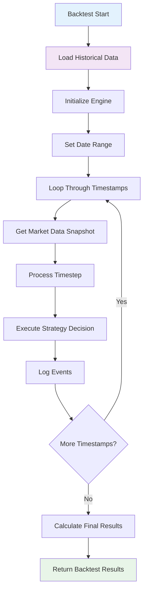

### **Live Mode Workflow**

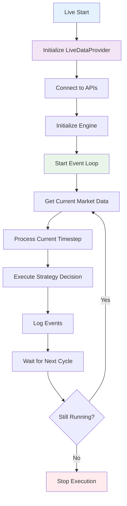

### **Code References**
- **Backtest**: `backend/src/basis_strategy_v1/core/event_engine/event_driven_strategy_engine.py:run_backtest()`
- **Live**: `backend/src/basis_strategy_v1/core/event_engine/event_driven_strategy_engine.py:run_live()`
- **Timestep Processing**: `backend/src/basis_strategy_v1/core/event_engine/event_driven_strategy_engine.py:_process_timestep()`

---

## 🎯 **Strategy Mode Workflows**

### **Pure Lending Mode**

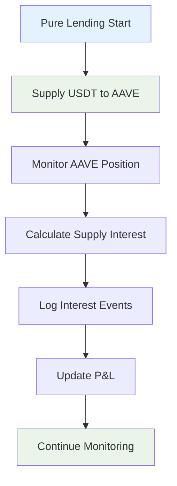

### **BTC Basis Mode**

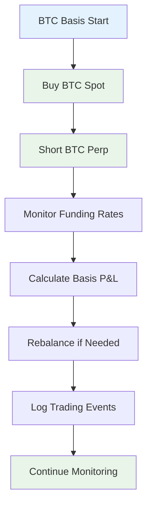

### **ETH Leveraged Mode**

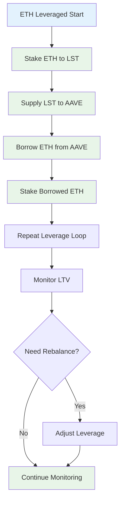

### **USDT Market Neutral Mode**

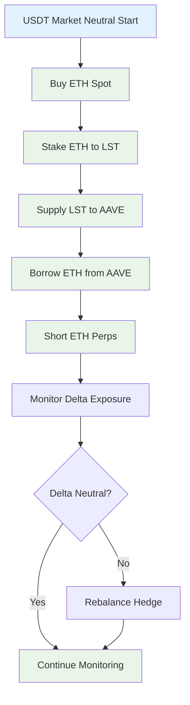

### **Code References**
- **Strategy Manager**: `backend/src/basis_strategy_v1/core/strategies/components/strategy_manager.py:make_strategy_decision()`
- **Mode Detection**: `backend/src/basis_strategy_v1/infrastructure/config/settings.py:detect_strategy_mode()`
- **Mode Configs**: `configs/modes/*.yaml`

---

## 🔧 **Error Handling & Monitoring Workflow**

### **Error Handling Chain**

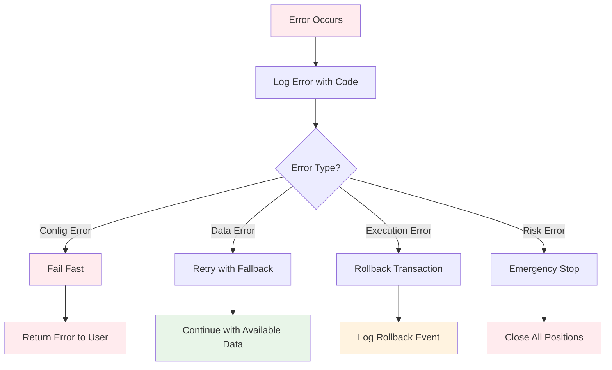

### **Code References**
- **Error Codes**: `backend/src/basis_strategy_v1/core/strategies/components/event_logger.py:ERROR_CODES`
- **Config Validation**: `backend/src/basis_strategy_v1/infrastructure/config/config_validator.py`
- **Risk Monitoring**: `backend/src/basis_strategy_v1/core/rebalancing/risk_monitor.py:assess_risk()`

---

## 📊 **Performance Monitoring Workflow**

### **Real-time Monitoring**

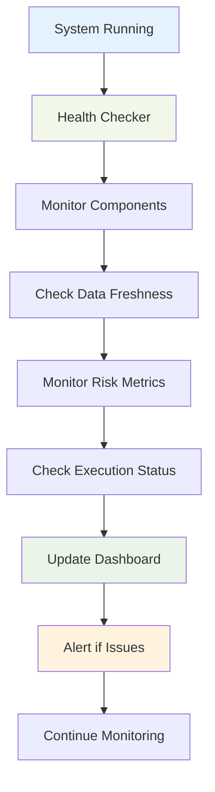

### **Code References**
- **Health Checker**: `backend/src/basis_strategy_v1/infrastructure/config/health_check.py`
- **Monitoring**: `backend/src/basis_strategy_v1/infrastructure/monitoring/health.py`
- **Metrics**: `backend/src/basis_strategy_v1/infrastructure/monitoring/metrics.py`

---

## 🎯 **Key Workflow Patterns**

### **1. Configuration → Data → Engine → Execution**
```
Config Loading → Data Provider → Event Engine → Execution Interfaces → Event Logging
```

### **2. Event Chain Pattern**
```
Position → Exposure → Risk → P&L → Strategy → Execution → Logging
```

### **3. Mode Switching Pattern**
```
Same Interface → Different Implementation → Same Result Format
```

### **4. Cross-Venue Transfer Pattern**
```
Plan → Validate → Execute Steps → Wait → Complete → Log
```

---

## 🚀 **Getting Started with Workflows**

### **1. Understanding the System**
1. Read this workflow guide
2. Review component specifications
3. Examine configuration files
4. Run infrastructure tests

### **2. Running a Backtest**
1. Configure strategy mode
2. Set date range
3. Initialize engine
4. Run backtest
5. Analyze results

### **3. Setting Up Live Trading**
1. Configure API keys
2. Set execution mode to 'live'
3. Initialize live data provider
4. Start event loop
5. Monitor execution

### **4. Debugging Issues**
1. Check configuration validation
2. Verify data availability
3. Review event logs
4. Check component health
5. Monitor error codes

---

## 🔍 **Implementation vs Documentation Discrepancies**

### **Current Implementation Status**

**✅ Implemented and Working**:
- All 9 core components exist and function
- YAML-based configuration system
- Event-driven architecture with synchronous communication
- Execution interfaces (not separate manager classes)
- Event Logger with Redis support for live mode
- Error code system
- Frontend wizard components
- Transfer manager for cross-venue operations

**❌ Documented but Not Implemented**:
- JSON configuration hierarchy (`default.json`, `{environment}.json`, `local.json`)
- Redis pub/sub communication between all components (only Event Logger uses Redis)
- Separate execution manager classes (implemented as interfaces instead)

**🔄 Partially Implemented**:
- Configuration loading attempts JSON first, falls back to YAML successfully
- Redis messaging standard only applies to Event Logger, not all components

### **Future Improvements to Match Documentation**

1. **Complete JSON Configuration System**:
   - Create `configs/default.json` with base configuration
   - Create environment-specific JSON files (`dev.json`, `staging.json`, `prod.json`)
   - Create `configs/local.json` for local overrides
   - Update configuration loader to use JSON hierarchy as documented

2. **Implement Full Redis Messaging**:
   - Add Redis pub/sub to all components for live mode
   - Implement channel naming conventions as documented
   - Add Redis state caching for all components
   - Maintain synchronous fallback for backtest mode

3. **Separate Execution Manager Classes**:
   - Create separate `CEXExecutionManager` and `OnChainExecutionManager` classes
   - Keep execution interfaces for abstraction
   - Update Strategy Manager to use manager classes instead of interfaces

**Status**: Workflow guide updated to reflect actual implementation! Core system working with documented discrepancies noted. ✅

*Last Updated: October 6, 2025*
