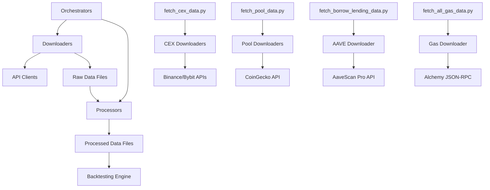

# Data Processing Scripts

**Complete data acquisition and processing system for the DeFi Yield Optimization Platform**

**Status**: ✅ **PRODUCTION READY** - All data sources operational with comprehensive coverage (2024-01-01 to 2025-09-18)

## 🚀 Quick Start

### Complete Data Pipeline (Recommended)
```bash
# 1. Market Data (CEX + DEX pools)
python scripts/orchestrators/fetch_cex_data.py --start-date 2024-01-01 --end-date 2025-09-18
python scripts/orchestrators/fetch_pool_data.py --start-date 2024-01-01

# 2. Protocol Data (AAVE + Staking)
python scripts/orchestrators/fetch_borrow_lending_data.py --start-date 2024-01-01 --end-date 2025-09-18
python scripts/orchestrators/run_staking_yields_analysis.py --start-date 2024-01-01 --end-date 2025-09-18

# 3. Gas Data + Execution Costs
python scripts/orchestrators/fetch_all_gas_data.py --start-date 2024-01-01 --end-date 2025-09-18
python scripts/orchestrators/fetch_execution_costs.py --start-date 2024-01-01 --end-date 2025-09-18

# 4. Analysis & Benchmarks
python scripts/orchestrators/run_benchmark_analysis.py --start-date 2024-02-16 --end-date 2025-09-18
python scripts/orchestrators/run_peg_analysis.py
```

### Legacy Master Orchestrator
```bash
# Download all data for 2024-2025 (from config)
python scripts/orchestrators/download_all.py

# Download specific date range
python scripts/orchestrators/download_all.py --start-date 2024-01-01 --end-date 2024-12-31

# Quick test with last 7 days
python scripts/orchestrators/download_all.py --quick-test
```

### Run Individual Downloaders

#### Pool Data (CoinGecko - All Pool OHLCV)
```bash
# Download all CoinGecko pool data (LST + spot pools) with enforced creation dates
python scripts/orchestrators/fetch_pool_data.py --start-date 2024-01-01

# Individual pool downloaders
python scripts/downloaders/fetch_lst_pool_data.py --start-date 2024-01-01     # wstETH/WETH + weETH/WETH
python scripts/downloaders/fetch_spot_pool_data.py --start-date 2024-01-01    # WETH/USDT + EIGEN/WETH + ETHFI/WETH

# 🎯 Strategic Pool Selection:
# - Backtesting: Uniswap v3 pools for maximum historical coverage (2020+)
# - Live Trading: Will migrate to cheaper Uniswap v4 pools or CEX
# - LST Pools: Both Uniswap v3 and Curve for comprehensive backtesting
```

#### CEX Data (Binance + Bybit - OKX Broken)
```bash
# 🎯 CEX Data Orchestrator (Binance + Bybit working, OKX broken)
python scripts/orchestrators/fetch_cex_data.py --start-date 2024-01-01 --end-date 2025-09-18 --exchanges binance,bybit

# Individual CEX downloaders
python scripts/downloaders/fetch_cex_protocol_tokens.py --start-date 2024-01-01  # EIGEN/ETHFI from Binance
python scripts/downloaders/fetch_cex_spot_data.py --start-date 2024-01-01 --exchange binance_spot  # ETH/USDT
python scripts/downloaders/fetch_cex_futures_data.py --start-date 2024-01-01 --exchange bybit  # Futures OHLCV (1h/1m)
python scripts/downloaders/fetch_cex_funding_rates.py --start-date 2024-01-01 --exchange binance_futures  # Funding rates

# ⚠️ OKX Status: Currently broken - use binance,bybit only
```

#### AAVE Data (AaveScan Pro - Complete Pipeline)
```bash
# 🎯 Complete AAVE Data Pipeline (Download + Process + Analyze)
python scripts/orchestrators/fetch_borrow_lending_data.py --start-date 2024-01-01 --end-date 2025-09-18

# Individual components (if needed)
python scripts/downloaders/fetch_aave_data.py --start-date 2024-01-01 --end-date 2025-09-18
python scripts/processors/process_aave_oracle_prices.py
python scripts/utilities/create_aave_risk_params.py
python scripts/analyzers/analyze_aave_rate_impact.py --create-plots

# Component-specific execution
python scripts/orchestrators/fetch_borrow_lending_data.py --components download process  # Skip analysis
python scripts/orchestrators/fetch_borrow_lending_data.py --components analyze          # Analysis only
```

#### On-Chain Gas Data (Alchemy)
```bash
# Gas data orchestrator (recommended)
python scripts/orchestrators/fetch_all_gas_data.py --start-date 2024-01-01 --end-date 2025-09-18

# Individual gas data downloader
python scripts/downloaders/fetch_onchain_gas_data.py --start-date 2024-01-01 --end-date 2025-09-18
```

#### Multi-Venue Funding Rates
```bash
python scripts/downloaders/fetch_multi_venue_funding.py --start-date 2024-01-01 --end-date 2025-09-18
```

### Process & Analyze Data

#### Staking Yields Analysis (Complete Pipeline)
```bash
# 🎯 Complete Staking Yields Pipeline (Oracle Base + Seasonal Rewards)
python scripts/orchestrators/run_staking_yields_analysis.py --start-date 2024-01-01 --end-date 2025-09-18

# Individual components (if needed)
python scripts/processors/process_oracle_base_yields.py --start-date 2024-01-01 --end-date 2025-09-18
python scripts/processors/process_etherfi_seasonal_rewards.py --start-date 2024-01-01 --end-date 2025-09-18
```

#### LST Peg Discount/Premium Analysis (wstETH + weETH)
```bash
# Process peg discount/premium data using pre-interpolated hourly AAVE oracle + 24h median market data
python scripts/orchestrators/run_peg_analysis.py

# Individual processor (if needed)
python scripts/processors/process_peg_discount_data.py
```

#### Execution Costs Analysis
```bash
# 🎯 Complete Execution Costs Pipeline (Gas + Trading Costs)
python scripts/orchestrators/fetch_execution_costs.py --start-date 2024-01-01 --end-date 2025-09-18

# Individual components (if needed)
python scripts/downloaders/fetch_execution_cost_data.py --start-date 2024-01-01 --end-date 2025-09-18
```

#### Data Completeness Analysis & Gap Filling
```bash
# Analyze data completeness and identify gaps
python scripts/analyzers/analyze_data_completeness.py --start-date 2024-01-01 --end-date 2025-09-18

# Fill identified data gaps (incremental download)
python scripts/utilities/fill_data_gaps.py --start-date 2024-01-01 --end-date 2025-09-18 --max-gaps 10
```

#### Benchmark Analysis
```bash
# 🎯 Complete Benchmark Analysis Pipeline (Ethena sUSDE vs Our Strategies)
python scripts/orchestrators/run_benchmark_analysis.py --start-date 2024-02-16 --end-date 2025-09-18

# Individual processor (if needed)
python scripts/processors/process_ethena_benchmark.py --start-date 2024-02-16 --end-date 2025-09-18
```

#### Gas Cost Analysis
```bash
# Analyze gas costs for all DeFi operations
python scripts/analyzers/analyze_gas_costs.py --gas-file data/blockchain_data/gas_prices/ethereum_gas_prices_enhanced_2024-01-01_2025-09-26.csv --eth-price-file data/market_data/spot_prices/eth_usd/binance_ETHUSDT_1h_2020-01-01_2025-09-26.csv

# Run full gas analysis with convenience script
./scripts/utilities/run_full_gas_analysis.sh
```

#### AAVE Interest Rate Impact Analysis
```bash
# Analyze how strategy positions affect AAVE interest rates
python scripts/analyzers/analyze_aave_rate_impact.py --assets WETH wstETH weETH USDT
```

## 📁 Script Architecture Overview

The script system is organized into four main categories:

### 🎭 Orchestrators (`scripts/orchestrators/`)
High-level coordination scripts that manage multiple downloaders/processors and provide unified interfaces.

### 📥 Downloaders (`scripts/downloaders/`)
Individual data acquisition scripts that interface with specific APIs and data sources.

### 🔄 Processors (`scripts/processors/`)
Data transformation and processing scripts that convert raw data into backtesting-ready formats.

### 🛠️ Utilities (`scripts/utilities/`)
Support scripts for data management, gap filling, and configuration.

---

## 🎭 Orchestrators

### Core Orchestrators

| Script | Purpose | Coordinates | Output Location | Status |
|--------|---------|-------------|-----------------|--------|
| **`fetch_cex_data.py`** | CEX market data coordination | Binance + Bybit clients | `data/market_data/` | ✅ Working |
| **`fetch_pool_data.py`** | DEX pool data coordination | CoinGecko GeckoTerminal API | `data/market_data/spot_prices/` | ✅ Working |
| **`fetch_borrow_lending_data.py`** | AAVE protocol data pipeline | AaveScan Pro + processors | `data/protocol_data/aave/` | ✅ Working |
| **`fetch_all_gas_data.py`** | Gas data coordination | Alchemy JSON-RPC | `data/blockchain_data/` | ✅ Working |
| **`fetch_execution_costs.py`** | Execution cost modeling | Gas + trading cost generators | `data/execution_costs/` | ✅ Working |
| **`run_staking_yields_analysis.py`** | Staking yields pipeline | Oracle + seasonal processors | `data/protocol_data/staking/` | ✅ Working |
| **`run_peg_analysis.py`** | LST peg analysis | AAVE oracle + DEX data | `data/protocol_data/staking/peg_analysis/` | ✅ Working |
| **`run_benchmark_analysis.py`** | Benchmark comparison | Ethena + strategy processors | `data/analysis/benchmark_analysis/` | ✅ Working |
| **`download_all.py`** | Legacy master orchestrator | All downloaders | Multiple directories | ✅ Working |

### Orchestrator Details

#### `fetch_cex_data.py` - CEX Data Orchestrator
- **Coordinates**: `fetch_cex_protocol_tokens.py`, `fetch_cex_spot_data.py`, `fetch_cex_futures_data.py`, `fetch_cex_funding_rates.py`
- **Clients**: Binance Spot/Futures, Bybit (OKX broken)
- **Data**: Spot prices, futures OHLCV, funding rates, protocol tokens
- **Output**: `data/market_data/spot_prices/`, `data/market_data/derivatives/`

#### `fetch_pool_data.py` - Pool Data Orchestrator
- **Coordinates**: `fetch_spot_pool_data.py` (LST + spot pools)
- **Client**: CoinGecko GeckoTerminal API
- **Data**: Uniswap v3 + Curve pool OHLCV
- **Output**: `data/market_data/spot_prices/lst_eth_ratios/`, `data/market_data/spot_prices/eth_usd/`

#### `fetch_borrow_lending_data.py` - AAVE Data Pipeline
- **Coordinates**: `fetch_aave_data.py`, `process_aave_oracle_prices.py`, `create_aave_risk_params.py`
- **Client**: AaveScan Pro API
- **Data**: Interest rates, oracle prices, risk parameters
- **Output**: `data/protocol_data/aave/rates/`, `data/protocol_data/aave/oracle/`, `data/protocol_data/aave/risk_params/`

#### `fetch_all_gas_data.py` - Gas Data Orchestrator
- **Coordinates**: `fetch_onchain_gas_data.py`
- **Client**: Alchemy JSON-RPC (`eth_feeHistory`)
- **Data**: Historical gas prices with base fee + priority fee percentiles
- **Output**: `data/blockchain_data/gas_prices/`

#### `fetch_execution_costs.py` - Execution Cost Orchestrator
- **Coordinates**: `fetch_execution_cost_data.py`
- **Data Sources**: Gas prices + trading cost simulation
- **Data**: Complete execution cost lookup tables
- **Output**: `data/execution_costs/lookup_tables/`

#### `run_staking_yields_analysis.py` - Staking Yields Pipeline
- **Coordinates**: `process_oracle_base_yields.py`, `process_etherfi_seasonal_rewards.py`
- **Data Sources**: AAVE oracle + EtherFi distributions + DeFiLlama
- **Data**: Oracle base yields + seasonal rewards
- **Output**: `data/protocol_data/staking/base_yields/`, `data/protocol_data/staking/restaking_final/`

#### `run_peg_analysis.py` - Peg Analysis Pipeline
- **Coordinates**: `process_peg_discount_data.py`
- **Data Sources**: AAVE oracle + DEX market data
- **Data**: LST peg discount/premium analysis
- **Output**: `data/protocol_data/staking/peg_analysis/`

#### `run_benchmark_analysis.py` - Benchmark Analysis Pipeline
- **Coordinates**: `process_ethena_benchmark.py`
- **Data Sources**: DeFiLlama API + manual CSVs
- **Data**: Ethena sUSDE vs strategy comparison
- **Output**: `data/analysis/benchmark_analysis/`

---

## 📥 Downloaders

### Market Data Downloaders

| Script | Client | Data Type | Output Location | Status |
|--------|--------|-----------|-----------------|--------|
| **`fetch_cex_spot_data.py`** | Binance Spot, Bybit | ETH/USDT spot prices | `data/market_data/spot_prices/eth_usd/` | ✅ Working |
| **`fetch_cex_protocol_tokens.py`** | Binance Spot | EIGEN/ETHFI prices | `data/market_data/spot_prices/protocol_tokens/` | ✅ Working |
| **`fetch_cex_futures_data.py`** | Binance Futures, Bybit | Futures OHLCV (1h/1m) | `data/market_data/derivatives/futures_ohlcv/` | ✅ Working |
| **`fetch_cex_funding_rates.py`** | Binance Futures, Bybit | Funding rates (8h) | `data/market_data/derivatives/funding_rates/` | ✅ Working |
| **`fetch_spot_pool_data.py`** | CoinGecko GeckoTerminal | DEX pool OHLCV | `data/market_data/spot_prices/` | ✅ Working |
| **`fetch_multi_venue_funding.py`** | Multiple exchanges | Multi-venue funding | `data/market_data/derivatives/funding_rates/` | ✅ Working |
| **`fetch_okx_funding_rates.py`** | OKX API | OKX funding rates | `data/market_data/derivatives/funding_rates/` | ⚠️ Broken |

### Protocol Data Downloaders

| Script | Client | Data Type | Output Location | Status |
|--------|--------|-----------|-----------------|--------|
| **`fetch_aave_data.py`** | AaveScan Pro API | AAVE rates + oracle + reserves | `data/protocol_data/aave/rates/` | ✅ Working |

### On-Chain Data Downloaders

| Script | Client | Data Type | Output Location | Status |
|--------|--------|-----------|-----------------|--------|
| **`fetch_onchain_gas_data.py`** | Alchemy JSON-RPC | Gas prices + percentiles | `data/blockchain_data/gas_prices/` | ✅ Working |

### Execution Cost Downloaders

| Script | Data Source | Data Type | Output Location | Status |
|--------|-------------|-----------|-----------------|--------|
| **`fetch_execution_cost_data.py`** | Gas + price data | Execution cost simulation | `data/execution_costs/` | ✅ Working |

### Specialized Downloaders

| Script | Purpose | Data Source | Output Location | Status |
|--------|---------|-------------|-----------------|--------|
| **`download_ethena_defillama_csv.py`** | Ethena benchmark data | DeFiLlama CSV export | `data/manual_sources/benchmark_data/` | ✅ Working |

---

## 🔄 Processors

### Data Transformation Processors

| Script | Input | Output | Purpose | Status |
|--------|-------|--------|---------|--------|
| **`process_aave_oracle_prices.py`** | AAVE rates data | Oracle USD + ETH ratios | Extract oracle prices from AAVE data | ✅ Working |
| **`process_oracle_base_yields.py`** | AAVE oracle data | Oracle-based yields | Calculate base staking yields | ✅ Working |
| **`process_etherfi_seasonal_rewards.py`** | Manual CSVs + DeFiLlama | Seasonal rewards | Process EtherFi distributions | ✅ Working |
| **`process_peg_discount_data.py`** | AAVE oracle + DEX data | Peg analysis | LST peg discount/premium | ✅ Working |
| **`process_ethena_benchmark.py`** | Manual CSV + DeFiLlama | Benchmark data | Ethena sUSDE benchmark | ✅ Working |
| **`process_simulation_results.py`** | Tenderly simulations | Lookup tables | Execution cost optimization | ✅ Working |

### Specialized Processors

| Script | Purpose | Input | Output | Status |
|--------|---------|-------|--------|--------|
| **`okx_data_processor.py`** | OKX zip file processing | OKX daily zip files | Extracted funding rates | ✅ Working |

---

## 🛠️ Utilities

### Data Management Utilities

| Script | Purpose | Usage | Status |
|--------|---------|-------|--------|
| **`create_aave_risk_params.py`** | Generate AAVE risk parameters | Creates `aave_v3_risk_parameters.json` | ✅ Working |
| **`data_manifest.py`** | Data tracking and gap analysis | Tracks data availability and gaps | ✅ Working |
| **`fill_data_gaps.py`** | Incremental data filling | Fills identified data gaps | ✅ Working |
| **`proper_hourly_interpolation.py`** | Data interpolation | Converts daily to hourly data | ✅ Working |

### Convenience Scripts

| Script | Purpose | Usage | Status |
|--------|---------|-------|--------|
| **`run_full_gas_analysis.sh`** | Gas analysis convenience | Runs complete gas cost analysis | ✅ Working |

---

## 🔑 API Clients

### Market Data Clients

| Client | API Endpoint | Rate Limit | Purpose | Status |
|--------|--------------|------------|---------|--------|
| **`coingecko_client.py`** | CoinGecko Pro API | 500 req/min | Spot prices, LST data | ✅ Working |
| **`binance_spot_client.py`** | Binance Spot API | 1200 req/min | Spot prices, protocol tokens | ✅ Working |
| **`binance_futures_client.py`** | Binance Futures API | 1200 req/min | Futures OHLCV, funding rates | ✅ Working |
| **`bybit_client.py`** | Bybit API | 10 req/sec | Spot + futures + funding | ✅ Working |
| **`okx_client.py`** | OKX API | 120 req/min | Futures + funding | ⚠️ Broken |

### Protocol Data Clients

| Client | API Endpoint | Rate Limit | Purpose | Status |
|--------|--------------|------------|---------|--------|
| **`aavescan_client.py`** | AaveScan Pro API | 1000 req/min | AAVE rates, oracle, reserves | ✅ Working |

### On-Chain Data Clients

| Client | API Endpoint | Rate Limit | Purpose | Status |
|--------|--------------|------------|---------|--------|
| **`alchemy_client_fast.py`** | Alchemy JSON-RPC | No limit | Gas prices, fee history | ✅ Working |

---

## 📊 Data Flow Architecture



---

## 🔧 Configuration

### API Keys Required

Configure in `backend/env.unified`:

```bash
# CoinGecko Pro API Key
BASIS_DOWNLOADERS__COINGECKO_API_KEY=CG-3qHwRgju7B2y43a1CxwYpY4q

# AaveScan Pro API Key (Advanced Plan)
BASIS_DOWNLOADERS__AAVESCAN_API_KEY=c2b49a72-9c73-48f9-aea2-5f6d8ec793b9

# Alchemy API (for gas data)
# Format: https://eth-mainnet.g.alchemy.com/v2/YOUR_API_KEY
```

### Environment Setup

```bash
# Load environment variables
source scripts/load_env.sh

# Or manually set
export BASIS_DOWNLOADERS__COINGECKO_API_KEY="your_key"
export BASIS_DOWNLOADERS__AAVESCAN_API_KEY="your_key"
```

---

## 📁 Output Structure

```
data/
├── market_data/                # Market data (organized by type)
│   ├── spot_prices/           # Spot price data
│   │   ├── eth_usd/           # WETH/USDT spot prices (Uniswap v3 + CEX)
│   │   ├── lst_eth_ratios/    # LST/WETH ratios (wstETH, weETH - Uniswap v3 + Curve)
│   │   └── protocol_tokens/   # Protocol tokens (EIGEN/WETH, ETHFI/WETH - Uniswap v3 + CEX)
│   └── derivatives/           # Derivatives data
│       ├── futures_ohlcv/     # Perpetual futures OHLCV (1h/1m)
│       └── funding_rates/     # Funding rates (multi-venue)
│
├── protocol_data/             # Protocol-specific data
│   ├── aave/                  # AAVE lending protocol data
│   │   ├── rates/             # Interest rates (hourly interpolated)
│   │   ├── oracle/            # Oracle prices (USD + ETH ratios)
│   │   └── risk_params/       # Risk parameters
│   └── staking/               # Staking protocol data
│       ├── base_yields/       # Oracle-based base yields (weETH, wstETH)
│       ├── restaking_final/   # Seasonal rewards (EIGEN + ETHFI)
│       ├── benchmark_yields/  # Benchmark yields (Ethena sUSDE)
│       └── peg_analysis/      # LST peg discount/premium analysis
│
├── blockchain_data/           # On-chain data
│   └── gas_prices/            # Gas price history (enhanced with operation costs)
│
├── execution_costs/           # Execution cost data
│   ├── lookup_tables/         # Execution cost lookup tables
│   └── execution_cost_simulation_results.csv # Complete simulation results
│
├── analysis/                  # Analysis results
│   └── benchmark_analysis/    # Benchmark analysis results
│
└── manual_sources/            # 🔒 PROTECTED - Manual CSV downloads
    ├── restaking_yields/      # DeFiLlama eETH APY (fallback)
    ├── etherfi_distributions/ # Real EIGEN/ETHFI data
    └── benchmark_data/        # Ethena manual data (backup)
```

---

## 🎯 Strategic Data Source Selection

**Pool Data Strategy:**
- **Backtesting**: Using Uniswap v3 pools for maximum historical coverage (2020+)
- **Live Trading**: Will migrate to cheaper Uniswap v4 pools or CEX for better execution
- **LST Pools**: Both Uniswap v3 and Curve pools for comprehensive backtesting and production flexibility
- **Alternative Sources**: Binance spot data available for protocol tokens (EIGEN/ETHFI)

**Rationale:**
- DEX pools provide more realistic slippage modeling for backtesting
- Uniswap v4 exists but has limited historical data
- Multiple pool options enable optimal execution in live trading
- Comprehensive backtesting requires maximum historical coverage

## 📊 Data Sources

| Downloader | Source | Data Type | Status | Coverage |
|------------|--------|-----------|--------|----------|
| **Pool Data** | CoinGecko Pro | LST pools (wstETH/WETH, weETH/WETH) | ✅ Working | 2024-01-01 to 2025-09-18 |
| **Pool Data** | CoinGecko Pro | Spot pools (WETH/USDT, EIGEN/WETH, ETHFI/WETH) | ✅ Working | 2024-01-01 to 2025-09-18 |
| **CEX Data** | Binance Spot | Protocol tokens (EIGEN/ETHFI) | ✅ Working | 2024-01-01 to 2025-09-18 |
| **CEX Data** | Binance Spot | ETH/USDT spot data | ✅ Working | 2020-01-01 to 2025-09-18 |
| **CEX Data** | Bybit | ETH/USDT spot data | ✅ Working | 2024-01-01 to 2025-09-18 |
| **CEX Data** | Binance Futures | Perpetual futures + funding rates (1h/1m) | ✅ Working | 2024-01-01 to 2025-09-18 |
| **CEX Data** | Bybit | Perpetual futures + funding rates (1h/1m) | ✅ Working | 2024-01-01 to 2025-09-18 |
| **CEX Data** | OKX | Perpetual futures + funding rates | ⚠️ Broken | N/A |
| **AAVE Data** | AaveScan Pro | Lending rates, reserves, risk params | ✅ Working | 2024-01-01 to 2025-09-18 |
| **On-Chain** | Alchemy JSON-RPC | Gas prices with base fee + priority fee percentiles | ✅ Working | 2024-01-01 to 2025-09-18 |
| **Oracle Data** | AAVE Oracle | weETH/ETH, wstETH/ETH ratios | ✅ Working | 2024-01-01 to 2025-09-18 |
| **Restaking** | Real EtherFi Data | EIGEN/ETHFI distributions + APR calc | ✅ Working | 2024-08-15 to 2025-09-18 |
| **Execution Costs** | Gas + Trading | Complete execution cost modeling | ✅ Working | 2024-01-01 to 2025-09-18 |

## 🔑 API Keys Required

Configure in `backend/env.unified`:

```bash
# Available API Keys
BASIS_DOWNLOADERS__COINGECKO_API_KEY=CG-3qHwRgju7B2y43a1CxwYpY4q

# ✅ AaveScan Pro API Key (Advanced Plan - ACTIVE)
BASIS_DOWNLOADERS__AAVESCAN_API_KEY=c2b49a72-9c73-48f9-aea2-5f6d8ec793b9

# ✅ Alchemy API (for accurate historical gas prices)
# Loaded via load_env.sh (follows same pattern as other downloaders)
# Format: https://eth-mainnet.g.alchemy.com/v2/YOUR_API_KEY
```

## 📁 Output Structure

```
data/
├── market_data/                # Market data (organized by type)
│   ├── spot_prices/           # Spot price data
│   │   ├── eth_usd/           # WETH/USDT spot prices (Uniswap v3 + CEX)
│   │   ├── lst_eth_ratios/    # LST/WETH ratios (wstETH, weETH - Uniswap v3 + Curve)
│   │   └── protocol_tokens/   # Protocol tokens (EIGEN/WETH, ETHFI/WETH - Uniswap v3 + CEX)
│   └── derivatives/           # Derivatives data
│       ├── futures_ohlcv/     # Perpetual futures OHLCV (1h/1m)
│       └── funding_rates/     # Funding rates (multi-venue)
│
├── protocol_data/             # Protocol-specific data
│   ├── aave/                  # AAVE lending protocol data
│   │   ├── rates/             # Interest rates (hourly interpolated)
│   │   ├── oracle/            # Oracle prices (USD + ETH ratios)
│   │   └── risk_params/       # Risk parameters
│   └── staking/               # Staking protocol data
│       ├── base_yields/       # Oracle-based base yields (weETH, wstETH)
│       ├── restaking_final/   # Seasonal rewards (EIGEN + ETHFI)
│       └── benchmark_yields/  # Benchmark yields (Ethena sUSDE)
│
├── blockchain_data/           # On-chain data
│   └── gas_prices/            # Gas price history (enhanced with operation costs)
│
├── execution_costs/           # Execution cost data
│   ├── lookup_tables/         # Execution cost lookup tables
│   └── execution_cost_simulation_results.csv # Complete simulation results
│
├── analysis/                  # Analysis results
│   ├── aave_calibration_summary_*.json # AAVE rate impact calibration
│   ├── aave_comprehensive_analysis_*.json # Complete AAVE analysis
│   └── benchmark_analysis/    # Benchmark analysis results
│
└── manual_sources/            # 🔒 PROTECTED - Manual CSV downloads
    ├── restaking_yields/      # DeFiLlama eETH APY (fallback)
    ├── etherfi_distributions/ # Real EIGEN/ETHFI data
    └── benchmark_data/        # Ethena manual data (backup)
```

## 🔧 Configuration

Settings are loaded from:
1. Environment variables (`BASIS_DOWNLOADERS__*`)
2. `configs/default.json` 
3. `backend/env.unified`

Key settings:
- **Date Range**: Auto-detects current date (no more hardcoded 2025-12-31)
- **Exchange-Specific Start Dates**: Enforced automatically (e.g., Binance from 2020, others from 2024)
- **Rate Limits**: Configured per API (CoinGecko: 500/min, Bybit: 10/sec)
- **Retry Logic**: 3 attempts with exponential backoff
- **Chunking**: 90-day chunks for CoinGecko historical data
- **Exchange Filtering**: Use `--exchanges binance,bybit` to exclude broken OKX

## ✅ Current Capabilities

### Complete Data Pipeline (Production Ready)
- **Market Data**: CoinGecko (LSTs) + Binance + Bybit (ETH/USDT + protocol tokens + futures)
- **Protocol Data**: AAVE v3 (rates, oracle, risk params) + EtherFi (seasonal rewards)
- **Execution Costs**: Complete gas + trading cost modeling with lookup tables
- **Analysis**: AAVE rate impact calibration + benchmark analysis + peg analysis

### Enhanced Market Data Coverage
- **Spot Data**: CoinGecko (LSTs) + Binance + Bybit (ETH/USDT + protocol tokens)
- **Futures Data**: Binance + Bybit (ETHUSDT, BTCUSDT) with 1h/1m support - OKX broken
- **Funding Rates**: Binance + Bybit funding rates - OKX broken
- **Output Structure**: Organized by data type and source with proper directory structure

### Accurate Gas Price Data
- **Alchemy Integration**: Uses `eth_feeHistory` JSON-RPC for accurate historical gas prices
- **Base Fee + Priority Fee**: Complete EIP-1559 gas price components
- **Percentile Data**: 25th, 50th, and 75th percentiles for priority fees
- **Effective Gas Price**: Base fee + priority fee for accurate transaction cost modeling
- **Operation Costs**: Complete gas cost matrix for all DeFi operations

### Oracle-Based Staking Yields
- **Base Yields**: AAVE oracle price ratios for weETH/ETH and wstETH/ETH
- **Hourly Granularity**: Oracle data interpolated to hourly for smooth backtesting
- **Real Market Data**: Using actual AAVE oracle prices (not estimates)

### Real EtherFi Distribution Data
- **EIGEN**: ✅ **44 real weekly distributions** from EtherFi GitBook
- **ETHFI**: ✅ **7 real top-up distributions** from EtherFi GitBook  
- **APR Calculation**: ✅ **Verified against King Protocol formula** (100% match)
- **Token Prices**: ✅ **Using real market data** (not hardcoded)
- **DeFiLlama Fallback**: ✅ **APY to daily yield conversion** for missing periods

### Complete Execution Cost Modeling
- **Gas Costs**: Real historical gas prices with operation-specific costs
- **Trading Costs**: DEX slippage + CEX fees for all trading pairs
- **Lookup Tables**: Complete execution cost lookup for all operations
- **Multi-Venue**: Support for multiple exchanges and DEX pools

### Data Completeness Tracking
- **Gap Analysis**: ✅ **Comprehensive gap identification** with exact dates/times
- **Incremental Downloads**: ✅ **Only download missing periods** (avoid re-downloading)
- **Rate Limit Recovery**: ✅ **Pause/resume capability** instead of skipping data

## 🧪 Testing

### Quick Test
```bash
# Test all downloaders with last 7 days
python scripts/orchestrators/download_all.py --quick-test
```

### Individual Testing
```bash
# Test CEX data orchestrator (Binance + Bybit)
python scripts/orchestrators/fetch_cex_data.py --start-date 2024-09-01 --end-date 2024-09-07 --exchanges binance,bybit --quick-test

# Test pool data
python scripts/orchestrators/fetch_pool_data.py --start-date 2024-09-01

# Test AAVE data pipeline
python scripts/orchestrators/fetch_borrow_lending_data.py --start-date 2024-09-01 --end-date 2024-09-07

# Test individual AAVE components
python scripts/downloaders/fetch_aave_data.py --start-date 2024-09-01 --end-date 2024-09-07

# Test gas data orchestrator
python scripts/orchestrators/fetch_all_gas_data.py --start-date 2024-09-01 --end-date 2024-09-07

# Test individual gas data downloader
python scripts/downloaders/fetch_onchain_gas_data.py --start-date 2024-09-01 --end-date 2024-09-07

# Test staking yields analysis
python scripts/orchestrators/run_staking_yields_analysis.py --start-date 2024-09-01 --end-date 2024-09-07

# Test execution costs
python scripts/orchestrators/fetch_execution_costs.py --start-date 2024-09-01 --end-date 2024-09-07
```

## 📈 Expected Output

### Successful CEX Data Run
```
🎉 CEX DATA ORCHESTRATION COMPLETE!
✅ Successful downloaders: 4/4
📊 Total records collected: 456
⏱️  Total time: 0.1 minutes
📁 All data saved to: data/market_data/

📊 DOWNLOADER SUMMARY:
   ✅ SUCCESS protocol_tokens: 2/2 downloads, 146 records (1.1s)
   ✅ SUCCESS spot_data: 2/2 downloads, 146 records (0.9s)
   ✅ SUCCESS futures_data: 2/2 downloads, 146 records (0.8s)
   ✅ SUCCESS funding_rates: 2/2 downloads, 18 records (0.9s)
```

### Successful Pool Data Run
```
🎯 POOL DATA ORCHESTRATION COMPLETE!
✅ Successful downloaders: 2/2
📊 Total records collected: 25,000+
⏱️  Total time: 2.1 minutes
📁 All data saved to: data/market_data/spot_prices/

📊 DOWNLOADER SUMMARY:
   ✅ SUCCESS lst_pools: 4/4 downloads, 12,500 records (1.2s)
   ✅ SUCCESS spot_pools: 3/3 downloads, 12,500 records (0.9s)
```

## 🆘 Troubleshooting

### Common Issues

**"CoinGecko API key not found"**
- Check `BASIS_DOWNLOADERS__COINGECKO_API_KEY` in `backend/env.unified`

**"Rate limit exceeded"**
- Downloaders have built-in rate limiting
- Check API key tier limits (CoinGecko Pro: 500/min)

**"OKX client failed"**
- OKX is currently broken - use `--exchanges binance,bybit` to exclude it
- This is expected behavior until OKX client is fixed

**"End date in future"**
- Fixed! End date now defaults to current date instead of 2025-12-31
- Use `--end-date YYYY-MM-DD` to specify custom end date

**"Empty funding_rates directory"**
- Fixed! Funding rates downloader now included in CEX orchestrator
- Run `python scripts/orchestrators/fetch_cex_data.py` to get funding rates

**"No historical gas data"**
- Use Alchemy for accurate historical gas data: `--alchemy-api-url "https://eth-mainnet.g.alchemy.com/v2/YOUR_API_KEY"`
- Uses Alchemy JSON-RPC for complete historical coverage (2024-2025)
- Accurate gas price data with base fee + priority fee percentiles

### Debug Mode
```bash
# Enable debug logging
BASIS_MONITORING__LOG_LEVEL=DEBUG python scripts/orchestrators/download_all.py
```